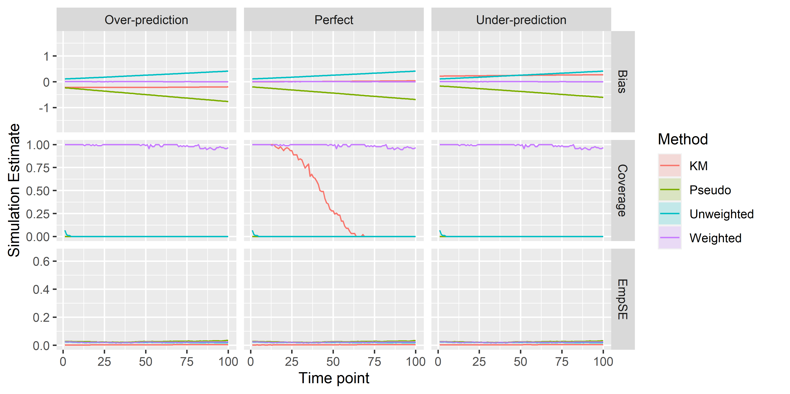
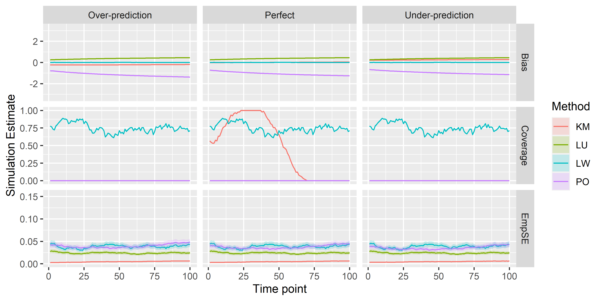
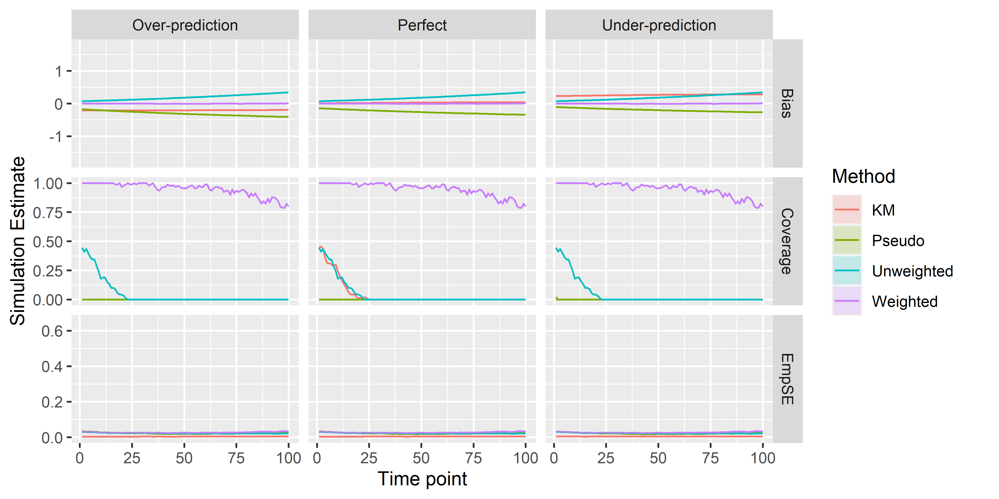

# Inverse Probability Weighting Adjustment of the Logistic Regression Calibration-in-the-Large {#chap-IPCW-logistic}
*MA Barrowman, A Pate, GP Martin, CJM Sammut-Powell, M Sperrin*
`r fb(thesis="\\chaptermark{IPCW Calibration-in-the-Large}")`
`r Updated(4)`

`r add_downloads(4)`

## Abstract {-}

### Introduction {-}

### Methods {-}

### Results {-}

### Discussion {-}


`r fb("### Supplementary Material {-}\n\n Supplementary Material is available in Appendix \\@ref(chap-dev-paper-supp).","### Supplementary Material {-}\n\n Supplementary Material is available in Appendix \\@ref(chap-dev-paper-supp).","")`


## Introduction

Clinical prediction models (CPMs) are statistical models/algorithms that aim to predict the presence (diagnostic) or furture occurence (prognostic) of an event of interest, conditional on a set of predictor variables. Before they be implemented in practice, CPMs must be robustly validated. They need to be validated before they are used and a fundamental test of their validity is calibration: the agreement between observed and predicted outcomes. This requires that among individuals with $p\%$ risk of an event, $p\%$ of those have the event across the full risk range [@steyerberg_clinical_2008]. The simplest assessment of calibration is the calibration-in-the-large, which tests for agreement in mean calibration (the weakest form of calibration) [@calster_calibration_2016-1]. With continuous or binary outcomes, such a test is straight-forward: it can be translated to a test for a zero intercept in a regression model with an appropriately transformed linear predictor as an offset, and no other predictors. More complicated measurements of calibration can also be assessed to descibe how calibration changes across the risk range, such as calibration slope (see Appendix \@ref(chap-IPCW-logistic-supp)). Calibration alone is not enough to fully assess a model's performance however and so we also need measures of discrimination (how well models discern between different patients), e.g the c-statistic and overall accuracy, e.g. the Brier Score.


In the case of time to event models, however, estimation of calibration is complicated in three ways. First, calibration can be computed at multiple time-points and one must decide which time-points to evaluate, and how to integrate over these time-points. The choice and combination of time-points determines what we mean by calibration; this is problem-specific and not the focus of this paper. Calibration can also be integrated over time using the martingale residuals [@crowson_assessing_2016]; however we focus on the case where calibration at a specific time point is of interest - e.g. as is common in clinical decision support. Second, there exists no explicit intercept in the model because of the non-parametric baseline hazard function [@royston_external_2013]. The lack of intercept can be overcome provided sufficient information concerning the baseline survival curve is available (although this is rarely the case as seen in QRISK [@hippisley-cox_2007], ASCVD [@goff_2013_2014] and ASSIGN [@de_la_iglesia_performance_2011]. Once this is established, estimated survival probabilities are available.

Third, censoring needs to be handled in an appropriate way. This is commonly overcome by using Kaplan-Meier estimates  [@royston_external_2013;@hippisley-cox_derivation_2007], but the censoring assumptions required for the Kaplan-Meier estimate are stronger than those required for the Cox model: the former requiring unconditional independence (random censoring), the latter requiring independence conditional on covariates only. This is a problem because when miscalibration is found using this approach, it is not clear whether this is genuine miscalibration or a consequence of the different censoring assumptions. Royston [@royston_tools_2014;@royston_tools_2015] has proposed the comparison of KM curves within risk groups, which alleviates the strength of the independence assumption required for the censoring handling to be comparable between the Cox model and the KM curves (since the KM curves now only assume independent censoring within risk group). In these papers a fractional polynomial approach to estimating the baseline survival function (and thus being able to share it efficiently) is also provided. However, this does not allow calculations of the overall calibration of the model, which is of primary interest here.


QRISK used the overall KM approach in the 2007 paper [@hippisley-cox_derivation_2007] with good results (6.34% predicted vs 6.25% observed in women and 8.86% predicted vs 8.88% observed in men), but worse results in the QRISK3 update [@hippisley-cox_development_2017] (4.7% predicted v 5.8% observed in women and 6.4% predicted vs 7.5% observed in men ). This may be because, as follow-up extends, the dependence of censoring on the covariates increases (QRISK had 12 years follow-up, QRISK3 had 18) and an important change between the update was the lower age limit moved from 35 to 25, as well as the implementation of QRISK in clinical practice `r xx("I remember discussing this with Alex & Matt a while ago as to whether the use of QRISK had a feedback loop when updated after it's own implementation. Did this go any further?")`.

Royston [@royston_tools_2014] also presented an alternative approach for calibration at external validation. He uses the approach of pseudo-observations, as described by Perme and Anderson [@perme_checking_2008] to overcome the censoring issue and produce observed probabilities at individual level; however, this assumes that censoring is independent of covariates.

A solution to this problem is to apply a weighting to uncensored patients based on their probability of being censored according to a model that accounts for covariates.  The Inverse Probability of Censoring Weighting (IPCW)  relaxes the  assumption that patients who were censored are identical to those that remain at risk and replaces it with the assumption that they are exchangeable conditional on the measured covariates. The weighting inflates the patients who were similar to the censored population to account for those patients who are no longer available at a given time.

Gerds & Schumacher [@gerds_consistent_2006] have thoroughly investigated the requirements and advantages of applying an IPCW to a performance measure for modelling using the Brier score as an example and demonstrating the efficacy of its use, which was augmented by Spitoni et al [@spitoni_prediction_2018] who demonstrated that any proper scoring rule can be improved by the use of the IPCW. This work has been extended by Han et al [@han_comparing_2017] and Liu et al [@liu_comparing_2016] who demonstrated one can also apply IPCW to the c-statistic (a measure of discrimination). 


In this paper we present an approach to assessing the calibration intercept (calibration-in-the-large) and calibration slope in time-to-event models based on estimating the censoring distribution, and reweighting observations by the inverse of the censoring probability. We first show, theoretically, how this method can be used and evidence that the metrics for calibration are amenable to its use. We then compare simulation results from using this weighted estimate to an unweighted estimate within various commonly used methods of calibration assessment.


## Methods

### Theory

`r xx("Lots of Theory work on the probabilities. May need to drop this if we're unable to do it between us.")`

### Aims

The aim of this simulation study is to investigate the bias induced by applying different methods of assessing model calibration to data that is susceptible to censoring and to compare it to the bias when this data has been adjusted by the Inverse Probability of Censoring Weighting (IPCW). 

### Data Generating Method

We simulated populations of patients with survival and censoring times, and took the observed event time as the minimum of these two values along with an event indicator of whether this was the survival or censoring time [@burton_design_2006]. Each population was simulated with three parameters: $\beta$, $\gamma$ and $\eta$, which defined the proportional hazards coefficients for the survival and censoring distributions and the baseline hazard function, respectively.


Patients were generated with a single covariate $Z \sim N(0,1)$ from which, we then generated a survival time, $T$ and a censoring time, $C$. Survival times were simulated with a baseline hazard $\lambda_0(t) = t^{\eta}$ (i.e. Weibull), and a proportional hazard of $e^{\beta Z}$. This allows the simulation of a constant baseline hazard ($\eta = 0$) as well as an increasing ($\eta = \sfrac{1}{2}$) and decreasing ($\eta = -\sfrac{1}{2}$) hazard function Censoring times were simulated with a constant baseline hazard, $\lambda_{C,0}(t) = 1$ and a proportional hazard of $e^{\gamma Z}$. <mark>This combines to give a simulated survival function, $S$ as
$$
S(t|Z=z) = \exp\left(-\frac{e^{\beta Z}t^{\eta+1}}{\eta+1}\right)
$$
and a simulated censoring function, $S_c$ as
$$
S_c(t|Z=z) = \exp\left(-e^{\gamma Z}t\right)
$$

</mark>

Once the survival and censoring times were generated, the event time, $X = \min(T,C)$, and the event indicator, $\delta = I(T=X)$, were generated. In practice, only $Z$, $X$ and $\delta$ would be observed.


During each simulation, we varied the parameters to take all the values,$\gamma = \{-2,-1.5,-1,-0.5,0,0.5,1,1.5,2\}$, $\beta = \{-2,-1.5,-1,-0.5,0,0.5,1,1.5,2\}$ and $\eta = \{-\sfrac{1}{2},0,\sfrac{1}{2}\}$. For each combination of parameters, we generated $N = 100$ populations of $n = 10,000$ patients (a high number of patients was chosen to improve precision of our estimates)
 
 
### Prediction Models

`r xx("New section, taken from previous snippets, highlighting/strikethroughs will show the new changes")`

For each population, we used three distinct prediction models  for survival. $F_P$ was chosen to exactly model the Data Generating Mechanism (DGM) to emulate a perfectly specified model:

$$
\begin{array}{c}
F_P(t|Z = z) = 1 - \exp\left(-\frac{e^{\beta Z}t^{\eta+1}}{\eta+1}\right)
\end{array}
$$
From this, we also derived a prediction model that would systematically over-estimate the prediction model, $F_O$, and one which would systematically under-estimate the prediction, $F_U$. These are defined as:

$$
\begin{array}{rl}
F_U(t|Z=z) =& \logit^{-1}\left(\logit\left( F_P(t|z) - 0.2\right)\right)
\end{array}
$$
$$
\begin{array}{rl}
F_O(t|Z=z) =& \logit^{-1}\left(\logit\left( F_P(t|z) + 0.2\right)\right)
\end{array}
$$

These prediction models were used to generate an estimate of the Expected probability that a given patient, with covariate $z$, will have an event at the given time.

### The IPCW

In order to apply the IPCW, we need to calculate a censoring prediction model. For our purposes, we will again use a perfectly specified censoring distribution, $G$, to be derived directly from the DGM:

$$
\begin{array}{c}
G(t|Z=z) = 1-\exp\left(-e^{\gamma Z}t\right)
\end{array}
$$
This is used to calculate an IPCW for all non-censored patients at the last time they were observed ($t$ for patients who have not had an event, and $X_i$ for patients who have had the event), This is defined as:


$$
\begin{array}{c}
\omega(t|z) = \frac{1}{1 - G(\min(t,X_i)|z)}
\end{array}
$$

### Calibration Measurements

The prediction models were assessed at 100 time points, evenly distributed between the 25th and 75th percentile of observed event times, $X$. At each of these time points, we compare Observed outcomes ($O$) with the Expected outcomes ($E$) of the prediction models based on four choices of methodology [@royston_tools_2014;@royston_tools_2015;@riley_prognosis_2019;@andersen_pseudo-observations_2010] to produce measures for the calibration-in-the-large

* Kaplan-Meier (KM) - A Kaplan-Meier estimate of survival is estimated from the data and the value of the KM curve at the current time is taken to be the average Observed number of events within the population and this is compared with the average Expected value.
* Logistic Unweighted (LU) - Logistic regression is performed on the non-censored population to predict the binary Observed value using the logit(Expected) value as an offset and the Intercept of the regression is the estimate of calibration-in-the-large.
* Logistic Weighted (LW) - As above, but the logistic regression is performed using the IPCW as a weighting for each non-censored patient.
* Pseudo-Observations (PO) - The contribution of each patient (including censored patients) to the overall Observed value is calculated by removing them from the population and aggregating the difference. Regression is performed with the complimentary log-log function as a link function and the log cumulative hazard as an offset with the Intercept representing the estimate of calibration-in-the-large.

Some of these methods produce unusual results for the regressions. Firstly, the weights within the LW method cause the "number of events" being processed (i.e the sum of the weighted events) to be non-integer. This is a minor issue and can be dealt with by most software packages [@wildscop_biostatistics_2013]. Secondly, the PO method produces outcomes that are outside of the (0,1) range [@perme_checking_2008] required for the complimentary log-log function. To combat this, we re-scale the values produced to be with this range and perform the regression as normal.


### Estimands

For each set of parameters and methodology, our estimand at time, $t$, measured in simulation $i = 1,...,N$ is $\theta_i(t)$, the set of estimates of the calibration-in-the-large for the $F_P$, $F_U$ and $F_O$ models in order. Therefore our underlying truth for all time points is

$$\begin{array}{c}
\theta = \left(0,0.2,-0.2\right)
\end{array}$$

From this, we can also define our upper and lower bound for a 95% confidence interval as the vectors $\theta_{i,L}(t)$ and $\theta_{i,U}(t)$.

### Performance Measures

The measures we will take as performance measures as the Bias, the Empirical Standard Error and the Coverage at time, $t$, along with relevant standard errors and confidence intervals as per current recommendations [@morris_using_2019]. These measures can be seen in table \@ref(tab:PM-DGM-time). For these estimates at each time point, Method and Model, the top and bottom 5% of all simulation estimates will be omitted, leaving $N=90$ to avoid biasing the results from singly large random effects.


```{r PM-DGM-time,echo=F}

tribble(~"Performance Measure",~"Estimation",~"SE",
        "Bias","$\\hat{\\theta}(t) = \\frac{1}{N} \\sum_{i=1}^N\\theta_i(t) - \\theta$","$\\hat{\\theta}_{SE}(t) = \\sqrt{\\frac{1}{N(N-1)} \\sum_{i=1}^N \\left(\\theta_i(t) - \\hat{\\theta}(t)\\right)^2}$",
        "EmpSE","$\\hat{E}(t) = \\sqrt{\\frac{1}{N-1}\\sum_{i=1}^N\\left(\\theta_i(t) - \\hat{\\theta}(t)\\right)^2}$","$\\hat{E}_{SE}(t)=\\frac{\\hat{E}(t)}{\\sqrt{2(N-1)}}$",
        "Coverage","$\\hat{C}(t)=\\frac{1}{N}\\sum_{i=1}^NI\\left(\\theta_{i,L}(t) \\le \\theta \\le \\theta_{i,U}(t)\\right)$","$\\hat{C}_{SE}(t) = \\frac{\\hat{C}(t)\\left(1-\\hat{C}(t)\\right)}{N}$")%>%
  if_fun(get_format("gitbook"),
         function(x) mutate(x,
                            Estimation = gsub("$","$$",Estimation,fixed=T),
                            SE = gsub("$","$$",SE,fixed=T))) %>%
  kable(format=fb("html","latex","latex"),
        caption=paste0(fb("<font size=\"2\">","{\\small ","{\\small "),
                       "Performance Measures to be taken at each time point",
                       fb("</font>","}","}")),
        booktabs=T,escape=F) %>%
  kable_styling(bootstrap_options="striped",
                latex_options="striped",
                font_size=fb(9,7,7),
                full_width=F) %>%
  #column_spec() %>%
    if_fun(get_format("gitbook"),
           function(x) scroll_box(x,width="100%"))

```

The bias provides a measure of how close our estimate is to the true value as per our data generating mechanisms. The coverage will demonstrate how often our confidence intervals surrounding our estimate actually include this true value. The Empirical Standard Error will show us how precise our estimates are.


### Software

All analysis was done in `R 3.6.3` [@r_core_team_r_nodate] using the various `tidyverse` packages [@wickham_tidy_2017], Kaplan-Meier estimates were found using the `survival` package [@therneau_package_2020], Pseudo-Observations were evaluated with the `pseudo` package [@perme_pseudo_2017], and the results app was developed using `shiny`[@chang_shiny_2020]. The code used for this simulation study is available [on Github](https://github.com/MyKo101/IPCW-Logistic) and the results can be seen in a [shiny app](https://michael-barrowman.shinyapps.io/IPCW_Calibrations/?_ga=2.129261196.1072091615.1588464259-38998367.1584541320)

## Results

`r xx("Results shown here are new and improved from the previous version. No highlighting is shown")`

```{r MainPlotg0, echo=F, fig.cap="Bias, Coverage and Empirical Standard Error for the Over-estimating, Perfect and Under-Estimating models across all four methods when $\\beta=1$, $\\gamma=0$ and $\\eta=\\sfrac{1}{2}$. Confidence Intervals are included in the plot, but are tight around the estimate"}

```

Figure \@ref(fig:MainPlotg0) shows the results when censoring is independent of covariates ($\gamma=0$). The LW method provides strong coverage across the entire timeframe and miminal bias. The absolute bias for PO and LU increases over time with PO under-reporting the correct value and LO over-reporting. KM bias remains constant across the timeframe, but for the imperfect models, is constantly under- or over-reported. LU and PO also provide minimal coverage at all time points, whereas KM covers perfect in the early stages of the Perfect Model with coverage dropping off as time progresses. Empirical Standard Error is clse to 0 for all models.


```{r MainPlotg1, echo=F, fig.cap="Bias, Coverage and Empirical Standard Error for the Over-estimating, Perfect and Under-Estimating models across all four methods when $\\beta=1$, $\\gamma=1$ and $\\eta=\\sfrac{1}{2}$. Confidence Intervals are included in the plot, but are tight around the estimate"}

```

Figure \@ref(fig:MainPlotg1) shows the results when censoring and the event-of-interest have the same individual effects ($\beta=\gamma=1$). The LW method provides strong coverage across the entire timeframe and miminal bias, although this coverage is reduced compared to the previous set of results shown (approximately 75% throughout). Once again, the absolute bias for PO and LU increases over time, however the under-reporting for PO is much more strongly pronounced. KM bias behaves similarly but for coverage, it starts off at around 50% coverage reaches a peak of full coverage approximately 25% of the way through the timeframe.


```{r MainPlotg2, echo=F, fig.cap="Bias, Coverage and Empirical Standard Error for the Over-estimating, Perfect and Under-Estimating models across all four methods when $\\beta=1$, $\\gamma=-1$ and $\\eta=\\sfrac{1}{2}$. Confidence Intervals are included in the plot, but are tight around the estimate"}

```

Figure \@ref(fig:MainPlotg2) shows the results when censoring and the event-of-interest have opposite individual effects ($\beta=1, \gamma=-1$). The bias results are similar to those when censoring is independent. A difference here is that coverage begins greater than zero for the KM, LU and PO methods, but quickly drops to 0 before the 25% time point. For LW, the coverage appears to reduce to around 80% by the end of the time point.


## Discussion

Weighting = Good.

Not Weighting = Bad.

**limitation**: Maybe the "True" $\theta$ for the under and over predictions were wrong and that would explain the low Coverage.


