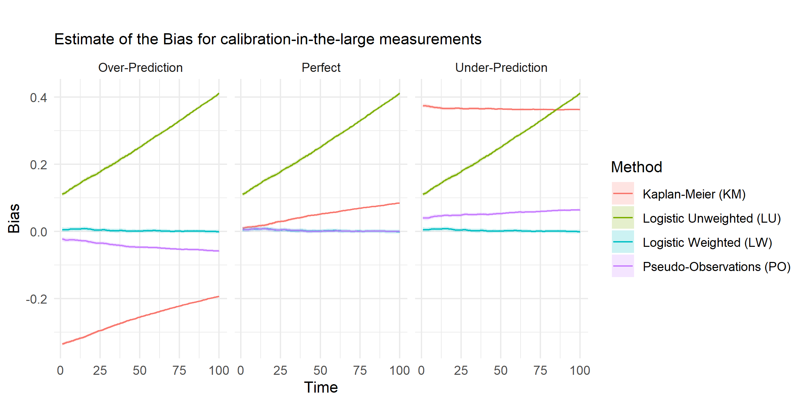
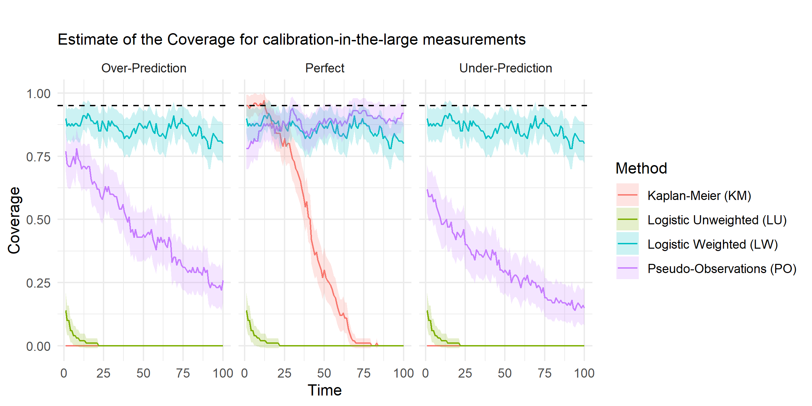
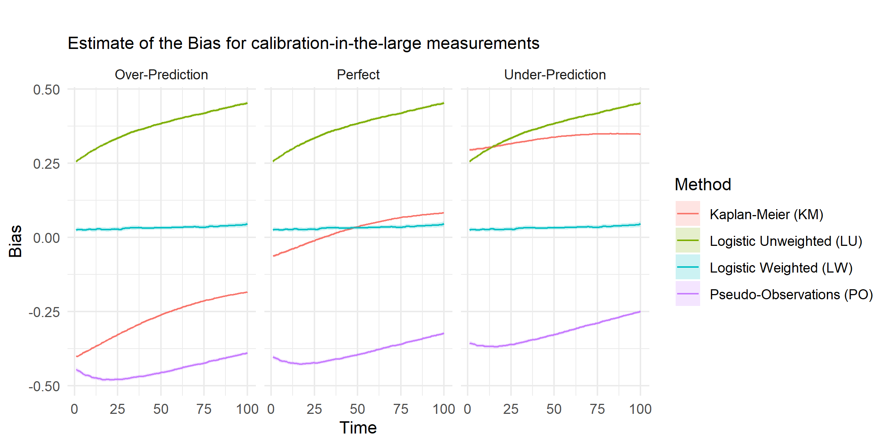
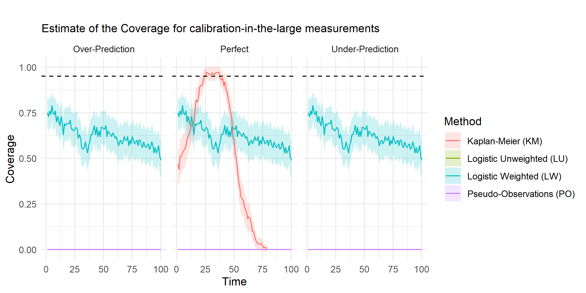
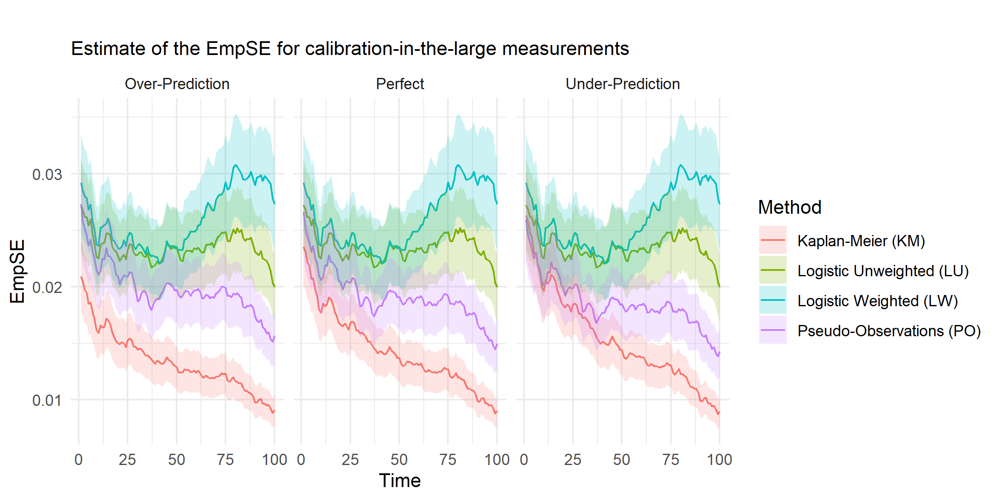
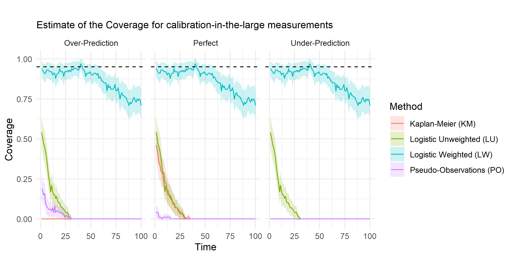

# Inverse Probability Weighting Adjustment of the Logistic Regression Calibration-in-the-Large {#chap-IPCW-logistic}
*MA Barrowman, A Pate, GP Martin, CJM Sammut-Powell, M Sperrin*
`r fb(thesis="\\chaptermark{IPCW Calibration-in-the-Large}")`
`r Updated(4)`
`r html_latex_header()`

`r add_downloads(4)`

## Abstract {-}

### Introduction {-}
A key component of the development of a prediction model/algorithm is the assessment of its calibration through means of validation (internal and external). For time-to-event models, this assessment is complicated in three ways:

* Calibration can be assessed at multiple time points,
* When Cox Modeling has been used, there exists no "intercept" for a model to be assessed on
* Censoring occurs within the data, and this may or may not be correlated with the event-of-interest

We choose to focus on analysing methods of overcoming the third of these problems using Inverse Probability of Censoring Weighting (IPCW), which can also combat the other two problems.

### Methods {-}
We used simulations to generate time-to-event data with censoring, where censoring can be correlated or not with the event-of-interest. We then applied a pre-calibrated prediction models (including flawed ones) to the data and assessed the calibrations of these models under different methods:

* Kaplan-Meier Method (KM), the KM curve is used as a comparitor to the model predictions
* Logistic Regression with IPCW Weighting (LW) and without it (LU)
* Pseudo-Observations (PO), where the calibration is assessed using the pseuo-observation of the model data.

These simulations were aggregating and analysed to compare Bias and Coverage of each of these methods.

### Results {-}
The LU and PO Methods had increasing absolute Bias over time, regardless of whether the model was perfectly calibrated or not. However, the LW Method consistently provided almost no Bias, and high coverage in all scenarios.


### Discussion {-}


`r fb("### Supplementary Material {-}\n\n Supplementary Material is available in Appendix \\@ref(chap-dev-paper-supp).","### Supplementary Material {-}\n\n Supplementary Material is available in Appendix \\@ref(chap-dev-paper-supp).","")`


## Introduction

Clinical prediction models (CPMs) are statistical models/algorithms that aim to predict the presence (diagnostic) or furture occurence (prognostic) of an event of interest, conditional on a set of predictor variables. Before they be implemented in practice, CPMs must be robustly validated. They need to be validated before they are used and a fundamental test of their validity is calibration: the agreement between observed and predicted outcomes. This requires that among individuals with $p\%$ risk of an event, $p\%$ of those have the event across the full risk range [@steyerberg_clinical_2008]. The simplest assessment of calibration is the calibration-in-the-large, which tests for agreement in mean calibration (the weakest form of calibration) [@calster_calibration_2016-1]. With continuous or binary outcomes, such a test is straight-forward: it can be translated to a test for a zero intercept in a regression model with an appropriately transformed linear predictor as an offset, and no other predictors. More complicated measurements of calibration can also be assessed to descibe how calibration changes across the risk range, such as calibration slope (see Appendix \@ref(chap-IPCW-logistic-supp)). Calibration alone is not enough to fully assess a model's performance however and so we also need measures of discrimination (how well models discern between different patients), e.g the c-statistic and overall accuracy, e.g. the Brier Score.


In the case of time to event models, however, estimation of calibration is complicated in three ways. First, calibration can be computed at multiple time-points and one must decide which time-points to evaluate, and how to integrate over these time-points. The choice and combination of time-points determines what we mean by calibration; this is problem-specific and not the focus of this paper. Calibration can also be integrated over time using the martingale residuals [@crowson_assessing_2016]; however we focus on the case where calibration at a specific time point is of interest - e.g. as is common in clinical decision support. Second, <mark>when a Cox Model is used</mark> there exists no explicit intercept in the model because of the non-parametric baseline hazard function [@royston_external_2013]. The lack of intercept can be overcome provided sufficient information concerning the baseline survival curve is available (although this is rarely the case as seen in QRISK [@hippisley-cox_derivation_2007], ASCVD [@goff_2013_2014] and ASSIGN [@de_la_iglesia_performance_2011]. Once this is established, estimated survival probabilities are available.

Third, censoring needs to be handled in an appropriate way and this is the core message of this paper. Censoring is commonly overcome by using Kaplan-Meier estimates  [@royston_external_2013;@hippisley-cox_derivation_2007], but the censoring assumptions required for the Kaplan-Meier estimate are stronger than those required for the Cox model: the former requiring unconditional independence (random censoring), the latter requiring independence conditional on covariates only. This is a problem because when miscalibration is found using this approach, it is not clear whether this is genuine miscalibration or a consequence of the different censoring assumptions. Royston [@royston_tools_2014;@royston_tools_2015] has proposed the comparison of KM curves within risk groups, which alleviates the strength of the independence assumption required for the censoring handling to be comparable between the Cox model and the KM curves (since the KM curves now only assume independent censoring within risk group). In these papers a fractional polynomial approach to estimating the baseline survival function (and thus being able to share it efficiently) is also provided. However, this does not allow calculations of the overall calibration of the model, which is of primary interest here.


QRISK used the overall KM approach in the 2007 paper [@hippisley-cox_derivation_2007] demonstrating adequate calibration (6.34% predicted vs 6.25% observed in women and 8.86% predicted vs 8.88% observed in men), but miscalibration in the QRISK3 update [@hippisley-cox_development_2017] (4.7% predicted v 5.8% observed in women and 6.4% predicted vs 7.5% observed in men ). This may be because, as follow-up extends, the dependence of censoring on the covariates increases (QRISK had 12 years follow-up, QRISK3 had 18).


Royston [@royston_tools_2014] also presented an alternative approach for calibration at external validation. He uses the approach of pseudo-observations, as described by Perme and Anderson [@perme_checking_2008] to overcome the censoring issue and produce observed probabilities at individual level; however, this assumes that censoring is independent of covariates.

A solution to this problem is to apply a weighting to uncensored patients based on their probability of being censored according to a model that accounts for covariates.  The Inverse Probability of Censoring Weighting (IPCW)  relaxes the  assumption that patients who were censored are identical to those that remain at risk and replaces it with the assumption that they are exchangeable conditional on the measured covariates. The weighting inflates the patients who were similar to the censored population to account for those patients who are no longer available at a given time.

Gerds & Schumacher [@gerds_consistent_2006] have thoroughly investigated the requirements and advantages of applying an IPCW to a performance measure for modelling using the Brier score as an example and demonstrating the efficacy of its use, which was augmented by Spitoni et al [@spitoni_prediction_2018] who demonstrated that any proper scoring rule can be improved by the use of the IPCW. This work has been extended by Han et al [@han_comparing_2017] and Liu et al [@liu_comparing_2016] who demonstrated one can also apply IPCW to the c-statistic (a measure of discrimination). 


In this paper we present an approach to assessing the calibration intercept (calibration-in-the-large) and calibration slope in time-to-event models based on estimating the censoring distribution, and reweighting observations by the inverse of the censoring probability. We first show, theoretically, how this method can be used and evidence that the metrics for calibration are amenable to its use. We then compare simulation results from using this weighted estimate to an unweighted estimate within various commonly used methods of calibration assessment.


## Methods

### Aims

The aim of this simulation study is to investigate the bias induced by applying different methods of assessing model calibration to data that is susceptible to censoring and to compare it to the bias when this data has been adjusted by the Inverse Probability of Censoring Weighting (IPCW). 

### Data Generating Method

We simulated populations of patients with survival and censoring times, and took the observed event time as the minimum of these two values along with an event indicator of whether this was the survival or censoring time [@burton_design_2006]. Each population was simulated with three parameters: $\beta$, $\gamma$ and $\eta$, which defined the proportional hazards coefficients for the survival and censoring distributions and the baseline hazard function, respectively.


Patients were generated with a single covariate $Z \sim N(0,1)$ from which, we then generated a survival time, $T$ and a censoring time, $C$. Survival times were simulated with a baseline hazard $\lambda_0(t) = t^{\eta}$ (i.e. Weibull), and a proportional hazard of $e^{\beta Z}$. This allows the simulation of a constant baseline hazard ($\eta = 0$) as well as an increasing ($\eta = \sfrac{1}{2}$) and decreasing ($\eta = -\sfrac{1}{2}$) hazard function Censoring times were simulated with a constant baseline hazard, $\lambda_{C,0}(t) = 1$ and a proportional hazard of $e^{\gamma Z}$. Therefore, the hazard functions can be expressed in full as:
$$
\lambda(t) = e^{\beta Z}t^{\eta}\qquad\qquad\lambda_C(t)=e^{\gamma Z}
$$

This combines to give a simulated survival function, $S$ as
$$
S(t|Z=z) = \exp\left(-\frac{e^{\beta Z}t^{\eta+1}}{\eta+1}\right)
$$
and a simulated censoring function, $S_c$ as
$$
S_c(t|Z=z) = \exp\left(-e^{\gamma Z}t\right)
$$
Once the survival and censoring times were generated, the event time, $X = \min(T,C)$, and the event indicator, $\delta = I(T=X)$, were generated. In practice, only $Z$, $X$ and $\delta$ would be observed.


During each simulation, we varied the parameters to take all the values,$\gamma = \{-2,-1.5,-1,-0.5,0,0.5,1,1.5,2\}$, $\beta = \{-2,-1.5,-1,-0.5,0,0.5,1,1.5,2\}$ and $\eta = \{-\sfrac{1}{2},0,\sfrac{1}{2}\}$. For each combination of parameters, we generated $N = 100$ populations of $n = 10,000$ patients (a high number of patients was chosen to improve precision of our estimates)
 
 
### Prediction Models

For each population, we used three distinct prediction models  for survival. $F_P$ was chosen to exactly model the Data Generating Mechanism (DGM) to emulate a perfectly specified model:

$$
F_P(t|Z = z) = 1 - \exp\left(-\frac{e^{\beta Z}t^{\eta+1}}{\eta+1}\right)
$$


From this, we also derived a prediction model that would systematically over-estimate the prediction model, $F_O$, and one which would systematically under-estimate the prediction, $F_U$. These are defined as:

$$
F_U(t|Z=z) = \logit^{-1}\left(\logit\left( F_P(t|z) - 0.2\right)\right)
$$

$$
F_O(t|Z=z) = \logit^{-1}\left(\logit\left( F_P(t|z) + 0.2\right)\right)
$$

These prediction models were used to generate an estimate of the Expected probability that a given patient, with covariate $z$, will have an event at the given time.

### The IPCW

In order to apply the IPCW, we need to calculate a censoring prediction model. For our purposes, we will again use a perfectly specified censoring distribution, $G$, to be derived directly from the DGM:

$$
G(t|Z=z) = 1-\exp\left(-e^{\gamma Z}t\right)
$$
This is used to calculate an IPCW for all non-censored patients at the last time they were observed ($t$ for patients who have not had an event, and $X_i$ for patients who have had the event), This is defined as:


$$
\omega(t|z) = \frac{1}{1 - G(\min(t,X_i)|z)}
$$

### Calibration Measurements

The prediction models were assessed at 100 time points, evenly distributed between the 25th and 75th percentile of observed event times, $X$. At each of these time points, we compare Observed outcomes ($O$) with the Expected outcomes ($E$) of the prediction models based on four choices of methodology [@hippisley-cox_derivation_2007;@royston_tools_2014;@royston_tools_2015;@riley_prognosis_2019;@andersen_pseudo-observations_2010] to produce measures for the calibration-in-the-large

* Kaplan-Meier (KM) - A Kaplan-Meier estimate of survival is estimated from the data and the value of the KM curve at the current time is taken to be the average Observed number of events within the population. The measure is the ratio of the Observed to the mean Expected number of events.
* Logistic Unweighted (LU) - Logistic regression is performed on the non-censored population to predict the binary Observed value using the logit(Expected) value as an offset and the Intercept of the regression is the estimate of calibration-in-the-large.
* Logistic Weighted (LW) - As above, but the logistic regression is performed using the IPCW as a weighting for each non-censored patient.
* Pseudo-Observations (PO) - The contribution of each patient (including censored patients) to the overall Observed value is calculated by removing them from the population and aggregating the difference. Regression is performed with the complimentary log-log function as a link function and the log cumulative hazard as an offset with the Intercept representing the estimate of calibration-in-the-large.

Some of these methods produce unusual results for the regressions. Firstly, the weights within the LW method cause the "number of events" being processed (i.e the sum of the weighted events) to be non-integer. This is a minor issue and can be dealt with by most software packages [@wildscop_biostatistics_2013]. Secondly, the PO method produces outcomes that are outside of the (0,1) range [@perme_checking_2008] required for the complimentary log-log function. To combat this, we re-scale the values produced to be with this range and perform the regression as normal. Finally, the KM method is centred around 1 for well performing models, whereas the others are centered around 0, so we subtract 1 from the results of the KM method to bring results to the same scale.


### Estimands

For each set of parameters and methodology, our estimand at time, $t$, measured in simulation $i = 1,...,N$ is $\theta_i(t)$, the set of estimates of the calibration-in-the-large for the $F_P$, $F_U$ and $F_O$ models in order. Therefore our underlying truth for all time points is

$$
\begin{array}{c}
\theta = \left(0,0.2,-0.2\right)
\end{array}
$$

From this, we can also define our upper and lower bound for a 95% confidence interval as the vectors $\theta_{i,L}(t)$ and $\theta_{i,U}(t)$.

### Performance Measures

The measures we will take as performance measures as the Bias, the Empirical Standard Error, <mark>the Median-Bias</mark> and the Coverage at time, $t$, along with relevant standard errors and/or confidence intervals [@morris_using_2019]. <mark>For most measures, the standard error is easily calculable, but for the Median, it is more appropriate to calculate the confidence interval directly from the sorted values, $\theta_{(1)},\theta_{(2)},...,\theta_{(100)}$, where $\theta_{(50)}$ is the median, the 95\% confidence interval is the interval $\left(\theta_{(40)}, \theta_{(61)}\right)$. To turn this into a Median-Bias, we subtract the true value, $\theta$. These measures can be seen in table \@ref(tab:PM-DGM-time). For the <mark>Bias and EmpSE</mark> estimates at each time point, Method and Model, the top and bottom 5% of all simulation estimates will be omitted, leaving $N=90$ to avoid biasing the results from <mark>large outlier effects</mark>. We will also perform a Shapiro-Wilk test for each of the combination of parameters.


```{r PM-DGM-time,echo=F}

tribble(~"Performance Measure",~"Estimation",~"SE/CI",
        "Bias","$\\hat{\\theta}(t) = \\frac{1}{N} \\sum_{i=1}^N\\theta_i(t) - \\theta$","$\\hat{\\theta}_{SE}(t) = \\sqrt{\\frac{1}{N(N-1)} \\sum_{i=1}^N \\left(\\theta_i(t) - \\hat{\\theta}(t)\\right)^2}$",
        "EmpSE","$\\hat{E}(t) = \\sqrt{\\frac{1}{N-1}\\sum_{i=1}^N\\left(\\theta_i(t) - \\hat{\\theta}(t)\\right)^2}$","$\\hat{E}_{SE}(t)=\\frac{\\hat{E}(t)}{\\sqrt{2(N-1)}}$",
        "Median","$\\hat{M}(t) = \\theta_{(50)} - \\theta$","$\\hat{M}_{CI}(t) =  \\left(\\theta_{(40)}-\\theta,\\;\\theta_{(60)}-\\theta\\right)$",
        "Coverage","$\\hat{C}(t)=\\frac{1}{N}\\sum_{i=1}^NI\\left(\\theta_{i,L}(t) \\le \\theta \\le \\theta_{i,U}(t)\\right)$","$\\hat{C}_{SE}(t) = \\frac{\\hat{C}(t)\\left(1-\\hat{C}(t)\\right)}{N}$")%>%
  if_fun(get_format("gitbook"),
         function(x) mutate(x,
                            Estimation = gsub("$","$$",Estimation,fixed=T),
                            `SE/CI` = gsub("$","$$",`SE/CI`,fixed=T))) %>%
  kable(format=fb("html","latex","latex"),
        caption=paste0(fb("<font size=\"2\">","{\\small ","{\\small "),
                       "Performance Measures to be taken at each time point",
                       fb("</font>","}","}")),
        booktabs=T,escape=F) %>%
  kable_styling(bootstrap_options="striped",
                latex_options="striped",
                font_size=fb(9,7,7),
                full_width=F) %>%
  #column_spec() %>%
    if_fun(get_format("gitbook"),
           function(x) scroll_box(x,width="100%"))

```

The bias <mark>and median-bias</marK> provide a measures of how close our estimate is to the true value as per our data generating mechanisms. The coverage will demonstrate how often our confidence intervals surrounding our estimate actually include this true value. The Empirical Standard Error will show us how precise our estimates are. <mark>The shapiro-wilk result will allow us to determine whether the bias or median-bias is more appropriate overall when analysing our data</mark>.


### Software

All analysis was done in `R 3.6.3` [@r_core_team_r_nodate] using the various `tidyverse` packages [@wickham_tidy_2017], Kaplan-Meier estimates were found using the `survival` package [@therneau_package_2020], Pseudo-Observations were evaluated with the `pseudo` package [@perme_pseudo_2017], and the results app was developed using `shiny`[@chang_shiny_2020]. The code used for this simulation study is available [on Github](https://github.com/MyKo101/IPCW-Logistic) and the results can be seen in a [shiny app](https://michael-barrowman.shinyapps.io/IPCW_Calibrations/?_ga=2.129261196.1072091615.1588464259-38998367.1584541320)

## Results

Here, we present a subset of results with the full set of outputs available in the Calculator App. The estimates are presented with time on the x-axis and the y-axis showing the performance measure, stratified by model across facets and method of analysis by colour. We will investigate the Bias, EmpSE and Coverage for the scenarios where $\beta=1$ and $\eta=\sfrac{1}{2}$ are fixed and $\gamma$ varies through -1, 0 and 1. These represent when the event and censoring are positively correlated ($\gamma = \beta = 1$), negatively correlated ($\gamma = - \beta = -1$) and when the covariate has no effect on the censoring distribution ($\gamma=0$)

### No correlation

When $\gamma = 0$, we can see in figure \@ref(fig:BiasPlotg0) that the Bias is moving away from 0 for both the LU and PO, in opposing directions over time. These time-based biases are consistent across models indicating that this is due to the censoring of the population and not the underlying model. The KM measure is biased downwards for the Over-Predicting model and upwards for the Under-Predicting model, however it is relatively unbiased when a model is defined perfectly. The LW Method consistently provides an unbiased measurement of the model calibration regardless of the underlying accuracy of the model.

```{r BiasPlotg0, echo = F, fig.cap="Bias for Over-estimating, Perfect and Under-Estimating models across all four methods when $\\beta = 1$, $\\gamma = 0$ and $\\eta = \\sfrac{1}{2}$. 95% Confidence Intervals are included in the plot."}

```

The small confidence intervals surrounding the Bias estimates above demonstrate that these results are consistent, which is exemplified by the small values found in figure \@ref(fig:EmpSEPlotg0), with the KM Method providing consistent (if biased) results.

```{r EmpSEPlotg0, echo = F, fig.cap="EmpSE for Over-estimating, Perfect and Under-Estimating models across all four methods when $\\beta = 1$, $\\gamma = 0$ and $\\eta = \\sfrac{1}{2}$. 95% Confidence Intervals are included in the plot."}
knitr::include_graphics("figure/IPCW_Logistic/No Slope/Plot_b(1)_g(0)_e(0.5)_M(EmpSE).png")
```

The large biases above, also lead to inaccurate estimations at the simulation level with very low coverage of the true value, as demonstrated in figure \@ref(fig:CoveragePlotg0). The LW Method once again is extremely close to the expected coverage of 95\%.

```{r CoveragePlotg0, echo = F, fig.cap="Coverage for Over-estimating, Perfect and Under-Estimating models across all four methods when $\\beta = 1$, $\\gamma = 0$ and $\\eta = \\sfrac{1}{2}$. 95% Confidence Intervals are included in the plot."}

```

### Positive correlation

When $\gamma = 1$, we can in figure \@ref(fig:BiasPlotg1) see that the Biases for PO and LU, are once again become more innacurate over time, whereas the LW Method is consistently unbiased.

```{r BiasPlotg1, echo = F, fig.cap="Bias for Over-estimating, Perfect and Under-Estimating models across all four methods when $\\beta = 1$, $\\gamma = 1$ and $\\eta = \\sfrac{1}{2}$. 95% Confidence Intervals are included in the plot."}

```


```{r EmpSEPlotg1, echo = F, fig.cap="EmpSE for Over-estimating, Perfect and Under-Estimating models across all four methods when $\\beta = 1$, $\\gamma = 1$ and $\\eta = \\sfrac{1}{2}$. 95% Confidence Intervals are included in the plot."}
knitr::include_graphics("figure/IPCW_Logistic/No Slope/Plot_b(1)_g(1)_e(0.5)_M(EmpSE).png")
```

However, there is an reduced level of coverage, even for the LW Method as shown shown in figure \@ref(fig:CoveragePlotg1).

```{r CoveragePlotg1, echo = F, fig.cap="Coverage for Over-estimating, Perfect and Under-Estimating models across all four methods when $\\beta = 1$, $\\gamma = 1$ and $\\eta = \\sfrac{1}{2}$. 95% Confidence Intervals are included in the plot."}

```


### Negative correlation

When $\gamma = -1$, we see can in figures \@ref(fig:BiasPlotgn1) and  \@ref(fig:EmpSEPlotgn1), the similar results to the above figures, with the LU and PO biases becoming more pronounced over time, and LW remainining consistently low.

```{r BiasPlotgn1, echo = F, fig.cap="Bias for Over-estimating, Perfect and Under-Estimating models across all four methods when $\\beta = 1$, $\\gamma = 1$ and $\\eta = \\sfrac{1}{2}$. 95% Confidence Intervals are included in the plot."}
knitr::include_graphics("figure/IPCW_Logistic/No Slope/Plot_b(1)_g(-1)_e(0.5)_M(Bias).png")
```


```{r EmpSEPlotgn1, echo = F, fig.cap="EmpSE for Over-estimating, Perfect and Under-Estimating models across all four methods when $\\beta = 1$, $\\gamma = 1$ and $\\eta = \\sfrac{1}{2}$. 95% Confidence Intervals are included in the plot."}

```


The data shown in figure \@ref(fig:CoveragePlotgn1) demonstrates that the LW Method is achieving higher Coverage than when there is a positive correlation between the event-of-interest and the censoring rate, however the intervals are still under-performing.

```{r CoveragePlotgn1, echo = F, fig.cap="Coverage for Over-estimating, Perfect and Under-Estimating models across all four methods when $\\beta = 1$, $\\gamma = 1$ and $\\eta = \\sfrac{1}{2}$. 95% Confidence Intervals are included in the plot."}

```


## Discussion

**To Be Done**


