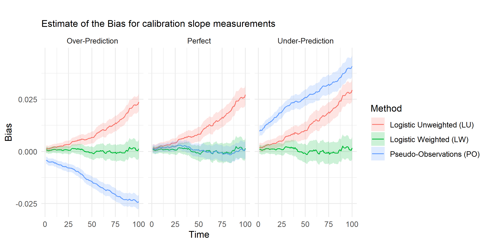

# Inverse Probability Weighting Adjustment of the Logistic Regression Calibration-in-the-Large - Supplementary Material {#chap-IPCW-logistic-supp}
`r fb(thesis="\\chaptermark{IPCW Calibration-in-the-Large - Supp}")`

## Calibration Slope


The main purpose of this paper was to assess the evaluation of calibration-in-the-large at different time points in a time-to-event clinical prediction model. Along with calibration-in-the-large, various methods of calibration can also produce measures of calibration slope. Calibration slope provides an insight into how well the model predicts outcomes across the range of predictions. In an ideal model, the calibration slope would be 1. The Logistic Weighted, Logistic Unweighted and Pseudo-Observation methods described above can provide estimates of the calibration slope. For each of these methods, we first estimate the calibration-in-the-large as above, using a predictor as an offset, then we use this estimate as an offset to predict the calibration slope (without an intercept term).

### Results


```{r SlopePlotg0,echo=F}
knitr:::
```

Results currently show bias/coverage/EmpsE away from 0, rather than 1. Needs fixing. Oops.

### Discussion

Brief discussion, much briefer than the main points.


