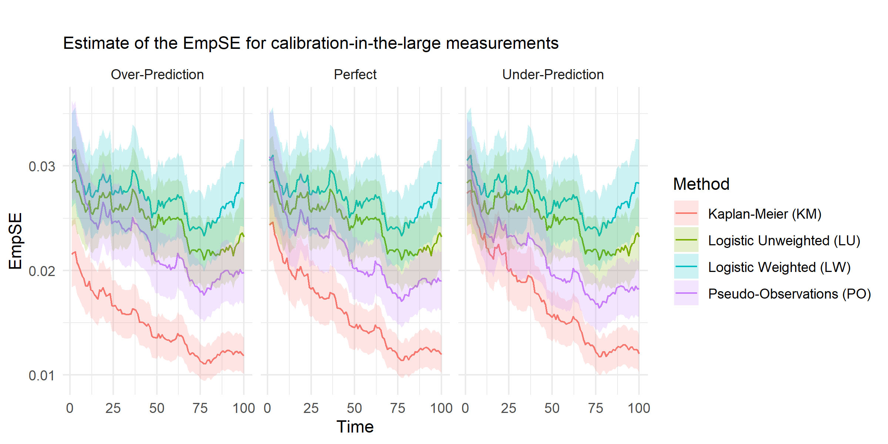
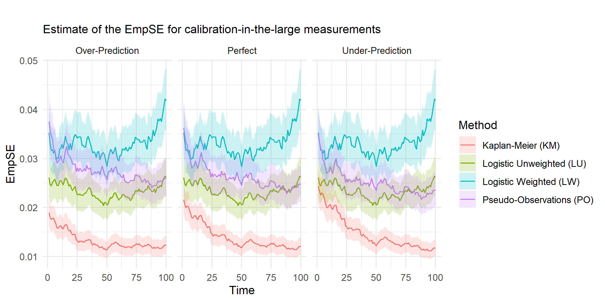

```{r include_packages, include = FALSE}
if(knitr:::is_latex_output())
  options(output.format = "thesis") else 
    options(output.format = "gitbook")

knitr::opts_chunk$set(echo = F)
options(knitr.kable.NA = "")

library(MyThesis)

```


# Introduction {-}

<!--
To Do List:
Write up current draft of other papers
Add Timeline

MyRender is now outputting 4 different things:
- Gitbook style html group of files
- Thesis formatted pdf
- individual papers as pdf
- individual papers as Word

Table format:

           |   Combined    | Individual |
----------------------------------------|
html       | Yes (gitbook) |            |
pdf        | Yes (thesis)  |    Yes     |
word(docx) |               |    Yes     |
----------------------------------------|


`r fb(gitbook=paste0(readLines("header.tex"),collapse="\n"))`

$$
F(x) = \int f(x) \d x
$$
-->


Welcome to my Thesis. I've used R Markdown to create a gitbook style thesis, as well as a traditional pdf (following the UoM Thesis template). `r fb(gitbook="The pdf version can be downloaded via the menu at the top.", thesis="The html version can be found [here](https://michaelbarrowman.co.uk/thesis).")`
  
I sent an email with details of how you can log in to the [hypothes.is](https://hypothes.is/) system. This will let you add comments to the gitbook pages. This is actually a really useful tool and has the ability to add annotations to any webpage. Annotated text can be seen highlighted and to add your own, just highlight the text you want to comment on, and the annotate bubble pops up (try it now). Make sure you click Post to Public after writing the annotation and annotations can include Rich Text and Markdown. You can view Annotations by clicking the menu on the right and this will show all comments.

<mark>New note: Comments added to textual whitespace (e.g. spaces or equations), don't get targetted correctly. They appear in the system where they should be, but the whitespace doesn't get highlighted in the text, which makes it a bit harder to locate them and add in the edits (e.g. if you want me to add a bit more text to the end of a sentence). If you could, please highlight *some* text (even a full stop works).</mark>

Google Docs was great, but when I started to use R Markdown for other purposes, I realised I could embed tables and equations much easier and automatically using `kable`. Google Docs on it's own became rather clunky (especially with tables, just like Word) and whenever I updated a document using R Markdown, any comments that were added to the document were lost. It was also difficult for you to remember *where* each document lived. Since R Markdown can also output to `LaTeX` I thought it would be easier to collate papers together. I'd have had to do this kind of transition over to`LaTeX` for my thesis eventually and this would have been difficult and tedious from Google Docs or Word.
  

Importantly, I've also added in functionality to output each chapter individually. For unpublished papers, there will be a link to download the pdf and tex versions of the individual paper.


Everything here is hosted in a [Github repo](https://https://github.com/MyKo101/Thesis). I originally used Github as my backup, but then decided to increase how I used it.

`r fb(gitbook="## Abstract {-}")`

`r prelim_Subsection("html","abstract")`

<!--chapter:end:index.Rmd-->


# Literature Report {#chap-lit-report}
`r fb(thesis="\\chaptermark{Literaure Report}")` `r Updated(1)`
`r html_latex_header()`


## Introduction

## Clinical Prediction Models

The idea of prognosis dates back to ancient Greece with the work of Hippocrates [@hippocrates_genuine_1886] and is derived from the Greek for "know before" meaning to forecast the future. Within the sphere of healthcare, it is defined as the risk of future health outcomes in patients, particularly patients with a certain disease or health condition. Prognosis allows clinicians to provide patients with a prediction of how their disease will progress and is usually given as a probability of having an event in a prespecified number of years. For example, QRISK3 [@hippisley-cox_development_2017] provides a probability that a patient will have a heart attack or stroke in the next 10 years. Prognostic research encompasses any work which enhances the field of prognosis, whether through methodological advancements, field-specific prognostic modeling or educational material designed to improve general knowledge of prognosis. Prognostic models come under the wider umbrella of predictive models which also includes diagnostic models; because of this most of the keys points in the field or prognostic modeling can be applied to diagnostic models with little to no change.

Prognosis allows clinicians to evaluate the natural history of a patient (i.e. the course of a patient's future without any intervention) in order to establish the effect of screening for asymptomatic diseases (such as with mammograms[@hemingway_prognosis_2013]). Prognosis research can be used to develop new definitions of diseases, whether a redefinition of an existing disease (such as the extension to the definition of myocardial infarction to include non-fatal events [@thygesen_universal_2007]) or a previously unknown sub-type of a disease (such as Brugada syndrome as a type of cardiovascular disease[@probst_long-term_2010])

In general, prognosis research can be broken down into four main categories, with three subcategories [@riley_prognosis_2019]:

* Type I: Fundamental prognosis research [@hemingway_prognosis_2013]
* Type II: Prognostic factor research [@riley_prognosis_2013]
* Type III: Prognostic model research [@steyerberg_prognosis_2013]  
* Model development [@royston_prognosis_2009]   
* Model validation [@altman_prognosis_2009]   
* Model impact evaluation [@moons_prognosis_2009] 
* Type IV: Stratified Medicine [@hingorani_prognosis_2013]

For a particular outcome, prognostic research will usually progress through these types, beginning with papers designed to evaluate overall prognosis within a whole population and then focusing in on more specificity and granularity towards individualised, causal predictions.

The model development and validation will usually occur in the same paper [@collins_transparent_2015;@moons_transparent_2015]. studies into all three of the subcategories of prognostic model research *should* be completed before a model is used in clinical practice [@riley_external_2016], although this does not always occur [@steyerberg_prognosis_2013]. External validation is considered by some to be more important than the actual derivation of the model as it demonstrates generalisability of the model [@collins_systematic_2013], whereas a model on it's own may be highly susceptible to overfitting [@steyerberg_overfitting_2009].

### Fundamental Prognosis Research

`r xx("What is it? Old definition is incorrect, so will need to write this fresh")`

### Prognostic Factor Research

The aim of prognostic factor research (Type II) is to discover which factors are associated with disease progression. This allows for the general attribution of relationships between predictors and clinical outcomes.

Predictive factor research can give researchers and clinicians an idea of which patient factors are important when assessing a disease. It is vital to the development of clinical predictive models as without an idea of what covariates *can* affect an outcome, we cannot figure out which variables *will* affect the outcome. For example, `r xx()` demonstrated that `r xx()` is correlated with `r xx()`, which subsequently used as a covariate in the development of the `r xx()` model. Note the use of the word correlate here as prognostic relationships do not have to be causal ones `r cc()`. These factors may indeed represent an underlying causal pathway, but this is not a requirement and it would require aetiological methods to discern whether it were causal or not. For example, when predicting `r xx()`, we can demonstrate that `r xx()` is a prognostic factor, [however since the arrow of causation is `r xx()`] `r xx("OR")` [however since `r xx()` causes both `r xx()` and `r xx()`], the relationship is prognostic, but not causal. `r xx("Previously used Apgar score here, reference 40")`

Counter to the idea that prognostic factors aren't always causal, they are *always* confounding factors for the event they predict. Thus prognostic factors should be taken into account when planning clinical trials as if they are wildly misbalanced across the arms (or not accounted for in some other manner), they can cause biases in the results [@riley_prognosis_2013]. Sometimes these factors are so strong that adjusting the results of a clinical trial by the factor can affect, or even reverse the interpretation of the results [@royston_dichotomizing_2006]. If a prognostic factor is causal, then by directly affecting the factor, it can causally affect the outcome. By discovering new prognostic factors, and investigating their causality, we can potentially open the door to new directions of attack for treatments.

It is unfortunate, however, that Riley at al [@riley_systematic_2003-1] found that only 35.5% of prognostic factor studies in paediatric oncology actually reported the size of the effect of the prognostic factor they reported on. This means that very little information can be drawn from these studies. It is also important that prognostic factor research papers consider and report on the implications of the factor they assess such as healthcare costs. These kinds of implications are rarely assessed, especially when compared to drugs or interventions [@riley_prognosis_2013].

### Prognostic Model Research

Predictive factors can be combined into a predictive model, which is a much more specific measurement of the effect of a factor on an outcome [@steyerberg_prognosis_2013] and they are deigned to augment the job of a clinician; and not to completely replace them [@moons_prognosis_2009]. Diagnostic prediction model can be used to indicate whether a patient is likely to need further testing to establish the presence of a disease [@collins_transparent_2015;~moons_transparent_2015]. Prognostic prediction models can be used to decide on further treatment for that patient, whether as a member of a certain risk group, or under a stratified medicine approach [@collins_transparent_2015;@moons_transparent_2015]. Outcomes being assessed in a prediction model should be directly relevant to the patient (such as mortality) or have a direct causal relationship with something that is [@moons_prognosis_2009]. There is a trend of researchers focusing on areas of improvement that are of less significance to the patient than it is to a physician [@kurella_optimizing_2012]. For example, older patient's might prefer to have an improved quality of life than an increase in life expectancy, and thus models should be developed to account for this.

Creating a clinically useful model is not as simple as just using some available data to develop a model, despite what a lot of researchers seem to believe [@chen_overview_2020]. To quote Steyerberg et al [@steyerberg_prognosis_2013]: "To be useful for clinicians a prognostic model needs to provide validated and accurate predictions and to improve patient outcomes and cost-effectiveness of care". This means that, although a model might appear to be useful, its effectiveness is only relevant to the population it was developed in. If your population is different, then the model will behave differently. Bleeker [@bleeker_external_2003] developed a model to predict bacterial infections in febrile children with an unknown source. The model scored well when assessed for the predictive value in the development dataset, however it scored much worse in an external dataset implying that it would be unwise to apply it to a new population.

#### Model Development

The first stage of having a useful model is to develop one. Clinical predictive models can take a variety of forms, such as logistic regression, cox models or some kind of machine learning. Regardless of the specific model type being used, there are certain universal truths than should be held up during model development which will be discussed here. The size of the dataset being used is of vital importance as it can combat overfitting of the data, but so is choosing which prognostic factors to be included in the final model. This section will discuss various ideas that researchers need to account for when developing a model from any source and can be applied to any model type.

By considering a multivariable approach to prediction models (as opposed to a univariable one), researchers can consider different combinations of predictive factors, usually refered to as potential predictors [@riley_prognosis_2013]. These can include factors where a direct relationship with the disease can be clearly seen, such as tumour size in the prediction of cancer mortality [@haybittle_prognosis_1982], or ones which could have a more general effect on overall health, such as socioeconomic and ethnicity variables [@zaman_social_2008]. By ignoring any previous assumptions about a correlation between these potential predictors and the outcome of interest, we can cast a wider net in our analysis allowing us to catch relationships that might have otherwise been lost [@hanauer_exploring_2009]. Prediction models should take into account as many predictive factors as possible. Demographic data should also be included as these are often found to be confounding factors, variables such as ethnicity and social deprivation risk exacerbating the existing inequality between groups [@hippisley-cox_predicting_2008].

 When developing a predictive model, the size of the dataset being used in an important consideration. A typical "rule of thumb" is to have at least 10 events for every potential predictor [@peduzzi_importance_1995;@peduzzi_simulation_1996], know as the Events-per-Variable (EPV). Recently, this number has been superseded by a methods to evaluate a specific required sample size [@riley_minimum_2019] based on Events-per-Predictor (EPP), where categorical variables are transformed into dummy variables prior to calculation (therefore number of predictors is higher than the number of variables). If there aren't enough events to satisfy this criteria, then some potential predictors should be eliminated before any formal analysis takes place (for example using clinical knowledge) [@sauerbrei_selection_2007]. In general, it is also recommended that this development dataset contain at least 100 events (regardless of number of potential predictors) [@riley_external_2016; @vergouwe_substantial_2005; @collins_sample_2016]. A systematic review by Counsell et al [@counsell_systematic_2001] found that out of eighty-three prognostic models for acute stroke, less than 50% of them had more than 10 EPV, and the work by Riley et al [@riley_minimum_2019] showed that less that `r xx("Pull example from Riley EPV")`. Having a low EPV can lead to overfitting of the model which is a concern associated with having a small data set. Overfitting leads to a worse prediction when the model is used on a new population which essentially makes the model useless [@royston_prognosis_2009]. However, just because a dataset is large does not imply that it will be a *good* dataset if the quality of the data is lacking [@riley_external_2016]. Having a large amount of data can lead to predictors being considered statistically significant when in reality they only add a small amount of information to the model [@riley_external_2016]. The size of the effect of a predictor should therefore be taken into account in the final model and, if beneficial, some predictors can be dropped at the final stage.

 Large datasets can be used for both development and validation if an effective subset is chosen. This subset should not be random or data driven and should be decided before data analysis is begun [@riley_external_2016]. Randomly splitting a dataset set into a training set (for development) and a testing set (for internal validation) can result in optimistic results in the validation process in the testing set. This is due to the random nature of the splitting causing the two populations to be too exchangeable, which is similar to the logic behind the splitting of patients in a Randomised Control Trial (RCT). Splitting the population by a specific characteristic (such as geographic location or time period) can result in a better internal validation [@altman_prognosis_2009; @ivanov_predictive_2000]. Derivation of the QRISK2 Score [@hippisley-cox_derivation_2007] (known later as QRISK2-2008) randomly assigned two thirds of practices to the derivation dataset and the remainder to the validation dataset. This model was further externally validated [@collins_independent_2012], and its most modern incarnation, QRISK3, performed the external validation in the same paper [@hippisley-cox_development_2017] The Nottingham Prognostic Index (NPI) was trained on the first 500 patients admitted to Nottingham City Hospital after the study began [@haybittle_prognostic_1982] and later validated on the next 320 patients to be admitted [@todd_confirmation_1987], this validation was not performed at the same time as the initial development and is thus an external validation.

As with any technology, clinicians and researchers should be wary of models becoming outdated [@pate_uncertainty_2019]. Healthcare systems and lifestyles change over time, and so models developed and externally validated in an outdated population will drift [@bhatnagar_epidemiology_2015] and so should be updated regularly, as with QRISK [@hippisley-cox_development_2017] or automatically with a dynamic model [@jenkins_dynamic_2018]

 If a sufficient amount of data is available and it has been taken from multiple sources (practices, clinics or studies), then it should be clustered to account for heterogeneity across sources [@liquet_investigating_2012]. It is important that any sources of potential variability are identified (such as heterogeneity between centres) as this can have an impact on the results of any analysis [@hemingway_prognosis_2013;@riley_external_2016]. Heterogeneity is particularly high when using multiple countries as a source of data [@snell_multivariate_2016] or if a potential predictor is of a subjective nature, which leads to discrepancies between assessors [@hougaard_frailty]. Overlooking of this clustering can lead to incorrect inferences [@liquet_investigating_2012]. The generalisability of the sources of data should also be considered in the development of a model. For example, the inclusion and exclusion criteria of an RCT can greatly reduce generalisability if used as a data source [@moons_prognosis_2009].

During development of any model, using only patients for whom all data is available

<!-- Removed paragraph on missing data --->

A prediction model researcher needs to select clinically relevant potential predictors for use in the development of the model [@royston_prognosis_2009]. Once chosen, researchers need to be very specific about how these variables are treated. Any adjustments from the raw data should be reported in detail [@collins_transparent_2015;@moons_transparent_2015]. Potential predictors with high levels of missingness should be excludes as this missingness can introduce bias [@royston_prognosis_2009]. One key fact that many experts agree on is that categoriation of continuous predictors should be avoided [@@royston_dichotomizing_2006] as it retains much more predictive information. The cut-points of these categorisations lead to artificial jumps in the outcome risk [@sauerbrei_selection_2007]. It is also worth noting that cut-points are often either arbitrarily decided or data-driven with the latter leading to overfitting [@sauerbrei_selection_2007]. If categorisation is performed, clear rationale should be provided with an ackowledgement that this wil reduce performance [@lagakos_effects_1988;@collins_systematic_2013]. When applying a model to a new population, extrapolation of a model should be avoided [@eberhart_applicability_1988] and so to aid in this, the ranges of continuous variables, and the considered values of categorical variables should be reported [@collins_systematic_2013]. this is especially true for age. QRISK2 was derived in a population ranging from 35 to 74 years of ages and so should not have been applied to patients out of this range [@hippisley-cox_predicting_2008]. This ranges was later extended with the updated version [@hippisley-cox_advantages_2011] and currently can be applied to patients aged 25-84 `r xx("Update with QRISK3")`.

When building a prediction model, we begin with a certain pool of potential predictors and try to establish which to include in the final model [@sauerbrei_selection_2007]. With $k$ candidate variables, we have $2^k$ possible choices which can get unwieldy even for low values of $k$, with only 10 predictors (a very reasonable number), there are over 1,000 combinations. This doesn't include interactions or non-linear components which increases this number even more. Therefore, model-building techniques are important for anybody attempting to build an accurate prediction model. It is currently undecided what the "best" way to select predictors in a multivariable model is or even if it exists [@sauerbrei_selection_2007]. One method that researchers use to decide on which predictors to include is to analyse each potential predictor individually for a correlation with the outcome in a univariable analysis and keeping those which are considered to have a statistically significant correlation. The general consensus amongst researchers is that predictors should not be excluded in this way [@royston_prognosis_2009]. Univariables analysis does not account for any dependencies between potential predictors and so any cross correlations that exists between them can cause a bias in the results. Despite its clear weaknesses, any prognostic studies still use univariable analysis to build their models [@riley_reporting_2003].

The NPI predictive model includes lymph-node stage, tumour size and pathological grade to identify patients with a poor prognosis with much better discrimination that would be possible if only one of these factors were used in isolation `r LR(5)`. The development of the model began with nine potenial predictors, of which three were considered to be statistically significant in a Cox model `r LR(73)` and so were included in the final model which was simplified to $I = 0.2\times\textrm{size (in cm)} + \textrm{stage} + \textrm{grade}$.

Backwards elimination (BE) involves starting with all potential predictors in the model and removing ones which do not reach a certain level of statistical significant (for example, 5%) one at a time until all remaining variables are significant. Forward selection begins with no variables and adds one a a time based on similar criteria. Under either of these methods, a lower significance level will exlucde more variables [@royston_prognosis_2009]. Backward elimination of variables is preferable over forward selection as users are less likely to end up in local minima [@mantel_why_1970]. A variant of these techniques is to use the Akaike Information Criteria (AIC) rather than statistical significance. This method avoids the comparison to p-values and so is often preferable to build robust models [@hubbarb_why_2008]. For this method, to establish which predictors should be removed at each step, the model is re-built with each of the predictors individually removed, and the AIC is calculated. The model with the lowest AIC is chosen to be the new model and the process is repeated. This process is repeated until the removal of a predictor would increase the AIC (i.e. make the model's fit worse). This same technique can be applied to a forward selection style model or, if the computing power is available, a backward-forward elimination technique were predictors are added or removed at each stage. The advantage of this method is that it avoids local minima better by trying more combinations.

It is also important to assess non-linearity relationships between variables and outcomes to ensure the relationship is accurately modeled. This can be done using standard transformations (e.g. logarithms, squaring) or using fractional polynomials [@royston_use_1999]. Interactions between terms also need to be checked for the same reasons, and when interactions are strong, it may be useful to completely stratify by a factor, rather than including as a covariate in the model. Strong interactions can be an indicator for a differential response amongst populations and so should be investigated directly [@aroon_prognosis_2013]. If a predictor is expensive or invasive, it may be better to include a less significant predictor which is easier to come by [@moons_prognosis_2009]. A limiting factor for some prognostic models is that the prognostic factors they measure are not readily available or are not used in routine care [@steyerberg_prognosis_2013]. The measurement (or lack thereof) can also be an indicator of patient health and so researchers need to be aware of these causal links when analysing measurements `r cc("Rose's Work")`.

 Once developed, prognostic models can be used to create risk groups for a population. Risk groups should be defined by clinical knowledge rather than statistical criteria [@altman_prognosis_2009]. Grouping patients into risk groups is not as accurate as using the specific model to provide an estimated risk [@steyerberg_prognosis_2013].


#### Model Validation

#### Impact Evaluation

### Stratified Medicine

#### Reviews

Along with the EPV assessment mentioned earlier, Counsell et al's systematic review [@counsell_systematic_2001] assessed other criteria related to validity, evaluation and practicality. Of those eighty-three models, only four met their requirements, none of which had been externally validated. The other seven criteria were:

* Adequate inception cohort * Less than 10% loss to followup * Prospective data collection * Valid and reliable outcome * Age as a candidate predictor * Severity of condition as a candidate predictor * Use of stepwise regression

<!-- Taken from page 8, continue with the other reviews mentioned there --->

## Competing Risks & Multi-State Models

Many diseases are measured in stages of progression or as types or variants. Often, patients can switch from one of these stages to another whilst they are being studied. If being in a different stage of the disease is believed to affect the way that the patient's condition behaves then it is important to account for this when modeling a disease. The simplest way is to have the disease stage/type as a covariate and ensure that it is updated accurately. However, if it is believed that a disease behaves wildly differently when at different stages, then this might not be feasible, especially if the stage can interact with other covariates. The solution to this is to use MSMs to map patients progression through the different stages of the disease**???**, where each stage is modelled as a state in the MSM.

### Traditional Survival Analysis

From survival analysis, a hazard function is a measure of the intensity of moving from one state to another (whether that is from alive to death, functioning to non-functioning or something more complicated as in an MSM). If we have T be the random variable defining the time of the event (or transition), then a hazard function is usually defined as**???** 

$$
h(t) = \frac{-\d \log S(t)}{\d t} = \lim_{\Delta t \to 0}\frac{\textrm{Prob}\left(T \le t + \Delta T\,|\,T\ge t\right)}{\Delta t}
$$
where $S$ is th survival function, or cumulative probability of having remained in the current state from time $t = 0$. An alternative way of writing this is
$$
S(t) = \exp\left(-\int_0^t h(u) \d u\right)
$$
We can simplify this equation to $S(t) = \exp\left(H(t)\right)$ if we defined the cumulative hazard function, $H(t)$, to be
$$
H(t) = \int_0^t h(u) \d u
$$
Two other useful definitions from survival analysis are the probability density function, $f$, and the cumultive distribution function, $F$ which are much more familiar to statisticians and are related to the previously defined functions by:
$$
f(t) = \frac{h(t)}{S(t)}\qquad\qquad F(t)=1-S(t)
$$
A function that is useful in estimating the survival of a population is the Kaplan-Meier estimate, it is a non-parametrics, empirical estimate of survival and is defined as:
$$
\hat{S}(t) = \prod_{j:\;t_j \le t}\left(1 - \frac{d_j}{n_j}\right)
$$
In this definition, $t_j$ is the $j$th event time, $n_j$ is the number of patients still at risk at time $t_j$ (i.e those event-free at time this time) and $d_j$ is the number of patients who had an event at time $t_j$. Kaplan-Meier estimates assume independence between the event we are modelling and censoring**???**. See figure \@ref(fig:KM-example) for a typical K-M plot for two populations:
```{r KM-example, echo=F, fig.cap="Example plot of Kaplan-Meier estimator for two populations"}
set.seed(10001)
n <- 100
beta <- -2
df <- tibble(id = 1:n,
             grp = sample(2,n,replace=T)-1,
             t = 100*rexp(n,exp(-beta*grp))+1) %>%
        group_by(grp,t) %>%
        summarise(d=n(),.groups="drop") %>%
        add_row(grp=0,t=0,d=0,.before=1) %>%
        add_row(grp=1,t=0,d=0,.before=1) %>%
        group_by(grp) %>%
        mutate(n = 1000-cumsum(d) + d,
               factor = 1-d/n,
               S_b = cumprod(factor),
               S_a = lag(S_b)) %>%
        select(grp,t,S_a,S_b) %>%
        pivot_longer(c(S_a,S_b),names_to="pre_post",values_to="S") %>%
        filter(!is.na(S)) %>%
        arrange(grp,t,pre_post)

ggplot(df,aes(t,S,group=grp)) +
        geom_line() +
        #xlim(0,100) +
        #scale_x_continuous(lim=c(0,100)) +
        coord_cartesian(xlim=c(0,50),ylim=c(0.945,1)) +
        scale_color_gradient(low="red",high="blue") +
        xlab("Time") +
        ylab("Survival") +
        theme_minimal() +
        theme(legend.position = "none",
              axis.text=element_blank(),
              axis.line = element_line(arrow=arrow(type="closed",
                                                   length=unit(0.2,"cm"))),
              panel.grid=element_blank(),
              )

```

There are many different kinds of statistical models that can be used to produce clinical prediction models based on the type of data and the shape of the desired output. Many models rely on regression techniques to produce their estimates and these can usually be rearranged into a linear relations of the form:
$$
Y = \beta_0 + \beta_1 Z_1 + \beta_2 Z_2 + ... + \beta_m Z_m = \beta^T Z + \epsilon
$$

where the $\beta$s are the coefficients found from the data and the $Z$s are the covariates of predictors. The first coefficient, $\beta_0$ is known as the intercept term and gives an idea of the average amongst the population (if the other covariates have been standardised). The final term here, $\epsilon$ is the error term or the residual, when measured across every patient, this error term should follow a Normal distribution and have its standard deviation be as small as possible, $\epsilon \sim N(0,\sigma)$. The $\epsilon$ term will be omitted from further equations, unless required.

The predictors above do not have to be directly from the raw data and can be derived in some way from the data (including via other regression models), and the predicted value here can be transformed by a link functions, usually called $g$ to the actual expected outcome. By choosing the correct transformations and link functions and repeatedly applying these regression, we can form a simple machine learning model [@breiman_statistical_2001]. For example, a logistic model uses the logit function as a link function as seen below:
$$
\textrm{logit}(p|Z) = \log\left(\frac{p}{1-p}\right) = \beta_0 + \beta_1 Z_1 + \beta_2 Z_2 + ... + \beta_m Z_m 
$$
The logit function can then be undone to provide a probability that an outcome occurs, such as the probability of a specific prognosis.

Within the realm of survival analysis, we have an extra dimension to include in our calculations, time, and this includes the fact that some patients are not observed after certain dates (i.e censoring). To combat this additional dimension, the most common form of regression in survival analysis, the Cox model[@cox_regression_1972] avoids estimating the intercept altogether and produces proportional hazard estimates for each covariate. The predicted values from the model are positioned within the hazard function, described above and give an idea of how a covariate increases or decreases the hazard of an event:
$$
h(t|Z) = h_0(t)\exp\left(\beta_1 Z_1 + \beta_2 Z_2 + ... + \beta_m Z_m \right)
$$
Notice that the intercept has, essentially been swallowed up by the $h_0(t)$ term, which is known as the baseline hazard. This baseline hazard function is not estimated within the Cox modelling regression method and is assumed to be the same for all patients (subject to stratification). This means that estimated values are relative to one another and therefore absolute estimates are not possible with the Cox Model. These relative estimates, written in their expontiated form, $\exp(\beta_j Z_j)$ are known as hazard ratios and are used extensively in clinical trials to compare two groups [@therneau_cox_2000].

To provide any absolute estimates of hazard functions, we need to extend the Cox model and a reliavle method to do this is with the Royston-Parmar Regression technique [@royston_flexible_2002]. This method estimates the hazard ratios in much the same way as the Cox model does, but in the same process, also uses restricted cubic splines on $x=log(t)$ [@mckinley_cubic_nodate] to estimate the log of the cumulative baseline hazard function, or the log-log of the baseline Survival function;
$$
\log(-\log(S_0(t|Z))) = \log(H_0(t|Z)) = \gamma_0 + \gamma_1 x + \gamma_2 \nu_1(x) + ... + \gamma_{m+1}\nu_m(x)
$$
where the pieces of the the cubic spline are defined as
$$
\nu_j(x) = (x-k_j)_+^3 - \lambda_j(x-k_\textrm{min})_+^3 - (1-\lambda_j)(x-k_\textrm{max})_+^3
$$
Each of the $k_j$ are the knots used to define the ranges where each cubic piece operates, the models are designed to be cubic between each of these knots and the $\lambda_j$ are defined to restrict the function to be linear outside of the range (below the first knot and above the final knot).
$$
\lambda_j = \frac{k_\textrm{max} - k_j}{k_\textrm{max} - k_\textrm{min}}
$$
We can also deviate from the proportional hazard requirement by defining the $\gamma$ terms to be dependendent on covariates; this is, of course, done via a linear model and demonstrates an extra layer of regression required to form such models:
$$
\gamma_j(Z) = \gamma_{j1}Z_1 + \gamma_{j2}Z_2 + ... +\gamma_{jm}Z_m
$$

### Competing Risks

A Competing Risk (CR) can be thought of simply as survival analysis where a cause of death, $D \in {1, ..., K}$ is also observed**???**. When patients are recovering from a disease, more than one event can play a role, but often one event is of more interest than the other**???**. This competing event can also prevent the event-of-interest from occurring. For example, if we are modeling discharge from hospital after surgery (event-of-interest), patients can also die whilst in hospital (competing event) which prevents the former from happening. Depending on clinical context, non-administrative right censoring can be modeled as a competing risk**???** because censoring times are not always independent of event times**???**. If healthier patients are less likely to use medical services, then they are more likely to be lost to followup meaning a negative correlation with event time and vice versa if a less healthy person is more likely to leave a study (e.g. they become too ill to continue in the study). If the competing event and event-of-interest are not independent, then this can cause bias in the Kaplan-Meier estimator**???**. Issues can arise with the naive Kaplain-Meier approach in CR, wherein the probability of having the events sum to more than 100%, even though the events can not occur together**???**.

We can adjust the previous definitely for a hazard function to become a cause-specific hazard function as:
$$
h_k(t) \lim_{\Delta t \to 0}\frac{\textrm{Prob}\left(T \le t + \Delta T,\,D=k\,|\,T\ge t\right)}{\Delta t}
$$
where $k$ is the event we are assessing. Cause specific hazard (CSH) estimates may be found by treating the data as simple survival data and the competing events as a censoring event**???**. In order to translate these into an event-free Survival probability (or marginal survival probability), we need to sum these hazard functions together;
$$
S(t) = \textrm{Prob}(T>t) = \exp\left(-\int_0^t \sum_{k=1}^K h_k(u) \d u\right)
$$
In traditional survival analysis, the probability of having the event, is simply $F(t) = 1-S(t)$, however since failures can occur from different events, we now have to take this into account by utilising an event specific failure:
$$
\mathcal{P}_k(t) = \int_0^t S(u-)h_k(u) \d u
$$
This can be broken down as the probabilty of surviving until time $u$, $S(u-)$ and then the instantaneous probability of the event occurring at that time, $\lambda_h(u)$. We integrate this over all the possible event times on the range $(0,t]$. This $\mathcal{P}$ is usually referred to as the cumulative incidence function, CIF. The CIF for a transition depends on all the other transition intensties through the $S(u-)$ component of the integrand**???**. 

The cumulative distribution function, $F$, grows from 0 to 1 as the probability of having had an event increases over time. This assumes that eventually all patients will have the event (and thus $\lim_{t \to \infty}F(t) = 1$). In regards to the cumulative incidence function, patients who have a competing event are precluded from having the event-of-interest and therefore the assumption that all patients will have the event does not hold. For this reason, the CIF is bounded within the range $[0,1)$ and never reaches 1 and is thus known as a subdistribution**???**.

Where we defined the hazard function earlier as the derivative of the log survival, we can define the subdistribution hazard similarly:
$$
h(t) = \frac{-\d\log\left(1-F(t)\right)}{\d t} \qquad \qquad \lambda_h(t) = \frac{-\d\log\left(1-\mathcal{P}_h(t)\right)}{\d t} 
$$

Fine & Gray **???** developed a method analogous to the Cox proportional hazards model for these subdistributions. The Proportional Subdistribution Hazards method (PSHM) calculates the hazard ratios for events occurring based on the CIF, $\mathcal{P}$**???**, and subdistribution hazard where the Cox model uses the cumulative distribution function, $F$**???** and the cause-specific hazard.
$$
\tilde{\lambda}_k(t) = \tilde{lambda}_{k0}(t)\exp\left(\beta_k^TZ\right)
$$

In this context, patients who have the competing event remain in the risk set for having the event-of-interest, however they will never have it, whereas in the CSH, they do not.


### Multi-State Models


## Chronic Kidney Disease

 Chronic diseases, especially non-communicable ones, have now become the major cause of morbidity and mortality around the world[@atkins_epidemiology_2005]. In particular, Chronic Kidney Disease (CKD) is a global health concern[@collins_systematic_2013] and is thus a major burden on healthcare utilisation worldwide[@mills_systematic_2015]. This is unsurprising given that, in the UK, 7,411 patients commenced RRT in 2004 alone which equates to a rate of 115 per million people[@gilg_uk_2016]. Part of this prevalence is believed to be increasing due to increased incidences of diabetes[@collins_systematic_2013] which contribute 26.9% of new RRT diagnosis in the UK in 2014[@gilg_uk_2016]. In 2013, the NHS spent 2% of its budget on kidney replacement therapy[@collins_systematic_2013;@ansell_9th_2007] and in 2008, 5.9% of the Medicare expenditure was spent on managing patients with End-Stage Renal Disease (ESRD)[@collins_systematic_2013;@collins_us_2011]. The progression of CKD amongst sufferers is believed to be homogeneous with respect to time**???**, meaning that it increases continuously at steady rate.

CKD treatment typically consists of either palliative care or a type of RRT. In the real world, it is difficult to make decisions on RRT for patients suffering from ESRD since, as with any disease, there is a lot of variability in the individuals[@tamura_optimizing_2012]. This variability is particularly prominent amongst older patients, which leads to variation in treatment methods from different physicians[@ohare_regional_2010]. Because of this, it is important to identify, as early as possible, patients who are likely to progress from CKD to ESRD[@collins_systematic_2013]. Tamura et al[@tamura_optimizing_2012] provides a framework for deciding which RRT patients should receive based on three factors: life expectancy, risks and benefits of competing treatment strategies and patient preference. This framework does not require precision, but rather a general idea of whether a patient is above or below average (median). These three factors allows for three key choices to be made for the patient: choice of dialysis modality (i.e. HD vs PD), choice of vascular access for HD, and whether or not to be referred for kidney transplantation.

Transferring from one dialysis modality to the other initially increases burden on patients and, for the first few weeks, has a higher mortality rate[@tina_shih_impact_2005]. Before beginning HD, patients and physicians must decide on the vascular access method which is basically how the HD will be administered. There are three main methods of vascular access: CVCs, AVFs and AVGs[@tamura_optimizing_2012]. In the US, 80% of patients who are given HD, begin it with a CVC[@foley_hemodialysis_2009]. CVCs are usually used as a temporary placement until a more permanent fistula or graft can be given to the patient[@tamura_optimizing_2012]. However, it can take time for AVF and AVG patency to occur and so their effects are not immediate. Current guidelines recommend using AVFs over AVGs as the method of permanent access which are both preferred over the temporary access provided by CVC, unless HD is predicted to be only a short-term treatment (i.e. because of expected kidney transplant or extremely high expected mortality)[@vascular_access_work_group_clinical_2006]. It is clear that these mortality estimates of patients are currently wildly incorrect as it has been found that two-thirds of deceased patients who had undergone AVF placement had died before it was even used[@richardson_should_2009].

It is suggested that PD gives an early benefit over HD using CVC due to the high infection rates caused by CVC. However, this benefit might be balanced out by the higher risk of modality failure and a common need to transfer to HD later, which merely pushes the higher CVC risk back[@perl_hemodialysis_2011]. In recent years, It has been observed that survival amongst patients given PD has increased to levels similar to HD[@mehrotra_similar_2011], although this is likely biased due to the difference in patient's selected for the each modality[@tamura_optimizing_2012].

Kidney Transplants are often hard to come by as there can be dificulties in finding compatible donors**???**. Living donors provide a better prognosis for recipients than deceased ones, but even deceased-donor transplantation implies a 48-82% decrease in mortality compared to remaining on dialysis**???**. For each patient, donors can be classified as being from a Standard Criteria Donor (SCD) or an Expanded Criteria Donor (ECD) list**???**. An ECD is, as the name implies, a much broader list of patients than appear on an SCD. Using an ECD comes with a shorter time on the waiting list for a transplant, but a higher risk of allograft loss and so a decision must be made about a patient of whether they are at higher risk of mortality if they remain on the waiting list for a longer period of time, or whether the risk of an unsuccessful transplant is worth it[@tamura_optimizing_2012]. As with transfering between dialysis modalities, there is an extremely high increase in risk for the first two weeks after transplantation (compared with staying on dialysis), this risk reduces until 7-8 months after transplantation, where the cumulative mortality of both options becomes equivalent, and afterwards is lower for the transplanted patients[@tamura_optimizing_2012]. It is worth noting that there is no upper age limit on kidney transplantation[@tamura_optimizing_2012] and it has actually been found that kidney transplantation was cost-effective amongst patients over 6530. This makes sense as, for patient's over 65, the average time spent on the waiting list for a new kidney is 7-8 months[@tamura_optimizing_2012].

In the UK in 2014, 71.8% of RRT patients had begun with HD, 20.0% were given PD, 8.2% were lined up to receive a kidney transplant[@gilg_uk_2016]. Of the patients who were initially assigned to received HD in 2009, 54.4% had died by 2014 and 34.4% of those still alive had been transfered to a different modality, PD had a lower mortality rate, 35.1%, but a higher transfer rate, 75.3%[@gilg_uk_2016]. These transitions are demonstrated graphically in Figure 1. Although these numbers do not account for the differences between the patients these two modalities were given to, it shows that there are major differences between modalities and that transitioning between treatments is common. These differences between modalities and the prevalence of transitions line up quite well with the idea of using an MSM as a representation for this process.

### Clinical Prediction Models


<!--chapter:end:01-Lit_Report.Rmd-->


# How unmeasured confounding in a competing risks setting can affect treatment effect estimates in observational studies {#chap-Conf-CR}
*MA Barrowman, N Peek, M Lambie, GP Martin, M Sperrin*
`r fb(thesis="\\chaptermark{Competing Risks and Unmeasured Confounding}")`
`r Updated(2)`


Published as: **MA Barrowman**, N Peek, M Lambie et al, How unmeasured confounding in a competing risks setting can affect treatment effect estimates in observational studies, BMC Medical Research Methodology (2019) doi: [10.1186/s12874-019-0808-7](https://doi.org/10.1186/s12874-019-0808-7)

## Abstract {-}

### Background {-}
Analysis of competing risks is commonly achieved through a cause specific or a subdistribution framework using Cox or Fine & Gray models, respectively. The estimation of treatment effects in observational data is prone to unmeasured confounding which causes bias. There has been limited research into such biases in a competing risks framework.

### Methods {-}
We designed simulations to examine bias in the estimated treatment effect under Cox and Fine & Gray models with unmeasured confounding present. We varied the strength of the unmeasured confounding (i.e. the unmeasured variable's effect on the probability of treatment and both outcome events) in different scenarios.

### Results {-}
In both the Cox and Fine & Gray models, correlation between the unmeasured confounder and the probability of treatment created biases in the same direction (upward/downward) as the effect of the unmeasured confounder on the event-of-interest. The association between correlation and bias is reversed if the unmeasured confounder affects the competing event. These effects are reversed for the bias on the treatment effect of the competing event and are amplified when there are uneven treatment arms.

### Conclusion {-}
The effect of unmeasured confounding on an event-of-interest or a competing event should not be overlooked in observational studies as strong correlations can lead to bias in treatment effect estimates and therefore cause inaccurate results to lead to false conclusions. This is true for cause specific perspective, but moreso for a subdistribution perspective. This can have ramifications if real-world treatment decisions rely on conclusions from these biased results. Graphical visualisation to aid in understanding the systems involved and potential confounders/events leading to sensitivity analyses that assumes unmeasured confounders exists should be performed to assess the robustness of results.

`r fb(gitbook="### Supplementary Material {-}\n\nSupplementary Material is in Appendix \\@ref(chap-Conf-CR-supp)",thesis="### Supplementary Material {-}\n\nSupplementary Material is in Appendix \\@ref(chap-Conf-CR-supp)")`


## Background

Well-designed observation studies permit researchers to assess treatment effects when randomisation is not feasible. This may be due to cost, suspected non-equipoise treatments or any number of other reasons [@jager_valuable_2007]. While observational studies minimise these issues by being cheaper to run and avoiding randomisation (which, although unknown at the time, may prescribe patients to worse treatments), they are potentially subject to issues such as unmeasured confounding and increased possibility of competing risks (where multiple clinically relevant events occur). Although these issues can arise in any study, Randomised Controlled Trials (RCTs) attempt to mitigate these effects by using randomisation of treatment and strict inclusion/exclusion criteria. However, the estimated treatment effects from RCTs are of potentially limited generalisability, accessibility and implementability [@rothwell_external_2005].

A confounder is a variable that is a common cause of both treatment and outcome. For example, a patient with a high Body Mass Index (BMI) is more likely to be prescribed statins [@hippisley-cox_development_2017], but are also more likely to suffer a cardiovascular event. These treatment decisions can be affected by variables that are not routinely collected (such as childhood socio-economic status or the severity of a comorbidity [@fewell_impact_2007]. Therefore, if these variables are omitted form (or unavailable for) the analysis of treatment effects in observational studies, then they can bias inferences [@lin_bias_2013]. As well as having a direct effect on the event-of-interest, confounders (along with other covariates) can also have further reaching effects on a patient's health by changing the chances of having a competing event. Patients who are more likely to have a competing event are less likely to have an event-of-interest, which can affect inferences from studies ignoring the competing event. In the above BMI example, a high BMI can also increase a patient's likelihood of developing (and thus dying from) cancer [@reeves_cancer_2007].

The issue of confounding in observational studies has been researched previously [@klungsoyr_sensitivity_2009; @burne_adjustment_2017; @chen_bayesian_2017], where it has been consistently shown that unmeasured confounding is likely to occur within these natural datasets and that there is poor reporting of this, even after the introduction of the The Strengthening the Reporting of Observational Studies in Epidemiology (STROBE) Guidelines [@von_elm_strengthening_2007; @pouwels_quality_2016]. Hence, it is widely recognised that sensitivity analyses are vital within the observational setting [@vanderweele_sensitivity_2017]. However these previous studies do not extend this work into a competing risk setting, meaning research in this space is lacking [@koller_competing_2012], particularly where the presence of a competing event can affect the rate of occurrence of the event-of-interest. These issues will commonly occur in elderly and comorbid patients where treatment decisions are more complex. As the elderly population grows, the clinical community needs to understand the optimal way to treat patients with complex conditions; here, causal relationships between treatment and outcome need to account for competing events appropriately.

The most common way of analysing data that contains competing events is using a cause specific perspective, as in the Cox methodology [@cox_analysis_1984], where competing events are considered as censoring events and analysis focuses solely on the event-of-interest. The alternative is to assume a subdistributional perspective, as in the Fine & Gray methodology [@fine_proportional_1999], where patients who have competing events remain in the risk set forever.

The aim of this paper is to study the bias induced by the presence of unmeasured confounding on treatment effect estimates in the competing risks framework. We investigated how unmeasured confounding affects the apparent effect of treatment under the Fine & Gray and the Cox methodologies and how these estimates differ from their true value. To accomplish this, we used simulations to generate synthetic time-to-event-data and then model under both perspectives. Both the Cox and Fine & Gray models provide hazard ratios to describe the effects of a covariate. A binary covariate will represent a treatment and the coefficients found by the model will be the estimate of interest.

## Methods

We considered a simulation scenario in which our population can experience two events; one of which is the event-of-interest (Event 1), the other is a competing event (Event 2). We model a single unmeasured confounding covariate, $U \sim N (0,1)$ and a binary treatment indicator, $Z$. We varied how much $U$ and $Z$ affect the probability distribution of the two events as well as how they are correlated. For example, $Z$ could represent whether a patient is prescribed statins, $U$ could be their BMI, the event-of-interest could be cardiovascular disease related mortality and a competing event could be cancer-related mortality. We followed best practice for conducting and reporting simulations studies [@burton_design_2006].

The data-generating mechanism defined two cause-specific hazard functions (one for each event), where the baseline hazard for event 1 was $k$ times that of event 2, see Fig. \@ref(fig:TransitionDiagramch02). We assumed a baseline hazard that was either constant (exponential distributed failure times), linearly increasing (Weibull distributed failure times) or biologically plausible [@crowther_simulating_2013]. The hazards used were thus:


\begin{align}
\lambda_1(t|U,Z) &= ke^{\beta_1U + \gamma_1Z}\lambda_0(t)\\
\lambda_2(t|U,Z) &= ke^{\beta_2U + \gamma_2Z}\lambda_0(t)
\end{align}

\begin{equation}
\lambda_0(t) \begin{cases}
1 & \textrm{Exponential}\\
2t & \textrm{Weibull}\\
\exp{-18+7.3t-11.5t^{0.5}\log(t) + 9.5t^{0.5}} & \textrm{Plausible}
\end{cases}
\end{equation}


In the above equations, $\beta$ and $\gamma$ are the effects of the confounding covariate and the treatment effect respectively with the subscripts representing which event they are affecting. These two hazard functions entirely describe how a population will behave [@haller_flexible_2014].

```{r TransitionDiagramch02, echo=F, fig.align="center", fig.cap="Transition State Diagram showing potential patient pathways", out.width="450px"}
knitr::include_graphics("figure/CR_Conf/Transition_Diagram.png")
```

We simulated populations of 10,000 patients to ensure small confidence intervals around our treatment effect estimates in each simulation. Each simulated population had a distinct value for $\beta$ and $\gamma$. In order to simulate the confounding of $U$ and $Z$, we generated these values such that $\textrm{Corr}(U,Z) = \rho$ and $\Pr(Z = 1) = \pi$ [@whuber_generate_2017]. Population end times and type of event were generated using the relevant hazard functions. The full process for the simulations can be found in **Additional file 1**. Due to the methods used to generate the populations, the possible values for $\rho$ are bounded by the choice of $\pi$ such that when $\pi = 0.5$, $\left|\rho\right| <= 0.797$ and when $\pi = 0.1$ (or $\pi=0.9$), $\left|\rho\right| <= 0.57$. The relationship between the parameters can be seen in the Directed Acyclic Graph (DAG) shown in Fig. \@ref(fig:ModelDAGch02), where $T$ is the event time and $\delta$ is the event type indicator (1 for event-of-interest and 2 for competing event).


```{r ModelDAGch02,echo=F, fig.align="center", fig.cap="Directed Acyclic Graph showing the relationship between some of the parameters", out.width="450px"}
knitr::include_graphics("figure/CR_Conf/DAG.png")
```

From this, we also explicitly calculated what we would expect the true subdistribution treatment effects, $\Gamma_1$ and $\Gamma_2$, to be in these conditions [@grambauer_proportional_2010] (See **Additional file 2**). It's worth noting that the values of $\Gamma$ will depend on the current value of $\rho$ since they are calculated using the expected distribution of end-times. However, it has been shown [@haller_flexible_2014; @latouche_misspecified_2007] that, due to the relationship between the Cause-Specific Hazard (CSH) and the Subdistribution Hazard (SH), only one proportional hazards assumption can be true. Therefore the "true" values of the $\Gamma$ will be misspecified and represent a least false parameter (which itself is an estimate of the time-dependent truth) [@grambauer_proportional_2010].


We used the simulated data to estimate the treatment effects under the Cox and Fine & Gray regression methods. We specify that $U$ is unmeasured and so it wasn't included in the analysis models. As discussed earlier, the Cox model defines the risk set at time $t$ to be all patients who have not had any event by time $t$, whereas the Fine & Gray defines it to be those who have not had the event-of-interest (or competing event) by time $t$.


For our models, for the events, $i={1,2}$, we therefore defined the CSH function estimate, $\hat{\lambda}_i$, and the SH function estimate, $\hat{h}_i$, to be

$$
\hat{\lambda}_i(t|Z) = \hat{\lambda}_{i0}(t)e^{\hat{\gamma}_iZ} \qquad\qquad 
\hat{h}_i(t|Z) = \hat{h}_{i0}(t)e^{\hat{\Gamma}_iZ}
$$


Where $\hat{\lambda}_{i0}(t)$ and $\hat{h}_{i0}(t)$ are the baseline hazard and baseline subdistribution hazard function estimates for the entire population (i.e. no stratification), and $\hat{\gamma}_i$ and $\hat{\Gamma}_i$ are the estimated treatment effects. From these estimates, we also extracted the estimate of the subdistribution treatment effect in a hypothetical RCT, where $\rho=0$ and $\pi=0.5$ to give $\hat{\Gamma}_{10}$ and  $\hat{\Gamma}_{20}$. To investigate how the correlation between $U$ and $Z$ affects the treatment effect estimate, we compared the explicitly prescribed or calculated values with the simulated estimates. Three performance measures for both events, along with appropriate 95% confidence intervals, were calculated for each set of parameters:

* $\theta_{\textrm{RCT},i} = \textrm{E}\left[\hat{\Gamma}_i - \hat{\Gamma}_{i0}\right]$ ~ The average difference between the SH treatment effect estimate from an idealised, hypothetical RCT situation.

* $\theta_{\textrm{Exp},i} = \textrm{E}\left[\hat{\Gamma}_i - \Gamma_i\right]$ ~ The average bias of the SH treatment effect estimate from the explicitly calculated value.

* $\theta_{\textrm{CSH},i} = \textrm{E}\left[\hat{\gamma}_i - \gamma_i\right]$ ~ The average bias of the CSH treatment effect estimate from the predefined treatment effect.

As mentioned above, the value of $\Gamma$ will depend on the current value of $\rho$ and so the estimation of the explicit bias will be a measure of the total bias induced on our estimate of the subdistribution treatment effect in those specific set of parameters. We also evaluate the bias compared to an idealised RCT to see how much of this bias could be mitigated if we were to perform an RCT to assess the effectiveness of the hypothetical treatment. Finally, we found the explicit bias in the cause specific treatment effect to again see the total bias applied to this measure. We did not compared the CSH bias to an idealised RCT as we believed that this could easily be inferred from the CSH explicit results, whereas this information wouldn't be as obvious in the SH treatment effect due to the existence of a relationship between $\Gamma$ and $\rho$.

Eight Scenarios were simulated based on real-world situations. In each scenario, $\rho$ varied across 5 different values ranging from 0 to their maximum possible value (0.797 for all Scenarios apart from Scenario 5, where it is 0.57, due to the bounds imposed by the values of $\pi$). One other parameter (different for different scenarios) varied across 3 different values, and all other parameters were fixed as detailed in Table 1. Each simulation was run 100 times and the performance measures were each pooled to provide small confidence intervals. This gives a total of 1,500 simulations for each of the 8 scenarios. Descriptions of the different scenarios are given below:

1. No Effect. To investigate whether treatment with no true effect ($\gamma_2=\gamma_2=0$) can have an "artificial" treatment effect induced on them in the analysis models through the confounding effect on the event-of-interest. $\beta_1$ varied between -1, 0 and 1.

2. Positive Effect. To investigate whether treatment effects can be reversed when the treatment is beneficial for both the event-of-interest and the competing event ($\gamma_2=\gamma_2=-1$). $\beta_1$ varied between -1, 0 and 1.

3. Differential Effect. To investigate how treatment effect estimates react when the effect is different for the event-of-interest ($\gamma_2=-1$) and the competing event ($\gamma_2=1$). $\beta_1$ varied between -1, 0 and 1.

4. Competing Confounder. To investigate whether treatments with no true effect ($\gamma_1=\gamma_2=0$) can have an "artificial" treatment effect induced on them by the effect of a confounded variable on the competing event only ($\beta_1=0$). $\beta_2$ varied between -1, 0 and 1.

5. Uneven Arms. To investigate how having uneven arms on a treatment in the population can have an effect on the treatment effect estimate ($\gamma_1=-1$, $\gamma_2=0$). $\pi$ varied between $\sfrac{1}{10}$, $\sfrac{1}{2}$ and $\sfrac{9}{10}$.

6. Uneven Events. To investigate how events with different frequencies can induce a bias on the treatment effect, despite no treatment effect being present ($\gamma_1=\gamma_2=0$). $k$ varied between $\sfrac{1}{2}$, $\sfrac{1}{2}$ and 2.

7. Weibull Distribution. To investigate whether a linearly increasing baseline hazard function affects the results found in Scenario 1. $\beta_1$ varied between -1, 0 and 1.

8. Plausible Distribution. To investigate whether a biologically plausible baseline hazard function affects the results found in Scenario 1. $\beta_1$ varied between -1, 0 and 1.

```{r ch02Parameters}
Print_Scenario_Table()
```

## Results

The first row of Fig. 3 shows the results for Scenario 1 (No Effect). When $\beta_1=\beta_2=0$ (the green line), correlation between $U$ and $Z$ doesn't imbue any bias on the treatment effect estimate for either event under any of the three measures, since all of the subdistribution treatment effects (estimated, calculated and hypothetical RCT) are approximately zero. When $\beta_1>0$, there is a strong positive association between correlation ($\rho$) and the RCT and CSH biases for the event-of-interest and a negative association for the RCT bias for the competing event. Similarly, these associations are reversed when $\beta_1<0$.


```{r ch02Res1, fig.cap="Results from Scenario 1",fig.align="center", out.height="50%"}
Print_CRConf_Res(1)
```


There was no effect on $\theta_{\textrm{CSH}}$ for the competing event in this Scenario regardless of $\rho$ or $\beta_1$. These results are similar to those found in Scenario 2 (Positive Effect) and Scenario 3 (Negative Effect) shown in Figs. 4 and 5. However, in both of these Scenarios, there is an overall positive shift in $\theta_{\textrm{CSH}}$ when $\beta_1\neq0$.

```{r ch02Res2, fig.cap="Results from Scenario 2",fig.align="center"}
Print_CRConf_Res(2)
```

The magnitude of $\theta_{\textrm{Exp}}$ is greatly reduced and is the reverse of the other associations when $\beta_1\neq0$ in Scenario 1 for the event-of-interest and when $\beta_1>0$ it stays extremely small for low values of $\rho$, and becomes negative for large $\rho$ for the competing event. In Scenario 2, $\theta_{\textrm{Exp}}$ behaves similarly to Scenario 1 for both events when $\beta_1<0$ and the event-of-interest, but for the competing event, when $\beta_1>0$, the $\theta_{\textrm{Exp}}$ is much tighter to 0. The competing event data for $\theta_{\textrm{Exp}}$ in Scenario 3 is similar to Scenario 2 with $\beta_1>0$ shifted downwards, but the event-of-interest has a near constant level of bias regardless of $\rho$, apart from in the case when $\beta_1<0$, the bias switches direction.


```{r ch02Res3, fig.cap="Results from Scenario 3",fig.align="center"}
Print_CRConf_Res(3)
```

In Scenario 4 (Competing Confounder), as would be expected, the results for the event-of-interest and the results for the competing event are swapped from those of Scenario 1 as shown in Fig. 6. Scenario 5 (Uneven Arms) portrays a bias similar to Scenario 1 where $\beta_1=1$, however, the magnitude of the RCT and CSH bias is increased when $\pi\neq0.5$ as shown in Fig. 7.


```{r ch02Res4, fig.cap="Results from Scenario 4",fig.align="center"}
Print_CRConf_Res(4)
```


The parameters for Scenario 6 (Uneven Events) were similar to the parameters for Scenario 1 (No Effect), when $\beta_1=1$. This also reflects in the results in Fig. 8 which look similar to the results for this set of parameters in Scenario 1. This bias is largely unaffected by the value of $k$. The results of Scenario 7 (Weibull Distribution) and Scenario 8 (Plausible Distribution) were nearly identical to those of Scenario 1 as shown in Figs. 9 and 10.


```{r ch02Res5, fig.cap="Results from Scenario 5",fig.align="center"}
Print_CRConf_Res(5)
```


As per our original hypotheses, Scenario 1 demonstrated that it is possible to induce a treatment effect when one isn't present through confounding effects on all biases, apart from the competing event CSH. In Scenario 2, with high enough correlation, the CSH event-of-interest bias could be greater than 1, meaning that the raw CSH treatment effect was close to 0, despite an actual treatment effect of -1, similarly large positive biases in the SH imply a treatment with no benefit and/or detrimental effect, despite the true treatment being beneficial for both events. This finding is similar for Scenario 3 with large biases changing the direction of the treatment effect (beneficial vs detrimental).


```{r ch02Res6, fig.cap="Results from Scenario 6",fig.align="center"}
Print_CRConf_Res(6)
```
Scenario 4 demonstrated that even without a treatment effect and with no confounding effect on the event-of-interest, a treatment effect can be induced on the SH methodology, which can imply a beneficial/detrimental treatment, depending on whether the confounder was detrimental/beneficial. Fortunately, it does not induce an effect on the CSH treatment effect for the event-of-interest.


```{r ch02Res7, fig.cap="Results from Scenario 7",fig.align="center"}
Print_CRConf_Res(7)
```

Scenarios 5 and 6 investigated other population level effects; differences in the size of the treatment arms and differences in the magnitude of the hazards of the events. Scenario 5 demonstrated that having uneven treatment arms can exacerbate the bias induced on both the $\theta_{\textrm{RCT}}$ and $\theta_{\textrm{CSH}}$ for both events and Scenario 6 showed that the different baseline hazards had little effect on the levels of bias in the results. This finding was supported by the additional findings of Scenarios 7 and 8, which showed that the underlying hazard functions did not affect the treatment effect biases compared to a constant hazard.


```{r ch02Res8, fig.cap="Results from Scenario 8",fig.align="center"}
Print_CRConf_Res(8)
```

## Discussion

This is the first paper to investigate the issue of unmeasured confounding on a treatment effect in a competing risks scenario. Herein, we have demonstrated that regardless of the actual effect of a treatment on a population that is susceptible to competing risks, bias can be induced by the presence of unmeasured confounding. This bias is largely determined by the strength of the confounding relationship with the treatment decision and size of confounding effect on both the event-of-interest and any competing events. This effect is present regardless of any difference in event rates between the events being investigated and is also exacerbated by misbalances in the number of patients who received treatment and the number of patients who did not.

Our study has shown how different the case would be if a similar population (without inclusion/exclusion criteria) were put through an RCT and how the correlation between an unmeasured confounder and the treatment is removed, as would be the case in a pragmatic RCT. By combining the biases from an RCT and the explicitly calculated treatment effect, we can also use these results to infer how much of the bias found here is from omitted variable bias [@gail_biased_1984] and how much is explicitly due to the correlation between the covariates. Omitted variable bias occurs when a missing covariate has an effect on the outcome, but is not correlated with the treatment (and so is not a true confounder). It can occur even if the omitted variable is initially evenly distributed between the two treatment arms because, as patients on one arm have events earlier than the other, the distributions of the omitted variable drift apart. This makes up some of the bias caused by unmeasured confounding, but not all of it. For example, in Scenario 3 (Differential Effect), the treatment lowered the hazard of the event-of-interest, but increased the hazard of the competing event; with a median level of correlation ($\rho=0.4$), the event-of-interest bias from the RCT when there is a negative confounding effect ($\beta_1<0$) is -0.628 and the bias from the explicit estimate is $0.295$ and therefore, the amount of bias due purely to the correlation between the unmeasured confounder and the treatment is actually -0.923. In this instance, some of the omitted variable bias is actually mitigating the bias from the correlation; if we have two biasing effects that can potentially cancel each other out, we could encounter a Type III error [@mosteller_k-sample_1948] which is very difficult to prove and can cause huge problems for reproducibility (if you eliminate a single source of bias, your results will be farther from the truth).

Our simulations indicate that a higher (lower) value of $\beta_1$ and a lower (higher) value of $\beta_2$ will produce a higher (lower) bias in the event-of-interest. These two biasing effects could cancel out to produce a situation similar to above. In our scenarios, we saw that, even when a treatment has no effect on the event-of-interest or a competing event (i.e. the treatment is a placebo), both a cause specific treatment effect and a subdistribution treatment effect can be found. This also implies that the biasing effect of unmeasured confounders (both omitted variable and correlation bias) can result in researchers reaching incorrect conclusions about how a treatment affects a population in multiple ways. We could have a treatment that is beneficial for the prevention of both types of event, but due to the effects of an unmeasured confounder, it could be found to have a detrimental effect (for one or both) on patients from a subdistribution perspective.

Our investigation augments Lin et al's study into unmeasured confounding in a Cox model [@lin_bias_2013] by extending their conclusion (that bias is in the same direction as the confounder's effect and dependent on its strength) into a competing risks framework (i.e. by considering the Fine & Gray model as well) and demonstrating that this effect is reversed when there is confounding with the competing event. Lin et al. [@lin_bias_2013] also highlight the problems of omitted variable bias, which comes from further misspecification of the model; this finding was observed in our results as described above for Scenario 3.

The results from Scenario 7 (Weibull Distribution) and Scenario 8 (Plausible Distribution) are almost identical to those of Scenario 1 (No Effect) which implies that, by assuming both hazard functions in question are the same, we can assume they are both constant for simplicity. Since both the Cox and Fine & Gray models are ambiguous to underlying hazard functions and treatment effects are estimated without consideration for the baseline hazard function, it makes intuitive sense that the results would be identical regardless of what underlying functions were used to generate our data. This makes calculation of the explicit subdistribution treatment effect much simpler for future researchers.

Thompson et al. used the paradox that smoking reduces melanoma risk to motivate simulations similar to ours, which demonstrated how the exclusion of competing risks, when assessing confounding, can lead to unintuitive, mis-specified and possibly dangerous conclusions [@thompson_competing_2013]. They hypothesised that the association found elsewhere [@song_smoking_2012] may be caused by bias due to ignoring competing events and used Monte Carlo simulations to provide examples of scenarios where these results would be possible. They demonstrated how a competing event could cause incorrect conclusions when that competing event is ignored - a conclusion we also confirm through the existence of bias induced on the Cox modelled treatment effect even with no correlation between the unmeasured confounder and treatment (i.e. $\theta_{\textrm{CSH,1}} \neq 0$ in Scenarios 2 & 3). Thompson's team began with a situation where there may be a bias due to a competing event and reverse-engineered a scenario to find the potential sources of bias, whereas our study explored different scenarios and investigated the biased results they potentially produced.

Groenwold et al. [@groenwold_sensitivity_2009] proposed methods to perform simulations to evaluate how much unmeasured confounding would be necessary for a true effect to be null given that an effect has been found in the data. Their methods can easily be applied to any metric in clinical studies (such as the different hazard ratios estimated here). Currently, epidemiologists will instigate methods such as DAGs, see Fig. \@ref(fig:ModelDAGch02), to visualise where unmeasured confounding may be a problem in analysis [@suttorp_graphical_2015] and statisticians who deal with such models will use transition diagrams, see Fig. \@ref(fig:TransitionDiagramch02), to visualise potential patient pathways [@putter_tutorial_2007]. Using these two visualisation techniques in parallel will allow researchers to anticipate these issues, successfully plan to combat them (through changes to protocol or sensitivity analysis, etc. ...) and/or implement simulations to seek hidden sources of bias (using the methods of Groenwold [@groenwold_sensitivity_2009] and Thompson [@thompson_competing_2013]) or to adjust their findings by assuming biases similar to those demonstrated in our paper exist in their work.

The work presented here could be extended to include more complicated designs such as more competing events, more covariates and differing hazard functions. However, the intention of this paper was to provide a simple dissection of specific scenarios that allow for generalisation to clinical work. The main limitation of this work, to use of the same hazard functions for both events in each of our scenarios, was a pragmatic decision made to reduce computation time. The next largest limitation was the lack of censoring events, and was chosen to simplify interpretation of the model. This situation is unlikely to happen in the real world. However, since both the Cox and the Fine & Gray modelling techniques are robust to any underlying baseline hazard and independent censoring of patients [@cox_analysis_1984, @fine_proportional_1999, @lin_robust_1989], these simplifications should not have had a detrimental effect on the bias estimates given in this paper. This perspective on censoring is similar to the view of Lesko et al. [@lesko_bias_2017] in that censoring would provide less clarity of the presented results.

## Conclusion

This paper has demonstrated that unmeasured confounding in observational studies can have an effect on the accuracy of outcomes for both a Cox and a Fine & Gray model. We have added to the literature by incorporating the effect of confounding on a competing event as well as on the event-of-interest simultaneously. The effect of confounding is present and reversed compared to that of confounding on the event-of-interest. This makes intuitive sense as a negative effect on a competing event has a similar effect at the population level as a positive effect on the event-of-interest (and vice versa). This should not be overlooked, even when dealing with populations where the potential for competing events is much smaller than potential for the event-of-interest and is especially true when the two arms of a study are unequal. Therefore, we recommend that research with the potential to suffer from these issues be accompanied by sensitivity analyses investigating potential unmeasured confounding using established epidemiological techniques applied to any competing events as well as the event-of-interest. In short, unmeasured variables can cause problems with research, but by being knowledgeable about what we don't know, we can make inferences despite this missing data.


<!--chapter:end:02-CR_Conf.Rmd-->


# Using Inverse-Probability-of-Censoring-Weights to Estimate Calibration-in-the-Large for Time-to-Event Models {#chap-IPCW-logistic}
*MA Barrowman, A Pate, GP Martin, CJM Sammut-Powell, M Sperrin*
`r fb(thesis="\\chaptermark{IPCW Calibration-in-the-Large}")`
`r Updated(3)`
`r html_latex_header()`


## Abstract {-}

### Introduction {-}
A key component of the development of a prediction model/algorithm is the assessment of its calibration through means of validation (internal and external). For time-to-event models, this assessment is complicated in three ways:

* Calibration can be assessed at multiple time points,
* When Cox Modeling has been used, there exists no "intercept" for a model to be assessed on
* Censoring occurs within the data, and this may or may not be correlated with the event-of-interest

We choose to focus on analysing methods of overcoming the third of these problems using Inverse Probability of Censoring Weighting (IPCW), which can also combat the other two problems.

### Methods {-}
We used simulations to generate time-to-event data with censoring, where censoring can be correlated or not with the event-of-interest. We then applied a pre-calibrated prediction models (including flawed ones) to the data and assessed the calibrations of these models under different methods:

* Kaplan-Meier Method (KM), the KM curve is used as a comparitor to the model predictions
* Logistic Regression with IPCW Weighting (LW) and without it (LU)
* Pseudo-Observations (PO), where the calibration is assessed using the pseuo-observation of the model data.

These simulations were aggregating and analysed to compare Bias and Coverage of each of these methods.

### Results {-}
The LU and PO Methods had increasing absolute Bias over time, regardless of whether the model was perfectly calibrated or not. However, the LW Method consistently provided almost no Bias, and high coverage in all scenarios.


### Discussion {-}


`r fb("### Supplementary Material {-}\n\n Supplementary Material is available in Appendix \\@ref(chap-dev-paper-supp).","### Supplementary Material {-}\n\n Supplementary Material is available in Appendix \\@ref(chap-dev-paper-supp).","")`


## Introduction

Clinical prediction models (CPMs) are statistical models/algorithms that aim to predict the presence (diagnostic) or furture occurence (prognostic) of an event of interest, conditional on a set of predictor variables. Before they be implemented in practice, CPMs must be robustly validated. They need to be validated before they are used and a fundamental test of their validity is calibration: the agreement between observed and predicted outcomes. This requires that among individuals with $p\%$ risk of an event, $p\%$ of those have the event across the full risk range [@steyerberg_clinical_2008]. The simplest assessment of calibration is the calibration-in-the-large, which tests for agreement in mean calibration (the weakest form of calibration) [@calster_calibration_2016-1]. With continuous or binary outcomes, such a test is straight-forward: it can be translated to a test for a zero intercept in a regression model with an appropriately transformed linear predictor as an offset, and no other predictors. More complicated measurements of calibration can also be assessed to descibe how calibration changes across the risk range, such as calibration slope (see Appendix \@ref(chap-IPCW-logistic-supp)). Calibration alone is not enough to fully assess a model's performance however and so we also need measures of discrimination (how well models discern between different patients), e.g the c-statistic and overall accuracy, e.g. the Brier Score.


In the case of time to event models, however, estimation of calibration is complicated in three ways. First, calibration can be computed at multiple time-points and one must decide which time-points to evaluate, and how to integrate over these time-points. The choice and combination of time-points determines what we mean by calibration; this is problem-specific and not the focus of this paper. Calibration can also be integrated over time using the martingale residuals [@crowson_assessing_2016]; however we focus on the case where calibration at a specific time point is of interest - e.g. as is common in clinical decision support. Second, when a Cox Model is used there exists no explicit intercept in the model because of the non-parametric baseline hazard function [@royston_external_2013]. The lack of intercept can be overcome provided sufficient information concerning the baseline survival curve is available (although this is rarely the case as seen in QRISK [@hippisley-cox_derivation_2007], ASCVD [@goff_2013_2014] and ASSIGN [@de_la_iglesia_performance_2011]. Once this is established, estimated survival probabilities are available.

Third, censoring needs to be handled in an appropriate way and this is the core message of this paper. Censoring is commonly overcome by using Kaplan-Meier estimates  [@royston_external_2013;@hippisley-cox_derivation_2007], but the censoring assumptions required for the Kaplan-Meier estimate are stronger than those required for the Cox model: the former requiring unconditional independence (random censoring), the latter requiring independence conditional on covariates only. This is a problem because when miscalibration is found using this approach, it is not clear whether this is genuine miscalibration or a consequence of the different censoring assumptions. Royston [@royston_tools_2014;@royston_tools_2015] has proposed the comparison of KM curves within risk groups, which alleviates the strength of the independence assumption required for the censoring handling to be comparable between the Cox model and the KM curves (since the KM curves now only assume independent censoring within risk group). In these papers a fractional polynomial approach to estimating the baseline survival function (and thus being able to share it efficiently) is also provided. However, this does not allow calculations of the overall calibration of the model, which is of primary interest here.


QRISK used the overall KM approach in the 2007 paper [@hippisley-cox_derivation_2007] demonstrating adequate calibration (6.34% predicted vs 6.25% observed in women and 8.86% predicted vs 8.88% observed in men), but miscalibration in the QRISK3 update [@hippisley-cox_development_2017] (4.7% predicted v 5.8% observed in women and 6.4% predicted vs 7.5% observed in men ). This may be because, as follow-up extends, the dependence of censoring on the covariates increases (QRISK had 12 years follow-up, QRISK3 had 18).


Royston [@royston_tools_2014] also presented an alternative approach for calibration at external validation. He uses the approach of pseudo-observations, as described by Perme and Anderson [@perme_checking_2008] to overcome the censoring issue and produce observed probabilities at individual level; however, this assumes that censoring is independent of covariates.

A solution to this problem is to apply a weighting to uncensored patients based on their probability of being censored according to a model that accounts for covariates.  The Inverse Probability of Censoring Weighting (IPCW)  relaxes the  assumption that patients who were censored are identical to those that remain at risk and replaces it with the assumption that they are exchangeable conditional on the measured covariates. The weighting inflates the patients who were similar to the censored population to account for those patients who are no longer available at a given time.

Gerds & Schumacher [@gerds_consistent_2006] have thoroughly investigated the requirements and advantages of applying an IPCW to a performance measure for modelling using the Brier score as an example and demonstrating the efficacy of its use, which was augmented by Spitoni et al [@spitoni_prediction_2018] who demonstrated that any proper scoring rule can be improved by the use of the IPCW. This work has been extended by Han et al [@han_comparing_2017] and Liu et al [@liu_comparing_2016] who demonstrated one can also apply IPCW to the c-statistic (a measure of discrimination). 


In this paper we present an approach to assessing the calibration intercept (calibration-in-the-large) and calibration slope in time-to-event models based on estimating the censoring distribution, and reweighting observations by the inverse of the censoring probability. We first show, theoretically, how this method can be used and evidence that the metrics for calibration are amenable to its use. We then compare simulation results from using this weighted estimate to an unweighted estimate within various commonly used methods of calibration assessment.


## Methods

### Aims

The aim of this simulation study is to investigate the bias induced by applying different methods of assessing model calibration to data that is susceptible to censoring and to compare it to the bias when this data has been adjusted by the Inverse Probability of Censoring Weighting (IPCW). 

### Data Generating Method

We simulated populations of patients with survival and censoring times, and took the observed event time as the minimum of these two values along with an event indicator of whether this was the survival or censoring time [@burton_design_2006]. Each population was simulated with three parameters: $\beta$, $\gamma$ and $\eta$, which defined the proportional hazards coefficients for the survival and censoring distributions and the baseline hazard function, respectively.


Patients were generated with a single covariate $Z \sim N(0,1)$ from which, we then generated a survival time, $T$ and a censoring time, $C$. Survival times were simulated with a baseline hazard $\lambda_0(t) = t^{\eta}$ (i.e. Weibull), and a proportional hazard of $e^{\beta Z}$. This allows the simulation of a constant baseline hazard ($\eta = 0$) as well as an increasing ($\eta = \sfrac{1}{2}$) and decreasing ($\eta = -\sfrac{1}{2}$) hazard function Censoring times were simulated with a constant baseline hazard, $\lambda_{C,0}(t) = 1$ and a proportional hazard of $e^{\gamma Z}$. Therefore, the hazard functions can be expressed in full as:
$$
\lambda(t) = e^{\beta Z}t^{\eta}\qquad\qquad\lambda_C(t)=e^{\gamma Z}
$$

This combines to give a simulated survival function, $S$ as
$$
S(t|Z=z) = \exp\left(-\frac{e^{\beta Z}t^{\eta+1}}{\eta+1}\right)
$$
and a simulated censoring function, $S_c$ as
$$
S_c(t|Z=z) = \exp\left(-e^{\gamma Z}t\right)
$$
Once the survival and censoring times were generated, the event time, $X = \min(T,C)$, and the event indicator, $\delta = I(T=X)$, were generated. In practice, only $Z$, $X$ and $\delta$ would be observed.


During each simulation, we varied the parameters to take all the values,$\gamma = \{-2,-1.5,-1,-0.5,0,0.5,1,1.5,2\}$, $\beta = \{-2,-1.5,-1,-0.5,0,0.5,1,1.5,2\}$ and $\eta = \{-\sfrac{1}{2},0,\sfrac{1}{2}\}$. For each combination of parameters, we generated $N = 100$ populations of $n = 10,000$ patients (a high number of patients was chosen to improve precision of our estimates)
 
 
### Prediction Models

For each population, we used three distinct prediction models  for survival. $F_P$ was chosen to exactly model the Data Generating Mechanism (DGM) to emulate a perfectly specified model:

$$
F_P(t|Z = z) = 1 - \exp\left(-\frac{e^{\beta Z}t^{\eta+1}}{\eta+1}\right)
$$


From this, we also derived a prediction model that would systematically over-estimate the prediction model, $F_O$, and one which would systematically under-estimate the prediction, $F_U$. These are defined as:

$$
F_U(t|Z=z) = \logit^{-1}\left(\logit\left( F_P(t|z) - 0.2\right)\right)
$$

$$
F_O(t|Z=z) = \logit^{-1}\left(\logit\left( F_P(t|z) + 0.2\right)\right)
$$

These prediction models were used to generate an estimate of the Expected probability that a given patient, with covariate $z$, will have an event at the given time.

### The IPCW

In order to apply the IPCW, we need to calculate a censoring prediction model. For our purposes, we will again use a perfectly specified censoring distribution, $G$, to be derived directly from the DGM:

$$
G(t|Z=z) = 1-\exp\left(-e^{\gamma Z}t\right)
$$
This is used to calculate an IPCW for all non-censored patients at the last time they were observed ($t$ for patients who have not had an event, and $X_i$ for patients who have had the event), This is defined as:


$$
\omega(t|z) = \frac{1}{1 - G(\min(t,X_i)|z)}
$$
Due to the sensitive nature of this propensity weighting over time, the IPCW is capped at a value of 10 [@shu_methods_2017], this capping should only effect around 2\% of simulated patients.

### Calibration Measurements

The prediction models were assessed at 100 time points, evenly distributed between the 25th and 75th percentile of observed event times, $X$. At each of these time points, we compare Observed outcomes ($O$) with the Expected outcomes ($E$) of the prediction models based on four choices of methodology [@hippisley-cox_derivation_2007;@royston_tools_2014;@royston_tools_2015;@riley_prognosis_2019;@andersen_pseudo-observations_2010] to produce measures for the calibration-in-the-large

* Kaplan-Meier (KM) - A Kaplan-Meier estimate of survival is estimated from the data and the value of the KM curve at the current time is taken to be the average Observed number of events within the population. The measure is the ratio of the Observed to the mean Expected number of events.
* Logistic Unweighted (LU) - Logistic regression is performed on the non-censored population to predict the binary Observed value using the $\textrm{logit}(E)$ value as an offset and the Intercept of the regression is the estimate of calibration-in-the-large.
* Logistic Weighted (LW) - As above, but the logistic regression is performed using the IPCW as a weighting for each non-censored patient.
* Pseudo-Observations (PO) - The contribution of each patient (including censored patients) to the overall Observed value is calculated by removing them from the population and aggregating the difference. Regression is performed with the complimentary log-log function as a link function and the log cumulative hazard as an offset with the Intercept representing the estimate of calibration-in-the-large.

The KM method is centred around 1 for well performing models, whereas the others are centered around 0, so we subtract 1 from the results of the KM method to bring results to the same scale.


### Estimands

For each set of parameters and methodology, our estimand at time, $t$, measured in simulation $i = 1,...,N$ is $\theta_i(t)$, the set of estimates of the calibration-in-the-large for the $F_P$, $F_U$ and $F_O$ models in order. Therefore our underlying truth for all time points is

$$
\begin{array}{c}
\theta = \left(0,0.2,-0.2\right)
\end{array}
$$

From this, we can also define our upper and lower bound for a 95% confidence interval as the vectors $\theta_{i,L}(t)$ and $\theta_{i,U}(t)$.

### Performance Measures

The measures we will take as performance measures are the Bias, the Empirical Standard Error (EmpSE) and the Coverage (Cov). We will also estimate the MCMC Standard Error of each of these estimates in order to calculate a 95\% confidence interval


```{r PM-DGM-time,echo=F}

tribble(~"Performance Measure",~"Estimation",~"SE",
        "Bias","$\\hat{\\theta}(t) = \\frac{1}{N} \\sum_{i=1}^N\\theta_i(t) - \\theta$","$\\hat{\\theta}_{SE}(t) = \\sqrt{\\frac{1}{N(N-1)} \\sum_{i=1}^N \\left(\\theta_i(t) - \\hat{\\theta}(t)\\right)^2}$",
        "EmpSE","$\\hat{E}(t) = \\sqrt{\\frac{1}{N-1}\\sum_{i=1}^N\\left(\\theta_i(t) - \\hat{\\theta}(t)\\right)^2}$","$\\hat{E}_{SE}(t)=\\frac{\\hat{E}(t)}{\\sqrt{2(N-1)}}$",
        "Coverage","$\\hat{C}(t)=\\frac{1}{N}\\sum_{i=1}^NI\\left(\\theta_{i,L}(t) \\le \\theta \\le \\theta_{i,U}(t)\\right)$","$\\hat{C}_{SE}(t) = \\frac{\\hat{C}(t)\\left(1-\\hat{C}(t)\\right)}{N}$")%>%
  if_fun(get_format("gitbook"),
         function(x) mutate(x,
                            Estimation = gsub("$","$$",Estimation,fixed=T),
                            `SE/CI` = gsub("$","$$",`SE`,fixed=T))) %>%
  kable(format=fb("html","latex","latex"),
        caption=paste0(fb("<font size=\"2\">","{\\small ","{\\small "),
                       "Performance Measures to be taken at each time point",
                       fb("</font>","}","}")),
        booktabs=T,escape=F) %>%
  kable_styling(bootstrap_options="striped",
                latex_options="striped",
                font_size=fb(9,7,7),
                full_width=F) %>%
  #column_spec() %>%
    if_fun(get_format("gitbook"),
           function(x) scroll_box(x,width="100%"))

```

The bias provide a measures of how close our estimate is to the true value as per our data generating mechanisms. The coverage will demonstrate how often our confidence intervals surrounding our estimate actually include this true value. The Empirical Standard Error will show us how precise our estimates are.

### Software

All analysis was done in `R 3.6.3` [@r_core_team_r_nodate] using the various `tidyverse` packages [@wickham_tidy_2017], Kaplan-Meier estimates were found using the `survival` package [@therneau_package_2020], Pseudo-Observations were optimised with the `Rcpp` package [@eddelbuettel_rcpp_2011] and influenced by the `pseudo` package [@perme_pseudo_2017]. The results app was developed using `shiny`[@chang_shiny_2020]. The code used for this simulation study is available [on Github](https://github.com/MyKo101/IPCW-Logistic) and the results can be seen [here](https://michael-barrowman.shinyapps.io/IPCW_Calibrations/?_ga=2.129261196.1072091615.1588464259-38998367.1584541320)

## Results

Here, we present a subset of results with the full set of outputs available in the Calculator App. The estimates are presented with time on the x-axis and the y-axis showing the performance measure, stratified by model across facets and method of analysis by colour. We will investigate the Bias, EmpSE and Coverage for the scenarios where $\beta=1$ and $\eta=\sfrac{1}{2}$ are fixed and $\gamma$ varies through -1, 0 and 1. These represent when the event and censoring are positively correlated ($\gamma = \beta = 1$), negatively correlated ($\gamma = - \beta = -1$) and when the covariate has no effect on the censoring distribution ($\gamma=0$)

### No correlation

When $\gamma = 0$, we can see in figure \@ref(fig:BiasPlotg0) that the Bias is moving away from 0 for both the LU and PO, in opposing directions over time. These time-based biases are consistent across models indicating that this is due to the censoring of the population and not the underlying model. The KM measure is biased downwards for the Over-Predicting model and upwards for the Under-Predicting model, however it is relatively unbiased when a model is defined perfectly. The LW Method consistently provides an unbiased measurement of the model calibration regardless of the underlying accuracy of the model.

```{r BiasPlotg0, echo = F, fig.cap="Bias for Over-estimating, Perfect and Under-Estimating models across all four methods when $\\beta = 1$, $\\gamma = 0$ and $\\eta = \\sfrac{1}{2}$. 95% Confidence Intervals are included in the plot."}
knitr::include_graphics("figure/IPCW_Logistic/No Slope/Plot_b(1)_g(0)_e(0.5)_M(Bias).png")
```

The small confidence intervals surrounding the Bias estimates above demonstrate that these results are consistent, which is exemplified by the small values found in figure \@ref(fig:EmpSEPlotg0), with the KM Method providing consistent (if biased) results.

```{r EmpSEPlotg0, echo = F, fig.cap="EmpSE for Over-estimating, Perfect and Under-Estimating models across all four methods when $\\beta = 1$, $\\gamma = 0$ and $\\eta = \\sfrac{1}{2}$. 95% Confidence Intervals are included in the plot."}

```

The large biases above, also lead to inaccurate estimations at the simulation level with very low coverage of the true value, as demonstrated in figure \@ref(fig:CoveragePlotg0). The LW Method once again is extremely close to the expected coverage of 95\%.

```{r CoveragePlotg0, echo = F, fig.cap="Coverage for Over-estimating, Perfect and Under-Estimating models across all four methods when $\\beta = 1$, $\\gamma = 0$ and $\\eta = \\sfrac{1}{2}$. 95% Confidence Intervals are included in the plot."}
knitr::include_graphics("figure/IPCW_Logistic/No Slope/Plot_b(1)_g(0)_e(0.5)_M(Coverage).png")
```

### Positive correlation

When $\gamma = 1$, we can in figure \@ref(fig:BiasPlotg1) see that the Biases for PO and LU, are once again become more innacurate over time, whereas the LW Method is consistently unbiased.

```{r BiasPlotg1, echo = F, fig.cap="Bias for Over-estimating, Perfect and Under-Estimating models across all four methods when $\\beta = 1$, $\\gamma = 1$ and $\\eta = \\sfrac{1}{2}$. 95% Confidence Intervals are included in the plot."}
knitr::include_graphics("figure/IPCW_Logistic/No Slope/Plot_b(1)_g(1)_e(0.5)_M(Bias).png")
```


```{r EmpSEPlotg1, echo = F, fig.cap="EmpSE for Over-estimating, Perfect and Under-Estimating models across all four methods when $\\beta = 1$, $\\gamma = 1$ and $\\eta = \\sfrac{1}{2}$. 95% Confidence Intervals are included in the plot."}

```

However, there is an reduced level of coverage, even for the LW Method as shown shown in figure \@ref(fig:CoveragePlotg1).

```{r CoveragePlotg1, echo = F, fig.cap="Coverage for Over-estimating, Perfect and Under-Estimating models across all four methods when $\\beta = 1$, $\\gamma = 1$ and $\\eta = \\sfrac{1}{2}$. 95% Confidence Intervals are included in the plot."}
knitr::include_graphics("figure/IPCW_Logistic/No Slope/Plot_b(1)_g(1)_e(0.5)_M(Coverage).png")
```


### Negative correlation

When $\gamma = -1$, we see can in figures \@ref(fig:BiasPlotgn1) and  \@ref(fig:EmpSEPlotgn1), the similar results to the above figures, with the LU and PO biases becoming more pronounced over time, and LW remainining consistently low.

```{r BiasPlotgn1, echo = F, fig.cap="Bias for Over-estimating, Perfect and Under-Estimating models across all four methods when $\\beta = 1$, $\\gamma = 1$ and $\\eta = \\sfrac{1}{2}$. 95% Confidence Intervals are included in the plot."}

```


```{r EmpSEPlotgn1, echo = F, fig.cap="EmpSE for Over-estimating, Perfect and Under-Estimating models across all four methods when $\\beta = 1$, $\\gamma = 1$ and $\\eta = \\sfrac{1}{2}$. 95% Confidence Intervals are included in the plot."}
knitr::include_graphics("figure/IPCW_Logistic/No Slope/Plot_b(1)_g(-1)_e(0.5)_M(EmpSE).png")
```


The data shown in figure \@ref(fig:CoveragePlotgn1) demonstrates that the LW Method is achieving higher Coverage than when there is a positive correlation between the event-of-interest and the censoring rate, however the intervals are still under-performing.

```{r CoveragePlotgn1, echo = F, fig.cap="Coverage for Over-estimating, Perfect and Under-Estimating models across all four methods when $\\beta = 1$, $\\gamma = 1$ and $\\eta = \\sfrac{1}{2}$. 95% Confidence Intervals are included in the plot."}
knitr::include_graphics("figure/IPCW_Logistic/No Slope/Plot_b(1)_g(-1)_e(0.5)_M(Coverage).png")
```


## Discussion

**To Be Done**


<!--chapter:end:03-IPCW_logistic.Rmd-->


# Prediction Model Performance Metrics for the Validation of Multi-State Clinical Prediction Models {#chap-performance-metrics}
*MA Barrowman, GP Martin, N Peek, M Lambie, M Sperrin*
`r fb(thesis="\\chaptermark{Development and Validation of MSCPM}")`
`r Updated(4)`

\newcommand{\Death}{\textrm{Death}}
\newcommand{\RRT}{\textrm{RRT}}
\newcommand{\CKD}{\textrm{CKD}}
\newcommand{\P}[1]{\textrm{P}\left(#1\right)}
\newcommand{\E}[1]{\textrm{E}\left[#1\right]}
\newcommand{\O}[1]{\textrm{O}\left[#1\right]}

## Introduction

Clinical Prediction Models (CPMs) provide individualised risk of a patient's outcome [@riley_prognosis_2019], based on that patient's predictors. These predictions will usually be in the form of a risk score or probability. However, using traditional modelling techniques, these CPMs will only predict a single outcome. Multi-State Clinical Prediction Models (MS-CPMs) combine the multi-state modelling framework to the prognostic field to provide predictions for multiple outcomes in a single model.

Once a CPM has been developed, it is important to assess how well the model actually performs [@steyerberg_clinical_2008]. This process is called Model Validation and involves comparing the predictions produced by the model to the actual outcomes experienced by patients. It is expected that the development of a CPM will be accompanied by the validation of the model on the same dataset it was developed in (internal validation), using either bootstrapping or cross-validation to account for optimism in the developed model [@steyerberg_overfitting_2009]. Models can also be validated on a novel dataset (external validation), which is used to assess the generalisability and transportability of the model [@steyerberg_towards_2014].

 During validation, there are different aspects of model performance that we can assess and these are measured using specific metrics. For example, to assess the overall Accuracy of a model, we may use the Brier Score [@brier_verification_1950-1] or to analyse how well a model discriminates between patients, we could use the c-statistic [@altman_prognosis_2009].  The current metrics that are commonly used have been designed and extended to work in a variety of model development frameworks. However, these extensions are limited to either a single outcome (as in traditionally developed models) or do not adequately account for the censoring of patients (as commonly occurs in longitudinal data).
This paper aims to provide use-able extensions to current performance metrics to be used when validating MS-CPMs. It is essential that these extensions are directly comparable with current metrics (to allow for quicker adoption), that they are collapsible to the current metrics and that they adjust for the bias induced by the censoring of patients.

Currently, the most common way to validate an MS-CPMs is by applying traditional methods to compare across two states at a given time and then aggregating the results in an arbitrary manner. Other methodologists have extended existing metrics to multinomial outcomes [@hoorde_assessing_2014], which do not contain a time-based component; to simple competing risks scenarios [@calster_extending_2012-1], which do not contain transient states; or to time dependent outcomes [@schumacher_how_2003]; which do not have multiple states. Spitoni et al **[cite Spitoni 2018]**] developed methods to apply the Brier Score (or any proper score functions) to a multi-state setting and so a simplified and specific version of their work is described in this paper.

It is the hope of the authors that this work will increase the uptake of multi-state models and the sub-field of MS-CPMs will grow appropriately.

## Motivating Data Set


Throughout this paper we will use a model developed in Chronic Kidney Disease (CKD) patients to assess their progression onto Renal Replacement Therapy (RRT) and/or Death [cite Dev/Valid Paper]. The model was developed using data from the Salford Kidney Study (SKS) and then applied to an external dataset derived from the West of Scotland (see Table \@ref(tab:UoGTableOne)). The original model predicts the probability that a patient has begun RRT and/or died after their first recorded eGFR below 60 ml/min/1.73m$^2$, by any time in the future (reliable up to 10 years). For the purposes of this paper, we will take a "snapshot" of the predictions at the 5 year time point.

```{r UoGTableOne}
Print_Population_Table_One(SKS=F,f_size=12)
```

The predictions and metrics applied to them will depend on the population distribution at the 5-year snapshot, which cn be seen in Table \@ref(tab:UoGProportions)

```{r UoGProportions}
Print_Proportion_tbl("Five_Year_Proportions.csv",f_size=12)
```

The Three-State model used in our example is designed as an Illness-Death Model [@putter_tutorial_2007], this is one of the simplest MSM designs and has the key advantage over a traditional model that they can predict whether a patient is in or has visited the transient state before reaching the absorbing state (i.e. patient who became ill before dying or who started RRT before dying), see figure \@ref(fig:ThreeStateDiagram). 

```{tikz, ThreeStateDiagram, fig.cap="Layout of the MSM used in the motivating model", fig.align="center"}
\usetikzlibrary{calc}
\usetikzlibrary{positioning}
\usetikzlibrary{arrows}
\begin{tikzpicture}[
    sharp corners=2pt,
    inner sep=7pt,
    node distance=3cm,
    >=latex]
\tikzstyle{my node}=[draw,minimum height=1cm,minimum width=2cm]
\node[my node] (CKD){CKD};
\node[my node,right of=CKD](Dead){Dead};
\node[my node] at ($(CKD)!0.5!(Dead)-(0pt,1.5cm)$) (RRT) {RRT};
\draw[->] (CKD) -- (RRT);
\draw[->] (CKD) -- (Dead);
\draw[->] (RRT) -- (Dead);
\end{tikzpicture}
```

For the purposes of this paper, we will not discern between whether a patient in the Death state has visited RRT or not, and so our model has $K=3$ states. If we were to differentiate between these two, then the "Death" state would essentially be split in two, and so the model would have four states to describe the four pathways a patient can take (and so $K=4$).

## Current Approaches

Here we describe three commonly used performance metrics for assessing the performance of a traditional survival  clinical prediction model. These metrics assess the Accuracy, Discrimination and Calibration of the models being validated. Accuracy is an overall measurement of how well the model predicts the outcomes in the patients. Discrimination assesses how well the model discerns between patients; in a two-state model this is a comparison of patients with and without the outcome, and should assign a higher value to those that experience the outcome. Calibration is the agreement between the observed outcomes and the predicted risks across the full risk-range. 

We are applying cross-sectional metrics at a set time point within the setting of a longitudinal model and so we need to account for the censoring of patients and therefore, each uncensored patient at a given time t will be weighted as per the Inverse Probability of Censoring Weighting (IPCW) [@matsuyama_estimation_2008]. This allows the uncensored patient population to be representative of the entire patient population.


### Baseline Models

To assess the performance of a model, we must compare the values produced by the performance metrics to those of two baseline models; a random or non-informative model and a perfect model.

A Non-Informative (NI-)model assigns the same probability to all patients to be in any state regardless of covariates and is akin to using the average prevalence in the entire population to define your model. For example, in a Two-State model with an event that occurs in 10% of patients, all patients are predicted to have a 10% chance of having the event. For many metrics, models can be compared to an NI-model to assess whether the model is in fact "better than random".

A Perfect (P-)model is one which successfully assigns a 100% probability to all patients, and the predictions are correct; this is the ideal case and is therefore the standard that most models aim for.

It may also be the case that a model performs worse than a non-informative one, however we will not consider these in detail here as they are considered to be without worth in terms of predictive ability without a well-informed adjustment.

The metrics produced by these baseline models will often depend on the prevalence of each state and/or the number of states. These values can be used as comparators to provide contextual information regarding the strength of model performance. These baselines metrics for the NI-model and the P-model will be referred to as the NI-level and P-level for the metric.


### Notation

Throughout this paper, we will use consistent notation which is shown here for reference and to avoid repetition in definitions. The common notations are defined below:

```{r NotationTable}
tribble(~Notation, ~Meaning,
        "$N(t)$ or $N$", "Number of (non-censored) patients in a population at time $t$",
        "$K$", "Number of states predicted by the model",
        "$P_i^k(t)$ or $P_i^k$", "Predicted probability of whether patient $i$ was in state $k$ at time $t$",
        "$P_i^{!k}(t)$ or $P_i^{!k}$","Predicted probability of whether patient $i$ was not in state $k$ at time $t$, i.e. $P_i^k + P_i^{!k} = 1$",
        "$P_i(t)$ or $P_i$","If $K \\neq 2$, vector of predicted probabilities for patient $i$ at time $t$, $P_i = (P_i^1,P_i^2,...,P_i^K)$<br>If $K=2$, then $P_i = P_i^2$ (i.e. predicted probability of the second state at time $t$)",
        "$P^k(t)$ or $P^k$","The vector of the predicted probabilities of being in state $k$ for the whole population at time $t$",
        "$P(t)$ or $P$", "If $K \\neq 2$, a $N \\times K$ matrix of predicted probabilities for each state & individual at time $t$<br>If $K=2$, a vector of the predicted probabilities of being in state 2 for the whole population at time $t$",
        "$O_i^k(t)$ or $O_i^k$","Binary indicator for whether patient $i$ was in state $k$ at time $t$",
        "$O_i^{!k}(t)$ or $O_i^{!k}$","Binary indicator for whether patient $i$ was not in state $k$ at time $t$, i.e $O_i^k + O_i^{!k} = 1$",
        "$O_i(t)$ or $O_i$","If $K \\neq 2$, vector of outcomes for patient $i$ at time $t$, $O_i = (O_i^1,O_i^2,...,O_i^K)$<br>If $K=2$, then $O_i = O_i^2$ (i.e. observation of patient in the second state at time $t$)",
        "$O^k(t)$ or $O^k$","The vector of observed outcomes of being in state $k$ for the whole population at time $t$",
        "$O(t)$ or $O$","If $K \\neq 2$, a $N \\times K$ matrix of observed proportions for each state & individual at time $t$<br>If $K=2$, a vector of the observed proportions for state 2 for the whole population at time $t$",
        "$Q_k(t)$ or $Q_k$","The proportion of the population in state $k$ at time $t$",
        "$Q(t)$ or $Q$","The vector of proportions of the populaton in all states at time $t$, $Q = (Q_1,Q_2,...,Q_K)$",
        "$\\omega_i(t)$ or $\\omega_i$","Weighting given to patient $i$ at time $t$",
        "$\\omega(t)$ or $\\omega$","The vector of weights given to entire population at time $t$",
        "$N_\\omega(t)$ or $N_\\omega$","Weighted size of population at time $t$, $N_\\omega = \\sum_{i=1}^N \\omega_i$"
        
        
        ) %>%
  my_kbl(caption=as_caption("Common Notation used throughout this paper"),
         f_size=12) %>%
  column_spec(1,width="9em")
```
Other notation will be define as they are introduced.


### Patient Weighting

At a given time after the index date, some patients in our validation data set will be censored and so our performance metrics must adjust for this. Therefore, all patients will be subject to IPCW, which applies a higher weighting to patients who are more likely to be censored. This process is assumed to be independent of the Multi-State process, given a patient's covariates [@spitoni_prediction_2018].

To calculate this weight, first we need to estimate an individual patient's probability of not being censored at the current time point, $G(t|Z)$, where $Z$ is the patient's covariate characteristics and $t$ is the current time point. This is done in our validation cohort using a Cox regression which provides estimated hazard ratios for each of the covariates $\hat{\beta}$ taking the time of censoring as the event-of-interest. Absolute predictions are then calculated using the Breslow estimate of the cumulative baseline hazard function, $\hat{\Lambda}_0$. The estimate, $\hat{G}$, is then given by 
$$
\hat{G}(t|Z) = \exp\left(-e^{\beta Z}\hat{\Lambda}_0(t)\right)
$$
For a given patient, $i$, with a maximum observed time of $T_i$, we will define $\delta_i = 0$ if the patient was censored and $\delta_i=1$ if the patient moved to an absorbing state (e.g. died) and $z_i$ to be that patient's set of covariates.

We can therefore define the IPCW for patient $i$ at time $t$ to be:

$$
\omega_i(t) = \frac{I(T_i \le t_i,\delta_i=1)}{\hat{G}(T_i|z_i)} + \frac{I(T_i > t_i)}{\hat{G}(t_i|Z_i)}
$$


By applying this weighted to all patients included at each time point under analysis, we can be confident that our measurements are robust to right-censored data, subject to the assumptions made in their definition.

The metrics defined below (including those traditionally defined elsewhere) have been corrected for the effect of censoring by applying the IPCW, $\omega_i(t)$ to each patient as a multiplicative weight.


### Accuracy - Brier Score

For these metrics, we will be taking the measurements of the models at specific time point of $t=5$ years, and so we simplify notation by removing the references to time given above, for example $\omega_i = \omega_i(5\;\textrm{years})$.

the Brier Score is used to assess the overall accuracy of predictions, it assigns a score to each observation dependent on the predicted probability and the outcome. It then averages these scores across the entire population. The Brier Score, adjusted for IPCW, for a single outcome model for a single patient is given by:
$$
\textrm{BS}_i = \omega_i\left(P_i - O_i\right)^2
$$

And for the entire population, we take the weighted average given by the following [@brier_verification_1950-1]
$$
\textrm{BS} = \frac{1}{N_\omega}\sum_{i=1}^N\textrm{BS}_i = \frac{1}{N_\omega}\sum_{i=1}^N\omega_i\left(P_i - O_i\right)^2
$$

A lower Brier score implies a more accurate model (since the Predictions and the Observations will be closer to one another). The P-level of the BS measure is 0 and the NI-level is $Q(1-Q)$.

In order to standardise the Brier Score, we can rescale it by dividing by the NI-level and subtracting it from 1 to give the adjusted Brier Score (aBS):

$$
\textrm{aBS} = 1-\frac{BS}{Q(1-Q)}
$$
The aBS brings the NI-level to 0 and the P-level to 1 and so a higher value for the aBS implies a model accurate model. One thing to note is that it is possible to get negative values for the aBS if a model performs worse than a non-informative model; however in practice this model would essentially be unusable as it is (although still useful if predictions were reversed).

We can use the values of $\textrm{BS}_i$ to calculate a standard deviation and thus build a confidence interval surrounding our overall BS estimate by use of the relevant z-score and assuming the underlying distribution of possible BS scores follow a Normal distribution [@montgomery_applied_2003]. This population-based BS confidence interval can be converted into a confidence interval for the aBS using the above formula. We will also use bootstrapping to construct a confidence interval around our estimate to compare the two methods of CI-building.

### Discrimination - c-statistic

The c-statistic [@austin_interpreting_2012-1] is the most common method to assess the disciminative ability of a prediction model. In a traditional model, this cna be interpreted as the probability that two patients, chosen at random from the two outcome groups, will be correctly discriminated. Here, correct discrimination means that the patient who had the event was predicted to have a high probability of having the event than the patient who did not have the event.

$$
c = \textrm{Prob}\left(P_i < P_j \;|\; O_i = 0 \;\&\; O_j = 1\right)
$$

This can be estimated empirically by averaging over all pairs of patients where one is selected from each state:

$$
\hat{c} = \frac{1}{N_1N_2}\sum_{i \in A_1}\sum_{j \in A_2} \omega_i\omega_jC_2(P_i,P_j)
$$
where

$$
C_2(a,b) = \begin{cases} 1 & a < b\\0 & a > b\\\frac{1}{2}& a = b \end{cases}
$$

In practice, it will be very rare for two predicted probabilities to be exactly equal, but this case is needed to account for the NI-model and produce the NI-level of 0.5, we also have a P-level of 1 regardless of the prevalence of the two states.

Since the occurence of equal predicted probabilities is rare, the vast majority of the values for the $C_2(a,b)$ will be either 0 or 1. This means we can model the distribution of $C_2$ as a Bernoulli distribution and use this modelling assumption to construct a population-based confidence interval accordingly by taking our standard error as:
$$
\sqrt{\frac{\hat{c}(1-\hat{c})}{N_1N_2}}
$$
As with the aBS, this population-based confidence interval will be compared to one constructed via bootstrapping.

### Calibration - Intercept and Slope

In a traditional model, the Calibration Intercept is a measure of Calibration-in-the-Large, or overall calibration across the entire population [@altman_prognosis_2009]. Calibration slope indictes how well the model predicts across different prediction values. These metrics can be measured using logistic regression on the probability of the outcome using the logit of the prediction as the predictor in the regression:

$$
\textrm{E}\left[\textrm{logit}\left(O\right)\right] = \alpha + \beta\textrm{logit}\left(P\right)
$$
The estimates of these coefficients, $\hat{\alpha}$ and $\hat{\beta}$ are found using a weighted binomial logistic regression, with weights $\omega_i$. The intercept, $\hat{\alpha}$, can provide a measure of any systemic over- or under-prediction of the outcome within the model. The slope, $\hat{\beta}$, provides a measure of how well the model performs across the population, rather than simply an average of the population (as $\hat{\alpha}$ is). It is advised that the intercept is calculated on its own first using $\textrm{logit}(P)$ as an offset (without a predictor, i.e. fixing $\beta = 1$) and then the slope is calculated using $\hat{\alpha}$ as an offset [@riley_prognosis_2019]; however, for simplicity we have chosen to model them both together.

As the predicted values of an NI-Model would be the same for all patients, a directly calculated NI-model would not converge, however the limit of such a model (as the individual predictions tend to equality) would give NI-levels for the Intercept equal to prevalence ($Q$) and slope equal to 0 (since every subgroup has the same predicted value). For a P-model, the Intercept would be 0 and the slope would be 1.

Most software which can produce these kinds of logistic regression models will have functionality to calculate confidence intervals built-in and so we will use these measures as out population-based confidence interval to compare to the one found via bootstrapping.

These metrics, intercept and slope, are usually described with an interpretation depending on the fit and whether the P-level (0 and 1, respectively) is within the confidence interval and, if not, which direction the miscalibration lies. If the calibration intercept is considered to be above or below the P-Level, then it indicates that the model is systemically under- or over-predicting the results, respectively. Similarly, a calibration slope that is below or above the P-Level is interpreted to mean that the model had predictions that were too extreme or too moderate across the prediction spectrum [@steyerberg_towards_2014].

## Extension to Multi-State Models

### Trivial Extensions

As well as the extension methods described in this paper, each of the traditional performance metrics described above can be applied to a MS-CPM with trivial extension. These require the predictions and outcomes to be reduced toa model with only two states which allows the traditional performance metrics to be directly applied.

The first method, One-Vs-All, is based on whether a patient is in each state or not at a given time. For each state, we take the current state as the outcome state and collapse all other states into a single "not-" state. For example, when analysing the CKD state, we collapse RRT and Death into a single "not-CKD" state. This gives us a metric for each state in the model.

The second method, Pairwise, compares across pairs of states by ignoring predictions unrelated to them at a given time. For each pair of states, we exclude patients not in one of the two states and normalise the two predicted probabilities so that they sum to 1. For example, when assessing CKD vs RRT, we exclude all patients in the Death state, take our outcome state as RRT and divide the predicted probability of being in RRT by the predicted probability of being in either CKD or RRT (i.e. probability of being in RRT given that they are in either RRT or CKD). This gives us a metric for each pair of states in the model.

The third method, Transitionwise, compares patients undergoing a specific transition. We take the subset of patients who were eligible for a transition and classify those who underwent the transition as being in the outcome state and compare them to those that didn't undergo the transition (by the given time). In our example, whne looking at the RRT to Death transition, we would take the subset of all patients who underwent the CKD to RRT transition (i.e. those eligible for the RRT to Death transition) and compare those who transitioned to Death with those who remained in the RRT state.

Note that the subset of patients in the second and third methods are not always equivalent. When analysing RRT to Death or RRT vs Death, the patients in the RRT state are the same, but the patients in the Death state are different (RRT vs Death includes those that went directly from CKD to Death). The predicted probabilities are similarly different.


### Accuracy  - Multiple Outcome Brier Score

Brier's original definition of the Brier Score [@brier_verification_1950-1] permits multiple outcomes and for an individual can be calculated as:

$$
\textrm{BS}_{i,K} = \omega_i\left(\sum_{k=1}^K\left(P_i^k - O_i^k\right)^2\right)
$$
We then take an average to find the overall $\textrm{BS}$:

$$
\textrm{BS}_K=\frac{1}{N_\omega}\sum_{i=1}^N\textrm{BS}_{i,K}=\frac{1}{N_\omega}\sum_{i=1}^N\sum_{k=1}^K\omega_i\left(P_i^k - O_i^k\right)^2
$$
The formula for the traditional Brier Score is actually a simplified version of the original Brier Score defined here. Similarly, a lower score implies a more accurate model. If the two Brier Score measures are applied to a Two-State Model, then the multi-state BS above is twice that of the traditional BS, ($\textrm{BS}_K=2\textrm{BS}$), this is because the traditional metric looks at only the outcome state, but the extended method sums over both states.

For this metric, the P-level is 0 and, similar to the traditional metric, the NI-Level is $\sum_{k=1}^kQ_k(1-Q_k)$; because of this, we would need to apply an adjustment similar to the traditional Brier Score:

$$
\textrm{aBS} = 1-\frac{\textrm{BS}_K}{\sum_{k=1}^kQ_k(1-Q_k)}
$$
Note that due to the relationship between $\textrm{BS}$ and $\textrm{BS}_2$, the doubling that occurs cancels out between the numerator and denominator and so this adjustment works on the same scale as the previously defined $\textrm{aBS}$ (and thus is given the same name).

As with the traditional $\textrm{BS}$ metric, each patient will have their own $\textrm{BS}_K$ measurement and so we can find the population-based confidence interval for the $\textrm{BS}_K$ by using the standard deviation of these values. This can once again be converted into a confidence interval for the $\textrm{aBS}$ and compared to the one found via bootstrapping.

### Discrimination - Polytomous Discriminatory Index

Intuitively, the extension of the c-statistic would be the probability that $K$ patients, chosen randomly from each of the outcome groups, will be correctly discriminated. In this case, what it is to be correctly discriminated needs to be defined. The Polytomous Discriminitory Index (PDI) provides a definition for this discrimination [@calster_extending_2012-1]. We define a $K$-uple of patients as an ordered set of $K$ patients where one patients is from each of the outcomes. A $K$-tuple of patients s well discriminated for a state $k$ if the patient in state $k$ was predicted to have the highest probability of being in state $k$ compared to the others in the $K$-tuple. If we let patients $i_j$ be a patient in state $j$, then the PDI for state $k$ in that $K$-tuple can be given as:

$$
C_K^k(i_1,i_2,...,i_k,...,i_K)=\begin{cases}1 & P_{i_k}^k > \max\left(P_{i_j}\;:\;j\neq k\right)\\0 & P_{i_k}^k < \max\left(P_{i_j}\;:\;j\neq k\right)\\\frac{1}{m} & P_{i_k}^k  =\max\left(P_{i_j}\;:\;j\neq k\right),\;m=\left|\left\{j\;:\;P_{i_j}^k=P_{i_k}^k\right\}\right|\\\end{cases}
$$

This definition also includes the caveat that if there are ties for the maximum predicted probability by assigning $\sfrac{1}{m}$ when that occurs, where $m$ is the number of patient (including $i_k$ tying for highest probability).

For a $K$-tuple of patients, we also define their combined IPCW as the product of their individual IPCWs. This allows us to define a PDI for a $K$-tuple in a given state.

$$
\textrm{PDI}_K^k(i_1,i_2,...,i_K)=\left(\prod_{j=1}^K\omega_{i_j}\right)C_K^k(i_1,i_2,...,i_K)
$$
This allows us to define average weighted PDI for a $K$-tuple of patients as:

$$
\textrm{PDI}_K(i_1,i_2,...,i_K)=\frac{1}{K}\sum_{k=1}^K\textrm{PDI}_K^k(i_1,i_2,...,i_K)
$$

Or, we can summarise by finding the average PDI for a given state across the whole population:

$$
\textrm{PDI}_K^k = \left(\frac{1}{\prod_{k=1}^KN_k}\right)\sum_{i_1 \in A_1}\sum_{i_2 \in A_2}...\sum_{i_K \in A_K}\textrm{PDI}_K^k(i_1,i_2,...,i_K)
$$

These averages can be averaged again to get an overall measure of PDI:

$$
\begin{align*}
\textrm{PDI}_K&=\frac{1}{K}\sum_{k=1}^K\textrm{PDI}_K^k \\&= \left(\frac{1}{\prod_{k=1}^KN_k}\right)\sum_{i_1 \in A_1}\sum_{i_2 \in A_2}...\sum_{i_K \in A_K}\textrm{PDI}_K(i_1,i_2,...,i_K)
\end{align*}
$$
Similar to the c-statistic, the P-model would score a PDI of 1, however the NI-model would achieve a PDI of $\sfrac{1}{K}$. Therefore, we need to adjust this PDI to correct the scaling to be that of he common c-statistic:

$$
c = \left(\textrm{PDI}_K\right)^{log_K(2)}
$$

Since this new measure is on the same scale as the c-statistic, we can just refer to it as such.

As with the c-statistic, values of the $C_k^K$ which are neither 0 nor 1 will be rare and so we can once again model this as a Bernoulli distribution. For calculation of confidence intervals, we take our $n$ as the number of possible $K$-tuples. We can then compare this population-based confidence interval with a bootstrapped estimate.


#### Computational Limitations

One major drawback of the PDI is that for large datasets and/or with many states, it can be computationally intensive. Therefore, an estimated PDI can be found by taking a sample of the $K$-tuples. To ensure robustness against censoring, each $K$-tuple should be drawn into th sample with probability inverse to the IPCW of that sample, where the IPCW of a $K$-tuple is calculated above as the probability of its elements. This is equivalent to drawing patients from each outcome with probability $\sfrac{\omega_j}{N_\omega}$. In this case, the calculations of the PDI remain similar, but each patient would be reset with a $\omega_j=1$ (as the weighting has already been applied during sampling). This would also allow for an empirical estimate of a confidence interval.

### Calibration - Multinomial Intercept, Matched and Unmatched Slopes

Since the traditional calibration metrics described above use a binomial logistic regression, it seems logical that the multi-dimensional extension for a multi-state models uses a multinomial logistic regression to provide parallel interpretation [@hoorde_assessing_2014]. Unlike the other measures, we must choose a state to be our base-state, $k=1$, this is usually the most populous initial state; however this choice is arbitrary and clinical reasoning may lead to a more logical choice. We then estimate the following series of regressions for all $k>1$:

$$
\textrm{E}\left[\textrm{log}\left(\frac{O^k}{O^1}\right)\right] = \alpha_k+\beta_{2,k}\textrm{log}\left(\frac{P^2}{P^1}\right) + ... +\beta_{K,k}\textrm{log}\left(\frac{P^K}{P^1}\right)
$$
Once again, using $\omega_i$ as weights for each patient during the regression process. This process estimates the $\alpha$ and $\beta$ to provide a $(K-1)$ length vector of intercept terms, $\hat{\alpha} = \left\{\hat{\alpha_2},\hat{\alpha_3},...,\hat{\alpha_K}\right\}$ and a $(K-1)\times(K-1)$ dimension matrix of slope terms, $\hat{\beta}$ with subscripts running from 2 to $K$ in both dimensions.

The baseline models produce values similar to those found in the traditional calibration intercept and slope metrics, but directly extended to a multi-dimensional space. The P-Level for the Intercept would therefore be the zero-vector of length $(K-1)$ and the Slope would be the Identity matrix for $(K-1)$ dimensions. The NI-Level for the Intercept would be the prevalence (without the first state), $\left\{Q_2,Q_3,...,Q_K\right\}$, and the Slope would be the zero-matrix for $(K-1)$ dimensions.

Software packages that can produce multinomial logistic regression [@ripley_package_2016] can also automatically produce confidence intervals surrounding these estimates, which can be arranged as a CI-vector and CI-matrix and can be compared to bootstrapped estimates.


As discussed earlier, traditional calibration measures are often associated with an interpretation depending on whether the model over- or under-predicts or has predictions that are too extreme or too moderate. Because of this, the multinomial extensions of these metrics cannot be aggregated to a single value (as with the other performance metric extensions), since doing so would lose a lot of information. Instead, we discuss their interpretations of different elements of the Intercept vector and Slope matrix

The Intercept vector can be interpreted to have an element for every state except the default one. Therefore in our example, the first element of the Intercept vector is associated with the RRT state (state 2) and the second element is the Death state (state 3). Similarly, the Slope matrix has its rows and columns associated with these states (in the same order).

Intercept values below 0 imply that the associated state is over-predicted by the model, and values above 0 imply the state is under-predicted. By summing the entire Intercept vector, we can get a feel for how well the default state is calibrated. If the sum is below 0 (implying that on aggregate all other states are over-predicted) it implies that the default state is under-predicted, and vice versa.

The Matched-Slope, or the diagonal of the Slope matrix can be thought of as a vector with a single state associated with it (since the row-state and the column-state are the same state). If the values in the Matched-Slope are below 1, it implies that the predictions for that state are too moderate and if they are above 1, it implies that they are too extreme.

The Unmatched-Slope allows us to assess the Assumption of Idependence of Irrelevant Alternatives (IIA) [@arrow_social_2012]. This assumes the predictions of one state is removed, the ratio of the observations in the other states will stay the same. More specifically, when dealing with a row/column state pair it means that we have found a correlation between the predictions of the row-state and the observations of the column-state. This implies that if the row-state were removed from our model and we were to re-standardise the other predictions, the predictions from the column-state would differ _more_ than would be expected if we only relied on the infomation from the Matched-Slope.

If the Unmatched-Slope for the row/column-state pair is less than 0, then the removal of the row-state implies that the predictions from the new model would more _over-predict_ the column-state compared to the original model. For complicated models, this kind of measure can provide insight into which states could potentially be dropped if they have a strong effect on other state's predictions. This is especially true if these changes to the predictions could potentially counteract the over/under-prediction found in the Matched-Slope.

## Application to Real-World Data

### Accuracy

Due to the prevalence of the different states in our population, the NI-levels for each the trivial extensions, and indeed the Multi-State version of the Brier Score would be different. These NI-levels can be seen \@ref(tab:NIBrier), and in order for the Brier Score to be considered better than Non-Informative, it would have to be _lower_ than these values. Fortunately, due to the correction applied to the aBS, the NI-level and P-level are 0 and 1 respectively, regardless of population.

```{r NIBrier}
Print_NI_Brier()
```


Amongst the Pairwise, One-Vs-All and Transition based Brier Scores, the lowest (best) score is the RRT vs All score of 0.025, which translates to an adjusted Brier Score of 0.774. However, the highest adjusted Brier Score is 0.818 for the CKD vs All transition. The MSM has an aBS of 0.802 indicating a very strong discrimination level.

```{r AccuracyTable}
Print_metric("Methods_Paper_Valid.csv","Accuracy")
```

The two sets of Confidence Intervals are roughly consistent, which demonstrates that the population-based values are suitable for use when estimating the standard errors for these metrics.

### Discrimination

For the c-statistic, the NI-level is 0.5 and P-level is 1, however for the PDI in the three state model, the NI-level is 0.333 and P-leve is 1, which is why we adjust the PDI to coincide with the c-statistic.

```{r DiscriminationTable}
Print_metric("Methods_Paper_Valid.csv","Discrimination")
```

The Death vs all comparison achieves the highest c-statistic with 0.795, however the MSM score is still significant with a PDI of 0.614 against an NI-level of 0.333, which converts to a c-statistic of 0.735. The calculated confidence interval for the PDI (and thus the overall MSM c-statistic) are very narrow. This would be due to the large number of comparisons being made (the product of the population of all states involved). The bootstrapped standard error for these values are therefore much higher giving a wider confidence interval.

### Calibration

The P-level for the Intercept is 0, or a vector of 0's (of the same length as the number of states). Several of the estimates for the intercept were significantly different from 0 at the 5% level (i.e. their confidence interval did not include 0). Death vs All was significantly above 0 and RRT vs All was significantly below 0, indicating umder- and over-predictive behaviours, respectively. RRT vs Death was not significantly different from 0, but the other two Pairwise values were under-predictive, and all of the Transition measures of the c-statistic were over-predictive.


```{r InterceptTable}
Print_metric("Methods_Paper_Valid.csv","Intercept")
```

In the MSM results, both the Intercept values were statistically below 0 meaning that our predictions were over-predicting both of these states, which indicates that the CKD state was being under-predicted by our model.

For the Calibration Slope, we would ideally have a P-level of 1 for the traditional Slope, and a 2x2 identity matrix for the MSM extension. The Slope for the RRT vs All group was slightly above 1 indicating that the model's predictions are grouped too tightly and should be spread out within the prediction range.

For the CKD vs Death Pairwise comparison, the Slope of 0.881 is statistically significantly lower than 0 and indicates that the predictions are too sparse and would need to be gathered inwards.

```{r SlopeTable}
Print_metric("Methods_Paper_Valid.csv","Slope")
```

For the 2x2 matrix produced for the MSM extension, the Matched-Slope is statistically above 1 for the Death state (the second value on the diagonal 2), this indicates that the predictions of the Death state are slightly too moderate to match the observed data, and would need to be spread slightly to match. The Unmatched-Slope (those taken from the off-diagonal) are all significantly below 0, meaning that the model does not strictly follow the independence of irrelevant alternatives assumption and therefore the removal of one of the states _does_ have a small effect on the others.

## Discussion

In this paper, we have extended the current methods of model validation to a Multi-State framework. These extensions and their relevant adjustments have been normalised to allow for their predictive ability to be understandable at the same scale regardless of the number of states. This can allow researchers to directly compare the predictive ability of more complicated models to simpler ones.

The results from applying our validation metrics to our model show consistency with trivial extensions (where traditional metrics are applied to sub-sections of the model), which adds to their robustness.

For the Brier Score, the extension is simple and also provides an updated version of the Brier Score, the aBS, which sets the level of a Non-informative (also known as a Random Model) to be 0 with a Perfect model scoring 1. Models that are worse than a Non-Informative model, score less than 0. Although not useful for direct application, models that score in this negative range can be used to inform other models or by simply altering their outcomes (e.g. by swapping states), a new model can be developed (which would have to undergo a similar validation process). The results from our model demonstrate consistecy between the extensions to the traditional

The Discrimination, which is traditionally most commonly measured using the c-statistic has various ways of being extended, most of which have been studied by Van Calster et al [@calster_extending_2012-1]. We chose to use their Polytomous Discriminatory Index, as it was the most robust one and provided a reasonable level for a Non-Infomative model. It was also simple to standardise to the same scale as the more well-known c-statistic.

The Calibration measurements provided more complexity in their extensions as the concept of a Calibration Intercept and Calibration Slope have been well studied elsewhere, the effect of inter-state dependency has not. The Intercept provides an understanding of how over- or under-predicted a state is within a population, and thus also provides an idea of how under- or over- predicted the "default" state is. The Matched-Slope (i.e. the diagonals of the Slope matrix) is interprettable similar to the standard Calibration Slope as it provides an idea of how moderate predictions are compared to the observations and could be used to adjust a model if required.

The Unmatched-Slope provides an indication of how well the model satisfies the assumption of irrelevant alternatives (IIA). If the IIA had held for the Unmatched-Slope, it would imply that the removal of the one state, for example, RRT, would simply normalise the other predictions (of the CKD and Death states) to have the same ratio, but so that they sum to 1. However, the value in the RRT row and Death column (top right) is negative and statistically different from 0. The breaking of this assumption implies that the removal of the RRT state would _increase_ the values of the predictions in the Death state compared to those in the CKD state, therefore:

$$
\frac{\E{\P{\Death|\;!\RRT}}}{\E{\P{\CKD|\;!\RRT}}} > 
\frac{\O{\P{\Death}}}{\O{\P{\CKD}]}}
$$

The value in the bottom-left of the Calibration Slope Matrix is also negative and so the same interpretation happens for the values of the RRT predictions if Death were removed as a state. Since these two values are statistically close, however, this implies that the removal of CKD would have little effect on the ratio of the predictions for RRT with Death. 

Although some of the methods demonstrated here were developed by others in categorical outcome data [@brier_verification_1950-1; @calster_extending_2012-1]; we are the first to apply them to a Multi-State scenario. This included the application of the IPCW to account for a time-trend and censoring and providing suitable adjustments to allow for cross-comparisons, regardless of the number of states. Before this work, it was previously un-assessable whether the additional information (e.g. prediction of Death alone or Death from multiple causes) came at a cost to model performance.


<!--chapter:end:04-Performance_Metrics.Rmd-->


# Development and External Validation of a Multi-State Clinical Prediction Model for Chronic Kidney Disease Patients Progressing onto Renal Replacement Therapy and Death {#chap-dev-paper}
*MA Barrowman, GP Martin, N Peek, M Lambie, W Hulme, R Chinnadurai, J Lees, P Kalra, P Mark, J Traynor, M Sperrin*
`r fb(thesis="\\chaptermark{Development and Validation of MSCPM}")`
`r Updated(5)`


## Abstract {-}

### Objectives {-}

### Background {-}

Clinical Prediction Models (CPMs) provide individualised predictions for patient outcomes. Traditionally, these models provide predictions for single outcomes, however in many circumstances, the ability to predict a multi-dimensional outcome with a single model can be advantageous. Many CPMs have been developed to predict the risk of different outcomes in individuals following chronic kidney disease (CKD) onset, but few allow the ability to predict the risk of patients transitioning onto renal replacement therapy (RRT) as well as death. For example, the risk of having a transplant within 1 year following dialysis, or the risk of remaining on dialysis until death. Multi-state models provide the vehicle to make such predictions, but have not been used within the CKD context.

### Objective {-}
<mark>Our objective was to develop a Multi-State Clinical Prediction Model (MSCPM), which can be used to predict patient progression through three states, untreated CKD (CKD), Renal Replacement Therapy (RRT) and Death (Dead).

### Methods {-}

We developed ~~a Multi-State Clinical Prediction Model (MSCPM)~~<mark> our model</mark> using tertiary care data from the Salford Kidney Study (SKS) as our development data set and secondary care data from the West of Scotland (SERPR) dataset as our external validation set. ~~We developed three models of different levels of complexity; a Two-State Model (Alive and Dead), a Three-State Model (Untreated CKD, Renal Replacement Therapy and Dead) and a Five-State model (Untreated CKD, Haemodialysis, Peritoneal Dialysis, Transplant and Dead)~~.<mark> State transition were modelled using the Royston-Parmer regression technique and combined to create a single model.</mark> Model performance was assessed for accuracy, discrimination and calibration using methods both internally and externally. <mark>The model was then used to create an online calculator.</mark>

### Results {-}

~~Of the three models produced,~~Age was a strong predictor of mortality ~~in all cases~~ and outcomes were highly dependent on primary renal diagnosis. Models performed well in both the internal and external validation with ~~the Three-State Model out performing overall with~~ a Brier Score of 0.67/0.62 (internal/external, respectively), c-statistic of 0.83/0.81 and an averaged calibration intercept of 0.00/0.00 and slope diagonal of 1.34/1.53 (indicating under-prediction of all non-untreated CKD states for more extreme values).

### Discusssion {-}

Our CPM~~s~~ provide<mark>s</mark> clinicians and patients with multi-dimensional predictions across different outcome states and any time point. This implies that users of these models can get more information about their potential future without a loss to the model's calibration nor its discriminative ability.

`r fb("### Supplementary Material {-}\n\n Supplementary Material is available in Appendix \\@ref(chap-dev-paper-supp).","### Supplementary Material {-}\n\n Supplementary Material is available in Appendix \\@ref(chap-dev-paper-supp).","")`


## Introduction

A clinical prediction model (CPM) is a tool which provides patients and clinicians with a measure of how likely a patient is to suffer a specific clinical event, more specifically, a prognostic model allows the prediction of future events [@steyerberg_prognosis_2013]. CPMs use data from previous patients to estimate the outcomes of an individual patient. Prognostic models can be used in clinical practice to influence treatment decisions.


Within Chronic Kidney Disease (CKD), prognostic models have been developed to predict mortality [@johnson_predicting_2007; @landray_prediction_2010; @bansal_development_2015; @marks_looking_2015; @wick_clinical_2017], End-Stage Renal Disease [@landray_prediction_2010], the commencements of Renal Replacement Therapy (RRT) [@marks_looking_2015; @johnson_predicting_2008; @schroeder_predicting_2017; @kulkarni_transition_2017] or mortality after beginning dialysis [@floege_development_2015; @hemke_survival_2013; @cao_predicting_2015]. Some previous models have used the commencement of RRT as a proxy for CKD Stage V [@tangri_predictive_2011; @roy_statistical_2017; @tangri_dynamic_2017], while others have investigated the occurrence of cardiovascular events within CKD patients[@shlipak_cardiovascular_2005; @weiner_framingham_2007; @mcmurray_predictors_2011]. Reviews by Grams & Coresh [@grams_assessing_2013], Tangri et al [@tangri_risk_2013] and Ramspek et al [@ramspek_prediction_2017], which explored the different aspects of assessing risk amongst CKD or RRT patients, found that the current landscape of CKD prediction models is lacking from both a methodological and clinical perspective [@collins_transparent_2015; @bouwmeester_reporting_2012-1]. 


Methodologically, the majority of existing CKD prediction models fail to account for competing events [@bansal_development_2015; @wick_clinical_2017; @perotte_risk_2015], have high risks of bias [@johnson_predicting_2007; @landray_prediction_2010; @johnson_predicting_2008] or are otherwise flawed compared to modern clinical prediction standards [@collins_transparent_2015; @steyerberg_prognosis_2013].<mark> These can have large implications if these models were to be used in clinical practice as, for example, patients could be given a predicted probabilty of RRT, which has not been adjusted for the probability of death and is thus, in fact a probability of RRT, assuming you don't die (a very different value if you have a high risk of death)</mark>.


In 2013, Begun et al [@begun_identification_2013] developed a multi-State model for assessing population-level progression through the severity stages of CKD (III-V), RRT and/or death, which can be used to provide a broad statement regarding a patient's future. In 2014, Allen et al [@allen_chronic_2014] applied a similar model to liver transplant recipients and their progression through the stages of CKD with a focus on the predictions of measured vs estimated glomerular filtration rate (mGFR vs eGFR). In 2017, Kulkarni et al [@kulkarni_transition_2017] developed an MSM focusing on the categories of Calculated Panel Reactive Antibodies and kidney transplant and/or death. 

Most recently, in 2018, Grams et al [@grams_predicting_2018] developed a multinomial clinical prediction model for CKD patients which focused on the occurrence of RRT and/or cardiovascular events. As of the publication of this paper, this is the only currently existing CPMs of this kind for CKD patients.

However, the first three of these existing models (Begun, Allen and Kulkarni) categorise continuous variables to define their states at specific cut-offs and this has been shown to be inefficient when modelling [@royston_dichotomizing_2006] and none of these models have undergone any validation process, whether internal or external [@altman_prognosis_2009].

It is also important to note that although these models can be used to predict patient outcomes, they were not designed to produce individualised patient predictions as is a key aspect of a clinical prediction model; they were designed to assess the methodological advantages of MSMs in this medical field, to describe the prevalence of  over time of different CKD stages and to produce population level predictions for patients with different levels of  panel-reactive antibodies [@royston_prognosis_2009].

The fourth model (Grams), is presented as a Multi-State Model and the transitions involved were studied and defined, however the underlying statistical model is two multinomial logistic models analysed at 2 and 4 years, which assumes homogeneity of transition times. Two downsides to the implementation of this model are that it can only produce predictions at those predefined time points and that it is unable to estimate duration of time on dialysis.

Therefore, our aim is to develop a MSCPM - we do this by modeling patient pathways through a Multi-State Model by choosing transition points which can be exactly identified and include states which produce a clinical difference in patient characteristics. Our modeling techniques allow for individual predictions of multi-dimensional outcomes at any time point . The models produced by this process will then be validated, both internally and externally, to compare their results and demonstrate the transportability of the  clinical prediction models. ~~We report our work in line with the TRIPOD guidelines for development and validation of clinical prediction models [@collins_transparent_2015; @moons_transparent_2015].~~

## Methods

We report our work in line with the TRIPOD guidelines for development and validation of clinical prediction models [@collins_transparent_2015; @moons_transparent_2015].

### Data Sources

The models were developed using data from the Salford Kidney Study (SKS) cohort of patients (previously named the CRISIS cohort), established in the Department of Renal Medicine, Salford Royal NHS Foundation Trust (SRFT). The SKS is a large longitudinal CKD cohort recruiting CKD patients since 2002. This cohort collects detailed annualised phenotypic and laboratory data, and plasma, serum and whole blood stored at -80\textdegree C for biomarker and genotypic analyses. Recruitment of patients into SKS has been described in multiple previous studies [@hoefield_factors_2010;
@chinnadurai_increased_2019-1] and these have included a CKD progression prognostic factor study and to evidence the increased risk of cardiovascular events in diabetic kidney patients. In brief, any patient referred to Salford renal service (catchment population 1.5 million) who is 18 years or over and has an eGFR measurement of less than $60\textrm{ml}/\textrm{min}/1.73\textrm{m}^2$ (calculated using the CKD-EPI formula [@levey_new_2009]) was approached to be consented for the study participation.

At baseline, the data, including demographics, comorbidities, physical parameters, lab results and primary renal diagnosis are recorded in the database. Patients undergo an annual study visit and any changes to these parameters are captured. All data except blood results are collected via questionnaire by a dedicated team of research nurses. Blood results (baseline and annualised), first RRT modality and mortality outcome data are directly transferred to the database from Salford's Integrated Record  [@new_obtaining_2014]. eGFR, uPCR, comorbidity and blood results were measured longitudinally throughout a patient's time within the cohort. 

Due to limitations in our data, we were agnostic to how long since patients were diagnosed with CKD. Therefore, we defined a patient's start date for our model as their first date after consent at which their eGFR was recorded to be below $60\textrm{ml}/\textrm{min}/1.73\textrm{m}^2$. Some patients consented with an eGFR that was already below 60, and some entered our study later when their eGFR was measured to be below 60. This implies that our models includes both patient who have recently been diagnosed with CKD ($\textrm{eGFR} \lessapprox 60$) *and* those that have been suffering with CKD for an arbitrary amount of time. This timelessness of the model means it can be applied to any patient <mark>prior to commencement of RRT</mark> at any time<mark> after their initial CKD diagnosis, be that immediately or 10 years later</mark> ~~during their CKD journey prior to commencement of RRT.~~

All patients registered in the database between October 2002 and December 2016 with available data were included in this study. As this is a retrospective convenience sample, no sample size calculations were performed prior to recruitment.<mark>However, we were able use the given sample size to calculate the maximum number of predictors for each transition as per Riley, et al [@riley_minimum_2019], which permitted us to use over 150 predictors for each transition</mark>. All patients were followed-up within SKS until the end-points of RRT, death or loss to follow-up or were censored at their last interaction with the healthcare system prior to December 2017. Date of death for patients who commenced RRT was  also included in the SKS database.

For external validation of the model, we extracted an independent cohort from the West of Scotland Electronic Renal Patient Record (SERPR). Our extract of SERPR contains all patients known to the Glasgow and Forth Valley renal service who had an eGFR measure of less than $60\textrm{ml}/\textrm{min}/1.73m^2$ between January 2006 and January 2016. This cohort has been previously used in Chronic Kidney Disease Prognosis consortium studies investigating outcomes in patients with CKD [@matsushita_cohort_2013] and a similar cohort has been used for the analysis of skin tumours amongst renal transplant patients. Use of anonymised data from this database has been approved by the West of Scotland Ethics Committee for use of NHS Greater Glasgow and Clyde 'Safe Haven' data for research.

Both the internal and external validation cohort were used as part of the multinational validation cohort used by Grams et al in their multinomial CPM discussed above [@grams_predicting_2018]. In SERPR, start dates were calculated to be the first time point where the following conditions were met:

* eGFR is measured at less than 60
* There is at least one prior eGFR measurement
* Patient is 18 or over

The second requirement was implemented to avoid a bias in the eGFR Rate. eGFR Rate is a measure of the change in eGFR over time and is calculated as the difference between the most recent two eGFR measurements divided by the time between them. For patients who entered the system with an $\textrm{eGFR} < 60$, their eGFR Rate would be unavailable (i.e. missing). Otherwise, patient eGFRs would *have* to drop to below 60 and thus eGFR Rate would be negative. In addition, to avoid Acute Kidney Incident events, we also filtered measurements of eGFR Rate that were more extreme than 1.5x those found in the SKS population. 

### Model Design

Three separate models were developed, so we could determine a clinically viable model while maintaining model parsimony as much as possible: a Two-State, Three-State and Five-State model, each building on the previous models' complexity (see figure \@ref(fig:State-Diagram)). The Two-State model was a traditional survival analysis where a single event (death) is considered. The Three-State model expanded on this, by splitting the Alive state into transient states of (untreated) CKD and (first) RRT; patients can therefore transition from CKD to Death or CKD to RRT, and then onto RRT to Death. The Five-State model stratifies the RRT state into HD, PD and Tx and allows similar transitions into and out of the RRT states; however, the transition from Tx to Death was not considered as it was anticipated a priori that there would be insufficient patients undergoing this transition and that the process of undergoing a transplant would be medically transformative and so it would be inappropriate to assume shared parameters before and after the transition (i.e. Tx was modelled as a second absorbing state).

```{r State-Diagram, echo=F, fig.align="center",out.width="90%", fig.cap="Diagram of the three models, the states being modelled and relevant transitions"}
knitr::include_graphics("figure/Dev_Paper_State_Diagrams.png")
```

Missing data was handled using multiple imputation [@white_imputing_2009] using times for all events as imputation covariates. Variables considered as covariates were demographics (sex, age, smoking status and alcohol consumption), comorbidities (congestive cardiac failure (CCF), chronic obstructive pulmonary disease (COPD), prior  cerebrovascular accident (CVA), hypertension (HT), diabetes mellitus (DM), ischemic heart disease (IHD), chronic liver disease (LD), prior myocardial infarction (MI), peripheral vascular disease (PVD) and slid tumour (ST)), physical parameters (BMI, blood pressure), blood results (haemoglobin, albumin, corrected calcium and phosphate measures), urine protein creatinine ratio (uPCR) and primary renal diagnosis (grouped as per ERA-EDTA classifications [@venkat-raman_new_2012]). From these variables, uPCR and eGFR Rate of change were also derived [@kovesdy_past_2016; @naimark_past_2016] as well as their log transforms and log(Age) and Age$^2$. For each transition, Backwards-forwards stepwise methods were used to minimise the AIC, allowing different variables to be used for each transition. <mark>Variables were also assessed for their adherence to the proportional hazards assumption by calculating their Schoenfeld residual [@grambsch_proportional_1994; @schoenfeld_partial_1982], for those that fail the test of proportionality, we include a time trend in their hazard estimate</mark>.

### Validation

Each of the three models were internally validated in the development dataset using bootstrapping to adjust for optimism and then further externally validated in the validation dataset extracted from SERPR [@schomaker_bootstrap_2018]. The bootstrapping method was also used for both validations to produce confidence intervals around the performance metric estimates. To assess the performance in low eGFR patients, the models were also validated in subsets of the SKS and SERPR where patients had an eGFR < 30/ml/min/1.73m`r fb("<sup>2</sup>","\\textsuperscript{2}","\\textsuperscript{2}")`.

Model accuracy was assessed using the Brier Score, discrimination was assessed using the c-statistic and the calibration was assessed using the multi-dimensional intercept and slope-matrix`r fb(single=" [@chap-performance-metrics]",gitbook=", as described in Chapter \\@ref(chap-performance-metrics)", thesis=", as described in Chapter \\@ref(chap-performance-metrics)")`. These measures were taken at One-Year, Two-Years and Five-Years after the patient's start dates, and therefore are equivalent to validation measures at that point in time after a prediction has been applied.

Further details of how the models were developed and validated is discussed in the Supplementary materials`r fb(" in appendix \\@ref(chap-dev-paper-supp)"," in appendix \\@ref(chap-dev-paper-supp)")`.

### Example

Once the models have been developed, we will apply them to three example patients to demonstrate their use and applicability to the general population. We will provide a direct clinical estimation of these patient outcomes based on years of nephrological experience and compare this with the results presented by our clinical prediction model.

We have chosen three (synthetic) patients to use as examples of the use of our model. Their details can be seen in table \@ref(tab:Example-Patient).


```{r Example-Patient, echo=F}
tibble(id = 1:3,Age=c("20","40","66"),Gender=c("Female","Male","Female"),
       `Smoking Status`=c("Non-Smoker","Smoker","Non-Smoker"),
       BP=c("144/101","160/90","140/80"),
       Albumin=c("39","40","40"),`Correct Calcium`=c("2.3","3.0","2.6"),
       Haemoglobin=c("150","100"," 14"), Phosphate=c("0.68","2.00","0.86"),
       eGFR=c("42","10","51"),
       `eGFR Previous`=c("50 (one week ago)","30 (one year ago)","70 (one week ago)"),
       uPCR=c("0.30","0.20","0.01"),
       `uPCR Previous`=c("0.80 (one month ago)","1.20 (one year ago)","0.06 (one week ago)"),
       `Primary Diagnosis`=c("Glomerulonephritis","Tubular Necrosis","Diabetes"),
       Comorbities=c("Chronic Obstructive Pulmonary Disease\nLiver Disease\nSolid Tumour","",
                     "Diabetes\nChronic Obstructive Pulmonary Disease\nHypertension")) %>%
  pivot_longer(-id,names_to="Vars",values_to="Vals") %>% 
  pivot_wider(names_from=id,values_from=Vals,names_prefix="Patient ") %>%
  to_kable(caption="Details of the Example Patients",
           row_names="Vars",
           col_widths=rep("3.5cm",4))
```

Our three example patients cover a broad range of ages and other covariates. A clinically guided prediction for these patients would assume that Patient 1 has a high chance of proceeding as normal (with little need for RRT), Patient 2 would be recommended to start RRT soon and Patient 3 would be predicted to have a high risk of mortality with or without RRT.

### Calculator

As part of this work, we have also  produced an online calculator to allow patients and clinicians to easily estimate outcomes without worrying about the mathematics involved.

All analysis was done in `R 3.6.2` [@r_core_team_r_nodate] using the various `tidyverse` packages [@wickham_tidy_2017], as well as the `mice` [@buuren_mice_2011-1], `flexsurv` [@jackson_flexsurv:_nodate], `nnet` [@ripley_package_2016] and `furrr` [@vaughan_furrr_2018] packages. The calculator was produced using the `shiny` package [@chang_shiny_2020].

## Results

### Data Sources

As seen in table \@ref(tab:Table-One), the Age of the populations had a mean of 64.4  and 65.9 respectively with a very broad range. Due to the inclusion criteria, eGFR were capped at a maximum of 60, and was consistent across populations; however, the rate of change for eGFR was much wider in the SERPR patients than in the SKS, and it was decreasing much faster, on average ( -25 vs 0) .  The uPCR measures are presented in our results as g/mmol, rather than the more conventional g/mol, this is to better present results and coefficients of varying magnitudes.  Levels of missingness were much higher in the SERPR dataset in most continuous variables.


<br>
```{r Table-One,echo=F}
Print_Population_Table_One(f_size=9)
```


Table \@ref(tab:Table-One) also shows a breakdown of the categorical variables across the populations. In the development population, crude proportions of males were numerically higher than females whereas in the validation population the proportions are much more matched (62.6% male vs 50.4% male). Most patients were white in the SKS dataset, and ethnicity has extremely high missingness in SERPR, which also contributed to its omission from the model. 

Overall, there were high levels of comorbidities within the SKS population, but these levels were much lower in the SERPR population.


The median date for the date of death was 3.9 years in the SKS population and 4.9 years in the SERPR population. The median date for transition to RRT was 2.2 years and 1.5 years (in SKS and SERPR respectively). In SKS, transitions to HD happened 6 months later than PD, and in SERPR it was 3.6 months. The Maximum followup time in SKS was 15.0 years and in SERPR it was 10.1 years. This information can be seen in table \@ref(tab:Event-Median2).

```{r Event-Median2, echo=F}
"data/Dev_Paper/Event_Median.csv" %>%
  read_csv(col_types=cols(.default="c"),trim_ws=F) %>%
  to_kable(caption="Event times for the two populations presented as Number of Events ~ Median (Inter-Quartile Range) [Max]",
           col_names = . %>%
             gsub("^SKS_","",.)%>% 
             gsub("^UoG_","",.),
           align=strrep("r",ncol(.)),
           col_groups = c(rep("Transition",3),rep("SKS",4),rep("SERPR",4)),
           numeric_cols = 4:11,
           col_groups_sep = T)

```

### Development

Here we present the proportional hazards and covariate time trends for the Three-State Model in \@ref(tab:PH-Three). The full model description, including proportional and baseline hazards can be found in the Supplementary Materials`r fb(" in appendix \\@ref(chap-dev-paper-supp)"," in appendix \\@ref(chap-dev-paper-supp)")`. Older patients are predicted to be likely to transition to RRT. Increased rates of decline of eGFR were associated with the transition from CKD to RRT. The effect of older Age decreased over time for higher values of Age (as seen by the time trend).

```{r PH-Three,echo=F}
print_table_PH("data/Dev_Paper/Hazard_Ratios.csv",3)
```


Female patients are predicted to be more likely to remain in the CKD state than Males, or to remain in the RRT state once there. Smokers were predicted as more likely than Non-/Former Smokers to undergo any transition, apart from CKD to Tx. Blood results had associations with all transitions in some way, and disease etiology were strongly associated with the transitions giving a wide range of predictions.

### Validation

Table \@ref(tab:IV-Three) shows the results from the internal validation in the Three-State Model. Performance was overall slightly better in patients in the <60 eGFR group than in the <30 eGFR group. All measures degraded over time, but the average scores remained strong.

```{r IV-Three,echo=F}
res <- list_table_Valid("data/Dev_Paper/Validation.csv",3,F)
res[[1]]
```

Table \@ref(tab:EV-Three) shows the results from the external validation in the Three-State Model.


```{r EV-Three,echo=F}
res <- list_table_Valid("data/Dev_Paper/Validation.csv",3,T)
res[[1]]
```


### Example

The example patients seen in Table \@ref(tab:Example-Patient) were passed through our Three-State prediction model and the results for all time-points are shown in figure \@ref(fig:Example-Predictions-trend). The prognosis for all three patients were very different. Patient 1 (20 year old) had a very high probability of survival, with only an 16% chance of mortality by year 10 and 0% chance of commencing RRT. Patient 2 (40 year old) was predicted almost 90% chance of starting RRT, and over 70% chance of dying overall (either with or without RR). Patient 3 (66 year old) had a fast acceleration towards high mortality, after 1 year from the recorded measurements, they had more than 50% chance of dying, and after 2 years that probability rises to over 85% with no chance of RRT.

```{r Example-Predictions-trend, out.width="100%", fig.align="center", fig.cap="Results of Example Patients", echo=F, fig.hold="hold"}
knitr::include_graphics("figure/Dev_Paper_Example.png")
```

### Calculator

The calculator is available online here:

[https://michael-barrowman.shinyapps.io/MSCPM_for_CKD_Patients/](https://michael-barrowman.shinyapps.io/MSCPM_for_CKD_Patients/).

## Discussion

We have used data provided by SKS to develop a Multi-State Clinical Prediction Model and then validated this model within the SKS and SERPR datasets. Within our Models, the cause of a patient's renal disease had the widest effect on patient outcomes meaning that outcomes are highly dependent on ERA-EDTA classification of the diagnosis. Most groupings resulted in a lowered hazard of death and an increased hazard of RRT compared to the baseline of Systemic diseases.

The application of a Multi-state clinical prediction model to this field is novel and gives a powerful tool for providing individualised predictions of different outcomes at a wide range of time points. <mark>The model performed well under the scrutiny of validation and thus it can be considered to be reliable to predict state probabilities for patient's futures.</mark> ~~The model~~ It can also be used to estimate an expected amount of time that a patient will be on RRT The general inclusion criteria for the development dataset, and the wide range of patient ages and measurements allows for the model to be applied to a broad spectrum of patients.

Although the inclusion criteria for SKS were broad, the demographics of the local area resulted in homogeneity of ethnicity, which may create a limitation to the applicability of our model to non-white patients, <mark>however the contribution of ethnicity to health is intertwined with deprivation level[@jivraj_ethnicity_2013] and the high levels of deprivation in the catchment area of this cohort should account for this[@public_health_england_salford_2017]. The Renal Department at SRFT is a tertiary care facility for CKD sufferers and is well renowned for its capabilities of care meaning that it is likely to attract less-healthy patients from a wider catchment area, making the cohort of patients in the development population in worse condition than the general population of CKD patients. 

There were also high levels of missingness in the eGFR and uPCR rates of changes would also produce a bias, due to these measures likely being missing not at random. The derivation of the validation dataset ensured that all patients had an eGFR Rate measurement; this was done to avoid data missing not at random (only negative or missing data would be available as patient's eGFR dropped to less than 60), however deriving data in this way could itself induce a survivor bias in the start date used for patients.

The R-P models used require the assumption that the log cumulative hazard function follow a cubic spline, however this is a very weak assumption and is assumed to be reasonable in most situations [@royston_flexible_2002] and therefore we did not assess the viability of the cubic spline model. We have avoided the need for the requirements of the proportional hazards assumption by introducing time trends in the estimation of the hazard functions. <mark>This adds complexity to the model, but permits more dynamic and accurate predictions</mark>

Compared to the apparent internal validation, the model performance during the external validation was worse for all metrics. However, once adjusted for optimism, the results were much more cohesive which implies that the model is highly transportable to a new population without much alterations being required. Due to the differences in the healthcare systems of England and Scotland, it can be appreciated that despite the populations being similar, their care would be different enough to emphasise a larger difference between our populations than that shown in our (relatively homogeneous) populations.

Our paper has clearly demonstrated the accuracy of such a model. However, further research would be needed to establish the effectiveness and efficacy of its use in clinical practice [@moons_prognosis_2009-1] by comparing it to standard care and establishing whether the use of our model improves patient outcomes.

All three models produced for this work performed well in terms of accuracy, calibration and discrimination when applied internally and externally. This shows directly that the models are suitable for use in populations similar to both our development and our validation datasets. It can also be concluded that the models can be transported and applied to any population with a similar healthcare system to the UK.


<!--chapter:end:05-Dev_Paper.Rmd-->


# Conclusion {#chap-conclusion}
`r fb(thesis="\\chaptermark{Conclusion}")`
`r Updated(10)`

Here is where my concluding section will go.


The end.


<!--chapter:end:10-Conclusion.Rmd-->

# (APPENDIX) Appendices {-}

<!--chapter:end:appendix.Rmd-->


# How unmeasured confounding in a competing risks setting can affect treatment effect estimates in observational studies - Supplementary Material {#chap-Conf-CR-supp}
`r fb(thesis="\\chaptermark{Competing Risks and Unmeasured Confounding - Supp}")`

## Simulation Details

<!-- https://static-content.springer.com/esm/art%3A10.1186%2Fs12874-019-0808-7/MediaObjects/12874_2019_808_MOESM1_ESM.docx -->

The populations 

## Mathematics of Subdistribution Hazards

<!-- https://static-content.springer.com/esm/art%3A10.1186%2Fs12874-019-0808-7/MediaObjects/12874_2019_808_MOESM2_ESM.docx -->

Due to the relationship between the cause specific hazard functions and the subdistribution hazard functions they cannot both satisfy the proportional hazards assumption. We have defined CSH functions to be proportio

<!--chapter:end:02a-CR_Conf_Supp.Rmd-->


# Inverse Probability Weighting Adjustment of the Logistic Regression Calibration-in-the-Large - Supplementary Material {#chap-IPCW-logistic-supp}
`r fb(thesis="\\chaptermark{IPCW Calibration-in-the-Large - Supp}")`

## Calibration Slope

The main purpose of this paper was to assess the evaluation of calibration-in-the-large at different time points in a time-to-event clinical prediction model. Along with calibration-in-the-large, various methods of calibration can also produce measures of calibration slope. Calibration slope provides an insight into how well the model predicts outcomes across the range of predictions. In an ideal model, the calibration slope would be 1. The Logistic Weighted, Logistic Unweighted and Pseudo-Observation methods described above can provide estimates of the calibration slope. For each of these methods, we first estimate the calibration-in-the-large as above, using a predictor as an offset, then we use this estimate as an offset to predict the calibration slope (without an intercept term).

### Results


```{r SlopePlotg0,echo=F}
knitr:::include_graphics("figure/IPCW_Logistic/Slope Only/Plot_b(1)_g(0)_e(0.5)_M(Bias).png")
```

Results currently show bias/coverage/EmpsE away from 0, rather than 1. Needs fixing. Oops.

### Discussion

Brief discussion, much briefer than the main points.


<!--chapter:end:03a-IPCW_logistic_Supp.Rmd-->


# Development and External Validation of a Multi-State Clinical Prediction Model for Chronic Kidney Disease Patients Progressing onto Renal Replacement Therapy and Death - Supplementary Material{#chap-dev-paper-supp}
`r fb(thesis="\\chaptermark{Development and Validation of MSCPM - Supp}")`

## Statistical Analysis

### Development

Data was recorded in a time-updated manner, however all variables were measured at baseline to emulate the real-world application of the model (i.e. future prediction of states and not covariates).  As well as those included in `r fb(gitbook="\\@ref(chap-dev-paper)", thesis="\\@ref(chap-dev-paper)", single="the main text")`, ethnicity was assessed in the populations, but as most patients were white, it was omitted as a potential predictor from the models. 

 log(Calendar Time) was included as a covariate to adjust for secular trends in treatment preferences [@bhatnagar_epidemiology_2015]. Calendar Time was defined as length of time between start date and  1st January 2019.

Intermediate states (RRT or modality) were considered to be medically transformative, and so a semi-markov (clock reset) method for analysis was considered to be well justified [@meira-machado_multi-state_2009]. Each transition was modelled under a proportional hazards assumption using the Royston-Parmar technique [@royston_flexible_2002] to estimate coefficients for each covariate and a restricted cubic spline (on the log-time scale) for the baseline cumulative hazard. The cumulative hazards for each transition can be combined to produce estimates for the probability of a patient being in any state at any time [@putter_tutorial_2007].

For variable selection, we stacked the imputed datasets together to create a larger, pseudo-population [@wood_how_2008] and performed backwards-forwards selection based on minimising the AIC at each step. This was repeated for each transition and for different numbers of evenly spaced knots in modelling the form of the baseline hazard, K={0,1,2,3,4,5}. This allowed for different transitions to use different sets of variables and numbers of knots in the final model. Some combinations of variables resulted in models that were intractable and so these models were excluded. Once a set of variables were chosen, the R-P model was applied to each imputed dataset individually and the resulting coefficients and cubic spline parameters were aggregated across imputations using Rubin's Rules [@rubin_multiple_1984]. This gave a model fully defined by smooth cubic splines representing the cumulative cause-specific hazard and individualised proportional hazards for each transition.

All missing data were assumed to be missing at random and so were multiply imputed using chained equations with the Nelson-Aalen estimators for each relevant transition as predictors [@white_imputing_2009]. Some variables (smoking status and histories of COPD, LD and ST)  were present in the SKS (development) dataset, but were completely missing in the SERPR extract (validation) and so these were multiply imputed from the development dataset [@janssen_dealing_2009].


### Validation


For validation purposes, we consider Death and Death after RRT/HD/PD to be distinct states meaning that for the Three-State model, we have $K=4$ pathways a patient can take and for the Five-State model, we have $K=7$. To compare across models, we combined states together to collapse down to simpler versions. We collapsed the Three-State model to a two-state structure by combining the CKD and RRT states into an Alive state. We collapsed the Five-State model to a three-state structure by combining the HD, PD and Tx into an RRT state and then further down to a two-state structure as with the Three-State model. We will report performance measures at 360 days (approx. 1-year), 720 days (approx. 2-years) and 1800 days (approx. 5-years). As well as presenting the performance measures over time.

`r fb("The performance metrics were chosen from those defined in chapter \\ref@(chap-performance-metrics)","The performance metrics were chosen from those defined in chapter \\ref@(chap-performance-metrics)","")`

The overall accuracy of each model was assessed using the MSM adjusted Brier Score`r fb(single=" [@chap-performance-metrics]")`, which is a proper score function [@gneiting_strictly_2007] assigning 0 to a non-informative model and 1 to a perfect model, with negative numbers implying the model performs worse than assuming every patient's state predictions are the same as the overall prevalence within the population.

The discrimination of each model was assessed using the MSM extension to the c-statistic [@calster_extending_2012-1`r fb(single=";@chap-performance-metrics")`]. The c-statistic is a score between 0 and 1 with higher scores suggesting a better model and a c-statistic of 0.5 suggesting the model performs no better than a non-informative model.

The calibration of each model was assessed using MSM multinomial logistic regression (MLR)  [@hoorde_assessing_2014`r fb(single=";@chap-performance-metrics")`] which extends the logistic regression to three or more mutually exclusive outcomes [@riley_prognosis_2019]. This produces an intercept vector of length $K-1$ and a Slope-matrix of dimension $(K-1) \times (K-1)$. As with the traditional calibration intercept for a well performing model, the MLR intercept values should all be as close to 0 as possible.  The traditional calibration slope should be as close to 1 as possible and so the multi-state extension of the slope, the Slope-matrix should be as close to the identity matrix ($I$) as possible.

## Model Results

### Two State Model


Table \@ref(tab:PH-Two) shows the proportional hazard ratios for the transitions in the Two-State Model. Older patients have a higher hazard towards death, low adn decreasing eGFR increased hazard as did a history of diabetes. Patients with a primary renal diagnosis included in the ERA-EDTA [@venkat-raman_new_2012] definition of Systemic diseases affecting the kidney had the highest likelihood of death.

```{r PH-Two,echo=F}
print_table_PH("data/Dev_Paper_Hazard_Ratios.csv",2,lscape=F)
```

Equation \@ref(eq:CH-Two-16) below shows the baseline cumulative hazard functions for the transition from Alive to Dead in the Two-State Model.

`r print_Cum_Haz_eq("data/Dev_Paper_Baseline_Cumulative_Hazard.csv",2)`

Table \@ref(tab:IV-Two) shows the results from the internal validation in the Two-State Model. Calibration Intercept is close to 0, implying the model is well calibrated overall with a high c-statistic and Brier Score. Calibration Slope above 1 implies that the model under-estimates outcomes.


```{r IV-Two,echo=F}
res <- list_table_Valid("data/Dev_Paper_Validation.csv",2,F)
res[[1]]
```

Table \@ref(tab:EV-Two) shows the results from the external validation in the Two-State Model, which shows similar results to the internal validation with slightly impaired perfomance, which is to be expected in an external validation.


```{r EV-Two,echo=F}
res <- list_table_Valid("data/Dev_Paper_Validation.csv",2,T)
res[[1]]
```

### Three State Model


The equations \@ref(eq:CH-Three-16), \@ref(eq:CH-Three-15) and \@ref(eq:CH-Three-56) shows the baseline cumulative hazard functions for the transition from CKD to Dead, CKD to RRT and RRT to Dead, respectively in the Three-State Model.

`r print_Cum_Haz_eq("data/Dev_Paper_Baseline_Cumulative_Hazard.csv",3)`

Validation results for the Three-State Model can be found in `r fb(gitbook="Chapter \\@ref(chap-dev-paper)", thesis="Chapter \\@ref(chap-dev-paper)", single="the main text")`.


### Five State Model

Table \@ref(tab:PH-Five) shows the proportional hazard ratios for the transitions in the Five-State Model.

```{r PH-Five,echo=F}
print_table_PH("data/Dev_Paper_Hazard_Ratios.csv",5,lscape=T)
```

The equations \@ref(eq:CH-Five-12), \@ref(eq:CH-Five-13), \@ref(eq:CH-Five-14) and \@ref(eq:CH-Five-16) show the baseline cumulative hazard functions from the CKD state to HD, PD, Tx and Dead, respectively. Equation \@ref(eq:CH-Five-26) shows the baseline cumulative hazard function from HD to Dead and Equation \@ref(eq:CH-Five-36) shows the baseline cumulative hazard function from PD to Dead.

`r print_Cum_Haz_eq("data/Dev_Paper_Baseline_Cumulative_Hazard.csv",5)`

Table \@ref(tab:IV-Five) shows the results from the internal validation in the Five-State Model. The calibration slope results are shown in a seperate table for both the internal and external validation.


```{r IV-Five,echo=F}
res_IV <- list_table_Valid("data/Dev_Paper_Validation.csv",5,F)
res_IV[[1]]
```


Table \@ref(tab:EV-Five) shows the results from the external validation in the Five-State Model.

```{r EV-Five,echo=F}
res_EV <- list_table_Valid("data/Dev_Paper_Validation.csv",5,T)
res_EV[[1]]
```

Table \@ref(tab:Five-Valid-Slope) shows the calibration slopes for the model in the internal and external datasets in both the < 60 eGFR and <30 eGFR sub-populations.


```{r Five-Valid-Slope, echo=F}
full_join(res_IV[[2]],res_EV[[2]],
          by="Time") %>%
  to_kable(caption="Calibration Slope results for both the External and Internal Validation for the Five-State Model",align="rr",row_names="Time",numeric_cols=2:5,col_widths=rep("20em",5))
```


<!--chapter:end:05a-Dev_Paper_Supp.Rmd-->

<!--
The bib chunk below must go last in this document according to how R Markdown renders.  More info is at http://rmarkdown.rstudio.com/authoring_bibliographies_and_citations.html
-->

\backmatter

<!-- 
If you'd like to change the name of the bibliography to something else,
delete "References" and replace it.
-->

# References {-}
`r fb(thesis="\\chaptermark{References}")`

<!--
This manually sets the header for this unnumbered chapter.
-->
\markboth{References}{References}
<!--
To remove the indentation of the first entry.
-->
\noindent

<!--
To create a hanging indent and spacing between entries.  These three lines may need to be removed for styles that don't require the hanging indent.
-->

\setlength{\parindent}{-0.20in}
\setlength{\leftskip}{0.20in}
\setlength{\parskip}{8pt}


<!--
This is just for testing with more citations for the bibliography at the end.  Add other entries into the list here if you'd like them to appear in the bibliography even if they weren't explicitly cited in the document.
-->

---
nocite: | 
  @angel2000, @angel2001, @angel2002a
...

<div id="refs"></div>


<!--chapter:end:99-references.rmd-->

